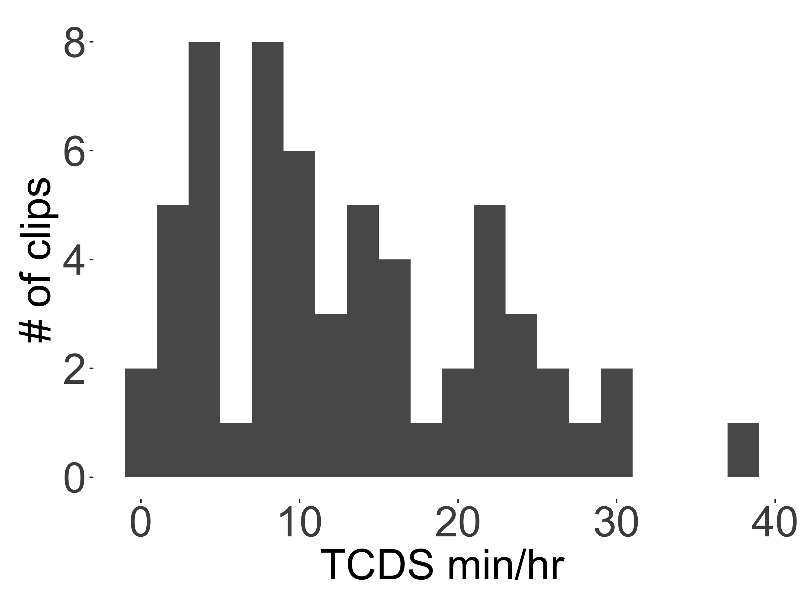
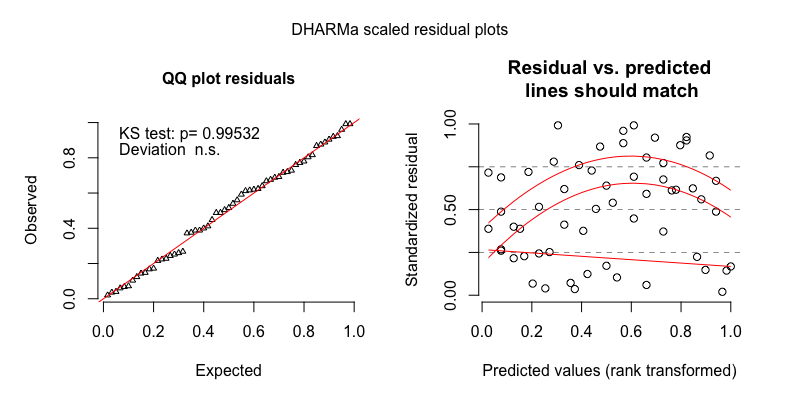

```{r load_packages, include=FALSE, echo=FALSE, warning=FALSE}
library(papaja)
library(tidyverse)
library(knitr)
knitr::opts_chunk$set(fig.pos = 'H')
```

```{r analysis_presets, include=FALSE}
options(scipen=999)
model.results <- read_csv("shiny_input/all_model_tables.csv")
model.results$component[which(model.results$effect == "ran_pars")] <- "random_effect"
rand.effect.rows <- which(!is.na(model.results$group))
model.results$term[rand.effect.rows] <- model.results$group[rand.effect.rows]
model.results <- model.results %>%
  select(-effect, -group) %>%
  mutate_if(is.numeric, round, 3)
```

# Full model outputs {#models}
In the main text we only report _significant_ effects on the five speech environment variables: TCDS min/hr, ODS min/hr, TC--O transitions/min, O--TC transitions/min, and sequence duration. Here in the Supplementary Materials we give the full model outputs for each analysis, including re-leveled versions of each model to show all three of the two-way tests between the three-level time-of-day factor. We also show, for each of the five measures, a figure showing how the variable is distributed across clips and a figure showing the distribution of model residuals. We also include full model output and residuals for a pair of comparably constructed gaussian mixed-effects regressions using a logged dependent measure. A gaussian model with logged measures is a more common solution to analyzing non-normal distributions in current psycholinguistics, but is not suitable for the current data given how our five speech environment measures are distributed, particularly in the randomly sampled clips (see, e.g., Figures [1](#fig1), [7](#fig7), [10](#fig10), [13](#fig13), [19](#fig19)). Overall, however, the gaussian models show a qualitatively similar pattern of results. None of the gaussian model results are presented in the main text---only here as supplementary information.

In what follows, the same information is shown for each of the five speech environment measures. All models were run with the glmm-TMB library in R [@R-glmmTMB; @brooks2017modeling]. Note that in all negative binomial regressions, the dependent variables have been rounded to the nearest integer (e.g., 3.2 minutes of TCDS per hour becomes 3 minutes per hour in the model).

The predictors in the models are abbreviated as follows: tchiyr.std = centered, standardized target child age in months; stthr.tri = the start time of the clip as either morning, midday, or afternoon; hsz.std = centered, standardized household size of the target child; nsk.std = centered, standardized number of speakers present in the clip, aclew_child_it = the unique identifier for each child. The predictors are sometimes combined in two-way interactions, as shown below with a ':' separator between predictor names (e.g., tchiyr.std:nsk.std = a two-way interaction of target child age and number of speakers present). In each model output table, the "component" shows what kind of model the estimate derives from (e.g., the zero-inflated models include both a conditional "cond" set of predictors, random effects, and zero-inflation "zi" predictors). The "term" is the estimated predictor. The "statistic" is the estimated _z_-statistic for each predictor's effect. The other labels are self-explanatory.

As more data are added to this corpus, the analyses will also be updated, as will this supplementary model information, all of which will be available at: https://middycasillas.shinyapps.io/Tseltal_Child_Language_Environment/.

## Target-child-directed speech (TCDS) {#models-tcds}
### Random clips {#models-tcds-random}
TCDS rate in the random clips demonstrated a skewed distribution with extra cases of zero. We therefore modeled it using a zero-inflated negative binomial mixed-effects regression.

\FloatBarrier

``` {r fig1, echo=FALSE, fig.align = "center", fig.cap="The distribution of TCDS rates found across the 90 random clips.", out.width = '40%'}
knitr::include_graphics("www/TCDS_random_distribution.png")
```

\FloatBarrier

```{r tab1, echo=FALSE, results='asis', message=FALSE, warning=FALSE}
apa_table(filter(model.results, model == "TCDS_random_z-inb") %>% select(-model),
          caption="Full output of the zero-inflated negative binomial mixed-effects regression of TCDS min/hr for the random sample, with midday as the reference level for time of day.")
```

```{r tab2, echo=FALSE, results='asis', message=FALSE, warning=FALSE}
apa_table(filter(model.results, model == "TCDS_random_z-inb.v2") %>% select(-model),
          caption="Model output of the zero-inflated negative binomial mixed-effects regression of TCDS min/hr for the random sample, with afternoon as the reference level for time of day.")
```

\FloatBarrier

``` {r fig2, echo=FALSE, fig.align = "center", fig.cap="The model residuals from the zero-inflated negative binomial mixed-effects regression of TCDS min/hr for the random sample.", out.width = '90%'}
knitr::include_graphics("www/TCDS_random_z-inb_res_plot.png")
```

\FloatBarrier

```{r tab3, echo=FALSE, results='asis', message=FALSE, warning=FALSE}
apa_table(filter(model.results, model == "TCDS_random_log_gaus") %>% select(-model),
          caption="Full output of the gaussian mixed-effects regression of TCDS min/hr for the random sample, with midday as the reference level for time of day.")
```

```{r tab4, echo=FALSE, results='asis', message=FALSE, warning=FALSE}
apa_table(filter(model.results, model == "TCDS_random_log_gaus.v2") %>% select(-model),
          caption="Model output of the gaussian mixed-effects regression of TCDS min/hr for the random sample, with afternoon as the reference level for time of day.")
```

\FloatBarrier

``` {r fig3, echo=FALSE, fig.align = "center", fig.cap="The model residuals from the gaussian mixed-effects regression of TCDS min/hr for the random sample.", out.width = '90%'}

```

\FloatBarrier

### Turn-taking clips {#models-tcds-turntaking}
TCDS rate in the turn-taking clips demonstrated a slightly skewed, but unimodal distribution. We therefore modeled it using a plain (i.e., non-zero-inflated) negative binomial mixed-effects regression. 

\FloatBarrier

``` {r fig4, echo=FALSE, fig.align = "center", fig.cap="The distribution of TCDS rates found across the 59 turn-taking clips.", out.width = '40%'}

```

\FloatBarrier

```{r tab5, echo=FALSE, results='asis', message=FALSE, warning=FALSE}
apa_table(filter(model.results, model == "TCDS_turntaking_nb") %>% select(-model),
          caption="Full output of the negative binomial mixed-effects regression of TCDS min/hr for the turn-taking sample, with midday as the reference level for time of day.")
```

```{r tab6, echo=FALSE, results='asis', message=FALSE, warning=FALSE}
apa_table(filter(model.results, model == "TCDS_turntaking_nb.v2") %>% select(-model),
          caption="Model output of the negative binomial mixed-effects regression of TCDS min/hr for the turn-taking sample, with afternoon as the reference level for time of day.")
```

\FloatBarrier

``` {r fig5, echo=FALSE, fig.align = "center", fig.cap="The model residuals from the negative binomial mixed-effects regression of TCDS min/hr for the turn-taking sample.", out.width = '90%'}
knitr::include_graphics("www/TCDS_turntaking_nb_res_plot.png")
```

\FloatBarrier

```{r tab7, echo=FALSE, results='asis', message=FALSE, warning=FALSE}
apa_table(filter(model.results, model == "TCDS_turntaking_log_gaus") %>% select(-model),
          caption="Full output of the gaussian mixed-effects regression of TCDS min/hr for the turn-taking sample, with midday as the reference level for time of day.")
```

```{r tab8, echo=FALSE, results='asis', message=FALSE, warning=FALSE}
apa_table(filter(model.results, model == "TCDS_turntaking_log_gaus.v2") %>% select(-model),
          caption="Model output of the gaussian mixed-effects regression of TCDS min/hr for the turn-taking sample, with afternoon as the reference level for time of day.")
```

\FloatBarrier

``` {r fig6, echo=FALSE, fig.align = "center", fig.cap="The model residuals from the gaussian mixed-effects regression of TCDS min/hr for the turn-taking sample.", out.width = '90%'}
knitr::include_graphics("www/TCDS_turntaking_log_gaus_res_plot.png")
```

\FloatBarrier

## Other-directed speech (ODS) {#models-ods}
### Random clips {#models-ods-random}
ODS rate in the random clips demonstrated a skewed distribution with extra cases of zero. We therefore modeled it using a zero-inflated negative binomial mixed-effects regression.

\FloatBarrier

``` {r fig7, echo=FALSE, fig.align = "center", fig.cap="The distribution of ODS rates found across the 90 random clips.", out.width = '40%'}
knitr::include_graphics("www/ODS_random_distribution.png")
```

\FloatBarrier

```{r tab9, echo=FALSE, results='asis', message=FALSE, warning=FALSE}
apa_table(filter(model.results, model == "ODS_random_z-inb") %>% select(-model),
          caption="Full output of the zero-inflated negative binomial mixed-effects regression of ODS min/hr for the random sample, with midday as the reference level for time of day.")
```

```{r tab10, echo=FALSE, results='asis', message=FALSE, warning=FALSE}
apa_table(filter(model.results, model == "ODS_random_z-inb.v2") %>% select(-model),
          caption="Model output of the zero-inflated negative binomial mixed-effects regression of ODS min/hr for the random sample, with afternoon as the reference level for time of day.")
```

\FloatBarrier

``` {r fig8, echo=FALSE, fig.align = "center", fig.cap="The model residuals from the zero-inflated negative binomial mixed-effects regression of ODS min/hr for the random sample.", out.width = '90%'}

```

\FloatBarrier

```{r tab11, echo=FALSE, results='asis', message=FALSE, warning=FALSE}
apa_table(filter(model.results, model == "ODS_random_log_gaus") %>% select(-model),
          caption="Full output of the gaussian mixed-effects regression of ODS min/hr for the random sample, with midday as the reference level for time of day.")
```

```{r tab12, echo=FALSE, results='asis', message=FALSE, warning=FALSE}
apa_table(filter(model.results, model == "ODS_random_log_gaus.v2") %>% select(-model),
          caption="Model output of the gaussian mixed-effects regression of ODS min/hr for the random sample, with afternoon as the reference level for time of day.")
```

\FloatBarrier

``` {r fig9, echo=FALSE, fig.align = "center", fig.cap="The model residuals from the gaussian mixed-effects regression of ODS min/hr for the random sample.", out.width = '90%'}
knitr::include_graphics("www/ODS_random_log_gaus_res_plot.png")
```

\FloatBarrier

### Turn-taking clips {#models-ods-turntaking}
ODS rate in the random clips demonstrated a skewed distribution with extra cases of zero. We therefore modeled it using a zero-inflated negative binomial mixed-effects regression.

\FloatBarrier

``` {r fig10, echo=FALSE, fig.align = "center", fig.cap="The distribution of ODS rates found across the 59 turn-taking clips.", out.width = '40%'}

```

\FloatBarrier

```{r tab13, echo=FALSE, results='asis', message=FALSE, warning=FALSE}
apa_table(filter(model.results, model == "ODS_turntaking_z-inb") %>% select(-model),
          caption="Full output of the negative binomial mixed-effects regression of ODS min/hr for the turn-taking sample, with midday as the reference level for time of day.")
```

```{r tab14, echo=FALSE, results='asis', message=FALSE, warning=FALSE}
apa_table(filter(model.results, model == "ODS_turntaking_z-inb.v2") %>% select(-model),
          caption="Model output of the negative binomial mixed-effects regression of ODS min/hr for the turn-taking sample, with afternoon as the reference level for time of day.")
```

\FloatBarrier

``` {r fig11, echo=FALSE, fig.align = "center", fig.cap="The model residuals from the zero-inflated negative binomial mixed-effects regression of ODS min/hr for the turn-taking sample.", out.width = '90%'}
knitr::include_graphics("www/ODS_turntaking_z-inb_res_plot.png")
```

\FloatBarrier

```{r tab15, echo=FALSE, results='asis', message=FALSE, warning=FALSE}
apa_table(filter(model.results, model == "ODS_turntaking_log_gaus") %>% select(-model),
          caption="Full output of the gaussian mixed-effects regression of ODS min/hr for the turn-taking sample, with midday as the reference level for time of day.")
```

```{r tab16, echo=FALSE, results='asis', message=FALSE, warning=FALSE}
apa_table(filter(model.results, model == "ODS_turntaking_log_gaus.v2") %>% select(-model),
          caption="Model output of the gaussian mixed-effects regression of ODS min/hr for the turn-taking sample, with afternoon as the reference level for time of day.")
```

\FloatBarrier

``` {r fig12, echo=FALSE, fig.align = "center", fig.cap="The model residuals from the gaussian mixed-effects regression of ODS min/hr for the turn-taking sample.", out.width = '90%'}

```

\FloatBarrier

## Target-child-to-other turn transitions (TC--O) {#models-tc_o}
### Random clips {#models-tc_o-random}
Target-child-to-other contingent response rate (TC--O transitions/min) in the random clips demonstrated a skewed distribution with extra cases of zero. We therefore modeled it using a zero-inflated negative binomial mixed-effects regression.

\FloatBarrier

``` {r fig13, echo=FALSE, fig.align = "center", fig.cap="The distribution of TC--O turn transitions/min rates found across the 90 random clips.", out.width = '40%'}
knitr::include_graphics("www/c_o_tpm_random_distribution.png")
```

\FloatBarrier

```{r tab17, echo=FALSE, results='asis', message=FALSE, warning=FALSE}
apa_table(filter(model.results, model == "c_o.tpm_random_z-inb") %>% select(-model),
          caption="Full output of the zero-inflated negative binomial mixed-effects regression of TC--O turn transitions/min for the random sample, with midday as the reference level for time of day.")
```

```{r tab18, echo=FALSE, results='asis', message=FALSE, warning=FALSE}
apa_table(filter(model.results, model == "c_o.tpm_random_z-inb.v2") %>% select(-model),
          caption="Model output of the zero-inflated negative binomial mixed-effects regression of TC--O turn transitions/min for the random sample, with afternoon as the reference level for time of day.")
```

\FloatBarrier

``` {r fig14, echo=FALSE, fig.align = "center", fig.cap="The model residuals from the zero-inflated negative binomial mixed-effects regression of TC--O turn transitions/min for the random sample.", out.width = '90%'}
knitr::include_graphics("www/c_o_tpm_random_z-inb_res_plot.png")
```

\FloatBarrier

```{r tab19, echo=FALSE, results='asis', message=FALSE, warning=FALSE}
apa_table(filter(model.results, model == "c_o.tpm_random_log_gaus") %>% select(-model),
          caption="Full output of the gaussian mixed-effects regression of TC--O turn transitions/min for the random sample, with midday as the reference level for time of day.")
```

```{r tab20, echo=FALSE, results='asis', message=FALSE, warning=FALSE}
apa_table(filter(model.results, model == "c_o.tpm_random_log_gaus.v2") %>% select(-model),
          caption="Model output of the gaussian mixed-effects regression of TC--O turn transitions/min for the random sample, with afternoon as the reference level for time of day.")
```

\FloatBarrier

``` {r fig15, echo=FALSE, fig.align = "center", fig.cap="The model residuals from the gaussian mixed-effects regression of TC--O turn transitions/min for the random sample.", out.width = '90%'}
knitr::include_graphics("www/c_o_tpm_random_log_gaus_res_plot.png")
```

\FloatBarrier


### Turn-taking clips {#models-tc_o-turntaking}
TC--O transitions/min in the random clips demonstrated a slightly skewed, unimodal distribution. We therefore modeled it using a plain (i.e., non-zero-inflated) negative binomial mixed-effects regression.

\FloatBarrier

``` {r fig16, echo=FALSE, fig.align = "center", fig.cap="The distribution of TC--O turn transitions/min found across the 59 turn-taking clips.", out.width = '40%'}

```

\FloatBarrier

```{r tab21, echo=FALSE, results='asis', message=FALSE, warning=FALSE}
apa_table(filter(model.results, model == "c_o.tpm_turntaking_nb") %>% select(-model),
          caption="Full output of the negative binomial mixed-effects regression of TC--O turn transitions/min for the turn-taking sample, with midday as the reference level for time of day.")
```

```{r tab22, echo=FALSE, results='asis', message=FALSE, warning=FALSE}
apa_table(filter(model.results, model == "c_o.tpm_turntaking_nb.v2") %>% select(-model),
          caption="Model output of the negative binomial mixed-effects regression of TC--O turn transitions/min for the turn-taking sample, with afternoon as the reference level for time of day.")
```

\FloatBarrier

``` {r fig17, echo=FALSE, fig.align = "center", fig.cap="The model residuals from the negative binomial mixed-effects regression of TC--O turn transitions/min for the turn-taking sample.", out.width = '90%'}

```

\FloatBarrier

```{r tab23, echo=FALSE, results='asis', message=FALSE, warning=FALSE}
apa_table(filter(model.results, model == "c_o.tpm_turntaking_log_gaus") %>% select(-model),
          caption="Full output of the gaussian mixed-effects regression of TC--O turn transitions/min for the turn-taking sample, with midday as the reference level for time of day.")
```

```{r tab24, echo=FALSE, results='asis', message=FALSE, warning=FALSE}
apa_table(filter(model.results, model == "c_o.tpm_turntaking_log_gaus.v2") %>% select(-model),
          caption="Model output of the gaussian mixed-effects regression of TC--O turn transitions/min for the turn-taking sample, with afternoon as the reference level for time of day.")
```

\FloatBarrier

``` {r fig18, echo=FALSE, fig.align = "center", fig.cap="The model residuals from the gaussian mixed-effects regression of TC--O turn transitions/min for the turn-taking sample.", out.width = '90%'}
knitr::include_graphics("www/c_o_tpm_turntaking_log_gaus_res_plot.png")
```

\FloatBarrier

## Other-to-target-child turn transitions (O--TC) {#models-o_tc}
### Random clips {#models-o_tc-random}
Other-to-target-child contingent response rate (O--TC transitions/min) in the random clips demonstrated a skewed distribution with extra cases of zero. We therefore modeled it using a zero-inflated negative binomial mixed-effects regression.

\FloatBarrier

``` {r fig19, echo=FALSE, fig.align = "center", fig.cap="The distribution of O--TC turn transitions/min rates found across the 90 random clips.", out.width = '40%'}

```

\FloatBarrier

```{r tab25, echo=FALSE, results='asis', message=FALSE, warning=FALSE}
apa_table(filter(model.results, model == "o_c.tpm_random_z-inb") %>% select(-model),
          caption="Full output of the zero-inflated negative binomial mixed-effects regression of O--TCturn transitions/min for the random sample, with midday as the reference level for time of day.")
```

```{r tab26, echo=FALSE, results='asis', message=FALSE, warning=FALSE}
apa_table(filter(model.results, model == "o_c.tpm_random_z-inb.v2") %>% select(-model),
          caption="Model output of the zero-inflated negative binomial mixed-effects regression of O--TC turn transitions/min for the random sample, with afternoon as the reference level for time of day.")
```

\FloatBarrier

``` {r fig20, echo=FALSE, fig.align = "center", fig.cap="The model residuals from the zero-inflated negative binomial mixed-effects regression of O--TC turn transitions/min for the random sample.", out.width = '90%'}
knitr::include_graphics("www/o_c_tpm_random_z-inb_res_plot.png")
```

\FloatBarrier

```{r tab27, echo=FALSE, results='asis', message=FALSE, warning=FALSE}
apa_table(filter(model.results, model == "o_c.tpm_random_log_gaus") %>% select(-model),
          caption="Full output of the gaussian mixed-effects regression of O--TC turn transitions/min for the random sample, with midday as the reference level for time of day.")
```

```{r tab28, echo=FALSE, results='asis', message=FALSE, warning=FALSE}
apa_table(filter(model.results, model == "o_c.tpm_random_log_gaus.v2") %>% select(-model),
          caption="Model output of the gaussian mixed-effects regression of O--TC turn transitions/min for the random sample, with afternoon as the reference level for time of day.")
```

\FloatBarrier

``` {r fig21, echo=FALSE, fig.align = "center", fig.cap="The model residuals from the gaussian mixed-effects regression of O--TC turn transitions/min for the random sample.", out.width = '90%'}
knitr::include_graphics("www/o_c_tpm_random_log_gaus_res_plot.png")
```

\FloatBarrier

### Turn-taking clips {#models-o_tc-turntaking}
O--TC transitions/min in the random clips demonstrated a fairly normal distribution. We therefore modeled it using a plain (i.e., non-zero-inflated) negative binomial mixed-effects regression.

\FloatBarrier

``` {r fig22, echo=FALSE, fig.align = "center", fig.cap="The distribution of O--TC turn transitions/min found across the 90 turn-taking clips.", out.width = '40%'}
knitr::include_graphics("www/o_c_tpm_turntaking_distribution.png")
```

\FloatBarrier

```{r tab29, echo=FALSE, results='asis', message=FALSE, warning=FALSE}
apa_table(filter(model.results, model == "o_c.tpm_turntaking_nb") %>% select(-model),
          caption="Full output of the negative binomial mixed-effects regression of O--TC turn transitions/min for the turn-taking sample.")
```

```{r tab30, echo=FALSE, results='asis', message=FALSE, warning=FALSE}
apa_table(filter(model.results, model == "o_c.tpm_turntaking_nb.v2") %>% select(-model),
          caption="Model output of the negative binomial mixed-effects regression of O--TC turn transitions/min for the turn-taking sample, with afternoon as the reference level for time of day.")
```

\FloatBarrier

``` {r fig23, echo=FALSE, fig.align = "center", fig.cap="The model residuals from the negative binomial mixed-effects regression of O--TC turn transitions/min for the turn-taking sample.", out.width = '90%'}

```

\FloatBarrier

```{r tab31, echo=FALSE, results='asis', message=FALSE, warning=FALSE}
apa_table(filter(model.results, model == "o_c.tpm_turntaking_log_gaus") %>% select(-model),
          caption="Full output of the gaussian mixed-effects regression of O--TC turn transitions/min for the turn-taking sample, with midday as the reference level for time of day.")
```

```{r tab32, echo=FALSE, results='asis', message=FALSE, warning=FALSE}
apa_table(filter(model.results, model == "o_c.tpm_turntaking_log_gaus.v2") %>% select(-model),
          caption="Model output of the gaussian mixed-effects regression of O--TC turn transitions/min for the turn-taking sample, with afternoon as the reference level for time of day.")
```

\FloatBarrier

``` {r fig24, echo=FALSE, fig.align = "center", fig.cap="The model residuals from the gaussian mixed-effects regression of O--TC turn transitions/min for the turn-taking sample.", out.width = '90%'}
knitr::include_graphics("www/o_c_tpm_turntaking_log_gaus_res_plot.png")
```

\FloatBarrier


## Interactive sequence duration {#models-seqdur}
### Random clips {#models-seqdur-random}
Other-to-target-child contingent response rate (O--TC transitions/min) in the random clips demonstrated a skewed distribution with extra cases of zero. We therefore modeled it using a zero-inflated negative binomial mixed-effects regression.

\FloatBarrier

``` {r fig25, echo=FALSE, fig.align = "center", fig.cap="The distribution of interactive sequence duration (sec) found across the 90 random clips.", out.width = '40%'}

```

\FloatBarrier

```{r tab33, echo=FALSE, results='asis', message=FALSE, warning=FALSE}
apa_table(filter(model.results, model == "seqdur.sec_random_nb") %>% select(-model),
          caption="Full output of the negative binomial mixed-effects regression of interactive sequence duration (sec) for the random sample, with midday as the reference level for time of day.")
```

```{r tab34, echo=FALSE, results='asis', message=FALSE, warning=FALSE}
apa_table(filter(model.results, model == "seqdur.sec_random_nb.v2") %>% select(-model),
          caption="Model output of the negative binomial mixed-effects regression of interactive sequence duration (sec) for the random sample, with afternoon as the reference level for time of day.")
```

\FloatBarrier

``` {r fig26, echo=FALSE, fig.align = "center", fig.cap="The model residuals from the negative binomial mixed-effects regression of interactive sequence duration (sec) for the random sample.", out.width = '90%'}

```

\FloatBarrier

```{r tab35, echo=FALSE, results='asis', message=FALSE, warning=FALSE}
apa_table(filter(model.results, model == "seqdur.sec_random_log_gaus") %>% select(-model),
          caption="Full output of the gaussian mixed-effects regression of interactive sequence duration (sec) for the random sample, with midday as the reference level for time of day.")
```

```{r tab36, echo=FALSE, results='asis', message=FALSE, warning=FALSE}
apa_table(filter(model.results, model == "seqdur.sec_random_log_gaus.v2") %>% select(-model),
          caption="Model output of the gaussian mixed-effects regression of interactive sequence duration (sec) for the random sample, with afternoon as the reference level for time of day.")
```

\FloatBarrier

``` {r fig27, echo=FALSE, fig.align = "center", fig.cap="The model residuals from the gaussian mixed-effects regression of interactive sequence duration (sec) for the random sample.", out.width = '90%'}

```

\FloatBarrier


### Turn-taking clips {#models-seqdur-turntaking}
O--TC transitions/min in the random clips demonstrated a fairly normal distribution. We therefore modeled it using a plain (i.e., non-zero-inflated) negative binomial mixed-effects regression.

\FloatBarrier

``` {r fig28, echo=FALSE, fig.align = "center", fig.cap="The distribution of interactive sequence duration (sec) found across the 90 turn-taking clips.", out.width = '40%'}

```

\FloatBarrier

```{r tab37, echo=FALSE, results='asis', message=FALSE, warning=FALSE}
apa_table(filter(model.results, model == "seqdur.sec_turntaking_nb") %>% select(-model),
          caption="Full output of the negative binomial mixed-effects regression of interactive sequence duration (sec) for the turn-taking sample.")
```

```{r tab38, echo=FALSE, results='asis', message=FALSE, warning=FALSE}
apa_table(filter(model.results, model == "seqdur.sec_turntaking_nb.v2") %>% select(-model),
          caption="Model output of the negative binomial mixed-effects regression of interactive sequence duration (sec) for the turn-taking sample, with afternoon as the reference level for time of day.")
```

\FloatBarrier

``` {r fig29, echo=FALSE, fig.align = "center", fig.cap="The model residuals from the negative binomial mixed-effects regression of interactive sequence duration (sec) for the turn-taking sample.", out.width = '90%'}

```

\FloatBarrier

```{r tab39, echo=FALSE, results='asis', message=FALSE, warning=FALSE}
apa_table(filter(model.results, model == "seqdur.sec_turntaking_log_gaus") %>% select(-model),
          caption="Full output of the gaussian mixed-effects regression of interactive sequence duration (sec) for the turn-taking sample, with midday as the reference level for time of day.")
```

```{r tab40, echo=FALSE, results='asis', message=FALSE, warning=FALSE}
apa_table(filter(model.results, model == "seqdur.sec_turntaking_log_gaus.v2") %>% select(-model),
          caption="Model output of the gaussian mixed-effects regression of interactive sequence duration (sec) for the turn-taking sample, with afternoon as the reference level for time of day.")
```

\FloatBarrier

``` {r fig30, echo=FALSE, fig.align = "center", fig.cap="The model residuals from the gaussian mixed-effects regression of interactive sequence duration (sec) for the turn-taking sample.", out.width = '90%'}

```

\FloatBarrier

\newpage

# References {#refs}

```{r create_r-references}
r_refs(file = "Tseltal-CLE.bib")
```

\begingroup
\setlength{\parindent}{-0.5in}
\setlength{\leftskip}{0.5in}

<div id = "refs"></div>
\endgroup
