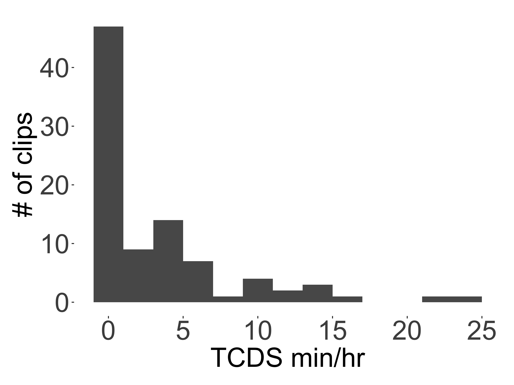
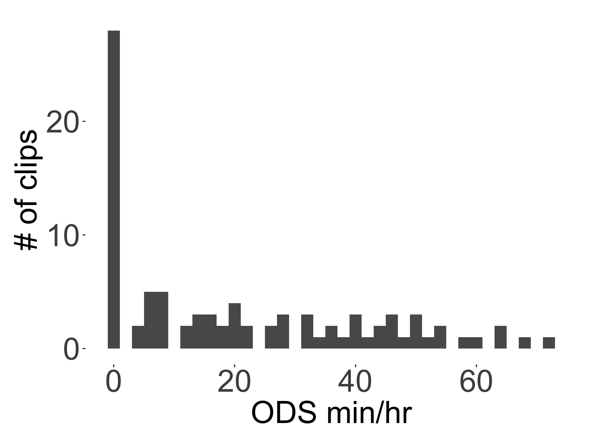

```{r load_packages, include=FALSE, echo=FALSE, warning=FALSE}
library(papaja)
#library(ggplot2)
library(tidyverse)
library(knitr)
#library(viridis)
#library(grid)
#library(gridExtra)
#library(ggpirate)
#library(lme4)
#library(glmmTMB)
#library(DHARMa)
#library(bbmle)
#library(broom.mixed)
#source("0-Helper.R")
```

```{r analysis_presets, include=FALSE}
options(scipen=999)
model.results <- read_csv("shiny_input/all_model_tables.csv")
model.results$component[which(model.results$effect == "ran_pars")] <- "random_effect"
rand.effect.rows <- which(!is.na(model.results$group))
model.results$term[rand.effect.rows] <- model.results$group[rand.effect.rows]
model.results <- model.results %>%
  select(-effect, -group) %>%
  mutate_if(is.numeric, round, 3)

#knitr::opts_chunk$set(fig.pos = 'H')


metadata.path <- "metadata/"
plot.path <- "plots/" # output plots
shiny.input.path <- "shiny_input/"
samplelabels <- c("High activity  ", "Random  ")
col.sample.bu <- list(
  scale_fill_manual(labels=samplelabels, values=viridis(2)),
  scale_color_manual(labels=samplelabels, values=viridis(2)))
col.sample.bu3 <- list(
  scale_fill_manual(labels=samplelabels, values=viridis(3)),
  scale_color_manual(labels=samplelabels, values=viridis(3)))
```

# Full model outputs {#models}
In the main text we only report significant effects from the models used to analyze the five speech environment variables. Here we give the full model outputs, figures showing the distribution of each variable and the residuals of each model, and the output of a comparably constructed gaussian mixed-effects linear regression for: TCDS min/hr, ODS min/hr, TC--O transitions/min, O--TC transitions/min, and sequence duration.

The predictors in the models are abbreviated: tchiyr.std = centered, standardized target child age in months; stthr.tri = the start time of the clip as either morning, midday, or afternoon; hsz.std = centered, standardized household size of the target child; nsk.std = centered, standardized number of speakers present in the clip, aclew_child_it = the unique identifier for each child.

## Target-child-directed speech (TCDS) {#models-tcds}
### Random clips {#models-tcds-random}
TCDS rate in the random clips demonstrated a skewed distribution with extra cases of zero. We therefore modeled it using a zero-inflated negative binomial mixed-effects regression. In order to do this, we rounded the rate of TCDS min/hr to the nearest integer in modeling the influence of time of day, child age, and so on.

In what follows we first show the distribution of TCDS min/hr across clips. We then show the full output of the model reported in the text---both the original, with midday as the reference point for time of day and then a second version with afternoon as the reference point for time of day. We follow these model outputs with a figure showing two residual plots for the main model [Table 1](#tab1). Finally, we show the full output for a gaussian linear mixed-effects model of the data using logged TCDS min/hr as the dependent variable, which is more common in current psycholinguistics, but is not appropriate for this distribution of data [Figure 1](#fig1). However, the gaussian model shows a similar pattern of results as the zero-inflated negative binomial model. As before, we show the model results with both midday and afternoon as the reference levels for time of day, followed by the residuals for the gaussian model.

``` {r fig1, echo=FALSE, fig.align = "center", fig.cap="The distribution of TCDS rates found across the 90 random clips.", out.width = '40%'}

```

```{r tab1, echo=FALSE, results='asis', message=FALSE, warning=FALSE}
apa_table(filter(model.results, model == "TCDS_random_z-inb") %>% select(-model),
          caption="Full output of the zero-inflated negative binomial mixed-effects regression of TCDS min/hr for the random sample.")
```

```{r tab2, echo=FALSE, results='asis', message=FALSE, warning=FALSE}
apa_table(filter(model.results, model == "TCDS_random_z-inb.v2") %>% select(-model),
          caption="Model output of the zero-inflated negative binomial mixed-effects regression of TCDS min/hr for the random sample, with afternoon as the reference level for time of day.")
```

``` {r fig2, echo=FALSE, fig.align = "center", fig.cap="The model residuals from the zero-inflated negative binomial mixed-effects regression of TCDS min/hr for the random sample.", out.width = '90%'}
knitr::include_graphics("www/TCDS_random_z-inb_res_plot.png")
```

```{r tab3, echo=FALSE, results='asis', message=FALSE, warning=FALSE}
apa_table(filter(model.results, model == "TCDS_random_log_gaus") %>% select(-model),
          caption="Full output of the gaussian mixed-effects regression of TCDS min/hr for the random sample, with midday as the reference level for time of day.")
```

```{r tab4, echo=FALSE, results='asis', message=FALSE, warning=FALSE}
apa_table(filter(model.results, model == "TCDS_random_log_gaus.v2") %>% select(-model),
          caption="Model output of the gaussian mixed-effects regression of TCDS min/hr for the random sample, with afternoon as the reference level for time of day.")
```

``` {r fig3, echo=FALSE, fig.align = "center", fig.cap="The model residuals from the gaussian mixed-effects regression of TCDS min/hr for the random sample.", out.width = '90%'}
knitr::include_graphics("www/TCDS_random_log_gaus_res_plot.png")
```


### Turn-taking clips {#models-tcds-turntaking}
TCDS rate in the turn-taking clips demonstrated a fairly normal distribution. We therefore modeled it using a plain (i.e., non-zero-inflated) negative binomial mixed-effects regression. In order to do this, we rounded the rate of TCDS min/hr to the nearest integer in modeling the influence of time of day, child age, and so on, as before. Below we show the distribution of TCDS min/hr across clips, the full output for the models reported in the text (both with the midday and afternoon reference level versions for time-of-day), the residual plots for the main model [Table 6](#tab6), and parallel models using gaussian linear mixed-effects analyses. Again, the gaussian model shows a similar pattern of results as the negative binomial model.

``` {r fig4, echo=FALSE, fig.align = "center", fig.cap="The distribution of TCDS rates found across the 90 turn-taking clips.", out.width = '40%'}
knitr::include_graphics("www/TCDS_turntaking_distribution.png")
```

```{r tab5, echo=FALSE, results='asis', message=FALSE, warning=FALSE}
apa_table(filter(model.results, model == "TCDS_turntaking_nb") %>% select(-model),
          caption="Full output of the negative binomial mixed-effects regression of TCDS min/hr for the turn-taking sample.")
```

```{r tab6, echo=FALSE, results='asis', message=FALSE, warning=FALSE}
apa_table(filter(model.results, model == "TCDS_turntaking_nb.v2") %>% select(-model),
          caption="Model output of the negative binomial mixed-effects regression of TCDS min/hr for the turn-taking sample, with afternoon as the reference level for time of day.")
```

``` {r fig5, echo=FALSE, fig.align = "center", fig.cap="The model residuals from the zero-inflated negative binomial mixed-effects regression of TCDS min/hr for the turn-taking sample.", out.width = '90%'}

```

```{r tab7, echo=FALSE, results='asis', message=FALSE, warning=FALSE}
apa_table(filter(model.results, model == "TCDS_turntaking_log_gaus") %>% select(-model),
          caption="Full output of the gaussian mixed-effects regression of TCDS min/hr for the turn-taking sample, with midday as the reference level for time of day.")
```

```{r tab8, echo=FALSE, results='asis', message=FALSE, warning=FALSE}
apa_table(filter(model.results, model == "TCDS_turntaking_log_gaus.v2") %>% select(-model),
          caption="Model output of the gaussian mixed-effects regression of TCDS min/hr for the turn-taking sample, with afternoon as the reference level for time of day.")
```

``` {r fig6, echo=FALSE, fig.align = "center", fig.cap="The model residuals from the gaussian mixed-effects regression of TCDS min/hr for the turn-taking sample.", out.width = '90%'}

```


## Other-directed speech (ODS) {#models-ods}
### Random clips {#models-ods-random}
ODS rate in the random clips demonstrated a skewed distribution with extra cases of zero. We therefore modeled it using a zero-inflated negative binomial mixed-effects regression. In order to do this, we rounded the rate of ODS min/hr to the nearest integer in modeling the influence of time of day, child age, and so on. Below first show the distribution of ODS min/hr across clips. We then show the full output of the model reported in the text---both the original, with midday as the reference point for time of day and then a second version with afternoon as the reference point for time of day. We follow these model outputs with a figure showing two residual plots for the main model [Table 10](#tab10). Finally, we show the full output for a gaussian linear mixed-effects model of the data using logged ODS min/hr as the dependent variable, which is not appropriate for this distribution of data [Figure 7](#fig7). However, the gaussian model shows a similar pattern of results as the zero-inflated negative binomial model. As before, we show the model results with both midday and afternoon as the reference levels for time of day, followed by the residuals for the gaussian model.

``` {r fig7, echo=FALSE, fig.align = "center", fig.cap="The distribution of ODS rates found across the 90 random clips.", out.width = '40%'}

```

```{r tab9, echo=FALSE, results='asis', message=FALSE, warning=FALSE}
apa_table(filter(model.results, model == "ODS_random_z-inb") %>% select(-model),
          caption="Full output of the zero-inflated negative binomial mixed-effects regression of ODS min/hr for the random sample.")
```

```{r tab10, echo=FALSE, results='asis', message=FALSE, warning=FALSE}
apa_table(filter(model.results, model == "ODS_random_z-inb.v2") %>% select(-model),
          caption="Model output of the zero-inflated negative binomial mixed-effects regression of ODS min/hr for the random sample, with afternoon as the reference level for time of day.")
```

``` {r fig8, echo=FALSE, fig.align = "center", fig.cap="The model residuals from the zero-inflated negative binomial mixed-effects regression of ODS min/hr for the random sample.", out.width = '90%'}
knitr::include_graphics("www/ODS_random_z-inb_res_plot.png")
```

```{r tab11, echo=FALSE, results='asis', message=FALSE, warning=FALSE}
apa_table(filter(model.results, model == "ODS_random_log_gaus") %>% select(-model),
          caption="Full output of the gaussian mixed-effects regression of ODS min/hr for the random sample, with midday as the reference level for time of day.")
```

```{r tab12, echo=FALSE, results='asis', message=FALSE, warning=FALSE}
apa_table(filter(model.results, model == "ODS_random_log_gaus.v2") %>% select(-model),
          caption="Model output of the gaussian mixed-effects regression of ODS min/hr for the random sample, with afternoon as the reference level for time of day.")
```

``` {r fig9, echo=FALSE, fig.align = "center", fig.cap="The model residuals from the gaussian mixed-effects regression of ODS min/hr for the random sample.", out.width = '90%'}

```

\newpage

### Turn-taking clips {#models-ods-turntaking}
ODS rate in the random clips demonstrated a skewed distribution with extra cases of zero. We therefore modeled it using a zero-inflated negative binomial mixed-effects regression. In order to do this, we rounded the rate of ODS min/hr to the nearest integer in modeling the influence of time of day, child age, and so on, as before. Below we show the distribution of ODS min/hr across clips, the full output for the models reported in the text (both with the midday and afternoon reference level versions for time-of-day), the residual plots for the main model [Table 13](#tab13), and parallel models using gaussian linear mixed-effects analyses. Again, the gaussian model shows a similar pattern of results as the negative binomial model.

``` {r fig10, echo=FALSE, fig.align = "center", fig.cap="The distribution of TCDS rates found across the 90 turn-taking clips.", out.width = '40%'}
knitr::include_graphics("www/TCDS_turntaking_distribution.png")
```

```{r tab13, echo=FALSE, results='asis', message=FALSE, warning=FALSE}
apa_table(filter(model.results, model == "TCDS_turntaking_nb") %>% select(-model),
          caption="Full output of the negative binomial mixed-effects regression of TCDS min/hr for the turn-taking sample.")
```

```{r tab14, echo=FALSE, results='asis', message=FALSE, warning=FALSE}
apa_table(filter(model.results, model == "TCDS_turntaking_nb.v2") %>% select(-model),
          caption="Model output of the negative binomial mixed-effects regression of TCDS min/hr for the turn-taking sample, with afternoon as the reference level for time of day.")
```

``` {r fig11, echo=FALSE, fig.align = "center", fig.cap="The model residuals from the zero-inflated negative binomial mixed-effects regression of TCDS min/hr for the turn-taking sample.", out.width = '90%'}

```

```{r tab15, echo=FALSE, results='asis', message=FALSE, warning=FALSE}
apa_table(filter(model.results, model == "TCDS_turntaking_log_gaus") %>% select(-model),
          caption="Full output of the gaussian mixed-effects regression of TCDS min/hr for the turn-taking sample, with midday as the reference level for time of day.")
```

```{r tab16, echo=FALSE, results='asis', message=FALSE, warning=FALSE}
apa_table(filter(model.results, model == "TCDS_turntaking_log_gaus.v2") %>% select(-model),
          caption="Model output of the gaussian mixed-effects regression of TCDS min/hr for the turn-taking sample, with afternoon as the reference level for time of day.")
```

``` {r fig12, echo=FALSE, fig.align = "center", fig.cap="The model residuals from the gaussian mixed-effects regression of TCDS min/hr for the turn-taking sample.", out.width = '90%'}

```


\newpage


## Target-child-to-other turn transitions (TC--O) {#models-tc_o}
### Random clips {#models-tc_o-random}
Target-child-to-other contingent response rate (TC--O transitions/min) in the random clips demonstrated a skewed distribution with extra cases of zero. We therefore modeled it using a zero-inflated negative binomial mixed-effects regression. In order to do this, we rounded the rate of TC--O transitions/min to the nearest integer in modeling the influence of time of day, child age, and so on. Below we first show the distribution of TC--O transitions/min across clips. We then show the full output of the model reported in the text---both the original, with midday as the reference point for time of day and then a second version with afternoon as the reference point for time of day. We follow these model outputs with a figure showing two residual plots for the main model [Table 17](#tab17). Finally, we show the full output for a gaussian linear mixed-effects model of the data using logged TC--O transitions/min as the dependent variable, which is not appropriate for this distribution of data [Figure 13](#fig13). However, the gaussian model shows a similar pattern of results as the zero-inflated negative binomial model. As before, we show the model results with both midday and afternoon as the reference levels for time of day, followed by the residuals for the gaussian model.

``` {r fig13, echo=FALSE, fig.align = "center", fig.cap="The distribution of TC--O turn transitions/min rates found across the 90 random clips.", out.width = '40%'}

```

```{r tab17, echo=FALSE, results='asis', message=FALSE, warning=FALSE}
apa_table(filter(model.results, model == "c_o.tpm_random_z-inb") %>% select(-model),
          caption="Full output of the zero-inflated negative binomial mixed-effects regression of TC--O turn transitions/min for the random sample.")
```

```{r tab18, echo=FALSE, results='asis', message=FALSE, warning=FALSE}
apa_table(filter(model.results, model == "c_o.tpm_random_z-inb.v2") %>% select(-model),
          caption="Model output of the zero-inflated negative binomial mixed-effects regression of TC--O turn transitions/min for the random sample, with afternoon as the reference level for time of day.")
```

``` {r fig14, echo=FALSE, fig.align = "center", fig.cap="The model residuals from the zero-inflated negative binomial mixed-effects regression of TC--O turn transitions/min for the random sample.", out.width = '90%'}

```

```{r tab19, echo=FALSE, results='asis', message=FALSE, warning=FALSE}
apa_table(filter(model.results, model == "c_o.tpm_random_log_gaus") %>% select(-model),
          caption="Full output of the gaussian mixed-effects regression of TC--O turn transitions/min for the random sample, with midday as the reference level for time of day.")
```

```{r tab20, echo=FALSE, results='asis', message=FALSE, warning=FALSE}
apa_table(filter(model.results, model == "c_o.tpm_random_log_gaus.v2") %>% select(-model),
          caption="Model output of the gaussian mixed-effects regression of TC--O turn transitions/min for the random sample, with afternoon as the reference level for time of day.")
```

``` {r fig15, echo=FALSE, fig.align = "center", fig.cap="The model residuals from the gaussian mixed-effects regression of TC--O turn transitions/min for the random sample.", out.width = '90%'}

```

\newpage

### Turn-taking clips {#models-tc_o-turntaking}
TC--O transitions/min in the random clips demonstrated a fairly normal distribution. We therefore modeled it using a plain (i.e., non-zero-inflated) negative binomial mixed-effects regression. In order to do this, we rounded the rate of ODS min/hr to the nearest integer in modeling the influence of time of day, child age, and so on, as before. Below we show the distribution of TC--O transitions/min across clips, the full output for the models reported in the text (both with the midday and afternoon reference level versions for time-of-day), the residual plots for the main model [Table 21](#tab21), and parallel models using gaussian linear mixed-effects analyses. Again, the gaussian model shows a similar pattern of results as the negative binomial model.

``` {r fig16, echo=FALSE, fig.align = "center", fig.cap="The distribution of TC--O turn transitions/min found across the 90 turn-taking clips.", out.width = '40%'}
knitr::include_graphics("www/c_o_tpm_turntaking_distribution.png")
```

```{r tab21, echo=FALSE, results='asis', message=FALSE, warning=FALSE}
apa_table(filter(model.results, model == "c_o.tpm_turntaking_nb") %>% select(-model),
          caption="Full output of the negative binomial mixed-effects regression of TC--O turn transitions/min for the turn-taking sample.")
```

```{r tab22, echo=FALSE, results='asis', message=FALSE, warning=FALSE}
apa_table(filter(model.results, model == "c_o.tpm_turntaking_nb.v2") %>% select(-model),
          caption="Model output of the negative binomial mixed-effects regression of TC--O turn transitions/min for the turn-taking sample, with afternoon as the reference level for time of day.")
```

``` {r fig17, echo=FALSE, fig.align = "center", fig.cap="The model residuals from the zero-inflated negative binomial mixed-effects regression of TC--O turn transitions/min for the turn-taking sample.", out.width = '90%'}
knitr::include_graphics("www/c_o_tpm_turntaking_nb_res_plot.png")
```

```{r tab23, echo=FALSE, results='asis', message=FALSE, warning=FALSE}
apa_table(filter(model.results, model == "c_o.tpm_turntaking_log_gaus") %>% select(-model),
          caption="Full output of the gaussian mixed-effects regression of TC--O turn transitions/min for the turn-taking sample, with midday as the reference level for time of day.")
```

```{r tab24, echo=FALSE, results='asis', message=FALSE, warning=FALSE}
apa_table(filter(model.results, model == "c_o.tpm_turntaking_log_gaus.v2") %>% select(-model),
          caption="Model output of the gaussian mixed-effects regression of TC--O turn transitions/min for the turn-taking sample, with afternoon as the reference level for time of day.")
```

``` {r fig18, echo=FALSE, fig.align = "center", fig.cap="The model residuals from the gaussian mixed-effects regression of TC--O turn transitions/min for the turn-taking sample.", out.width = '90%'}

```


\newpage


## Other-to-target-child turn transitions (O--TC) {#models-o_tc}
### Random clips {#models-o_tc-random}
Other-to-target-child contingent response rate (O--TC transitions/min) in the random clips demonstrated a skewed distribution with extra cases of zero. We therefore modeled it using a zero-inflated negative binomial mixed-effects regression. In order to do this, we rounded the rate of O--TC transitions/min to the nearest integer in modeling the influence of time of day, child age, and so on. Below we first show the distribution of O--TC transitions/min across clips. We then show the full output of the model reported in the text---both the original, with midday as the reference point for time of day and then a second version with afternoon as the reference point for time of day. We follow these model outputs with a figure showing two residual plots for the main model [Table 25](#tab25). Finally, we show the full output for a gaussian linear mixed-effects model of the data using logged O--TC transitions/min as the dependent variable, which is not appropriate for this distribution of data [Figure 19](#fig19). However, the gaussian model shows a similar pattern of results as the zero-inflated negative binomial model. As before, we show the model results with both midday and afternoon as the reference levels for time of day, followed by the residuals for the gaussian model.

``` {r fig19, echo=FALSE, fig.align = "center", fig.cap="The distribution of O--TC turn transitions/min rates found across the 90 random clips.", out.width = '40%'}
knitr::include_graphics("www/o_c_tpm_random_distribution.png")
```

```{r tab25, echo=FALSE, results='asis', message=FALSE, warning=FALSE}
apa_table(filter(model.results, model == "o_c.tpm_random_z-inb") %>% select(-model),
          caption="Full output of the zero-inflated negative binomial mixed-effects regression of O--TCturn transitions/min for the random sample, with midday as the reference level for time of day.")
```

```{r tab26, echo=FALSE, results='asis', message=FALSE, warning=FALSE}
apa_table(filter(model.results, model == "o_c.tpm_random_z-inb.v2") %>% select(-model),
          caption="Model output of the zero-inflated negative binomial mixed-effects regression of O--TC turn transitions/min for the random sample, with afternoon as the reference level for time of day.")
```

``` {r fig20, echo=FALSE, fig.align = "center", fig.cap="The model residuals from the zero-inflated negative binomial mixed-effects regression of O--TC turn transitions/min for the random sample.", out.width = '90%'}

```

```{r tab27, echo=FALSE, results='asis', message=FALSE, warning=FALSE}
apa_table(filter(model.results, model == "o_c.tpm_random_log_gaus") %>% select(-model),
          caption="Full output of the gaussian mixed-effects regression of O--TC turn transitions/min for the random sample, with midday as the reference level for time of day.")
```

```{r tab28, echo=FALSE, results='asis', message=FALSE, warning=FALSE}
apa_table(filter(model.results, model == "o_c.tpm_random_log_gaus.v2") %>% select(-model),
          caption="Model output of the gaussian mixed-effects regression of O--TC turn transitions/min for the random sample, with afternoon as the reference level for time of day.")
```

``` {r fig21, echo=FALSE, fig.align = "center", fig.cap="The model residuals from the gaussian mixed-effects regression of O--TC turn transitions/min for the random sample.", out.width = '90%'}
knitr::include_graphics("www/o_c_tpm_random_log_gaus_res_plot.png")
```

\newpage

### Turn-taking clips {#models-o_tc-turntaking}
O--TC transitions/min in the random clips demonstrated a fairly normal distribution. We therefore modeled it using a plain (i.e., non-zero-inflated) negative binomial mixed-effects regression. In order to do this, we rounded the rate of O--TC transitions/min to the nearest integer in modeling the influence of time of day, child age, and so on, as before. Below we show the distribution of O--TC transitions/min across clips, the full output for the models reported in the text (both with the midday and afternoon reference level versions for time-of-day), the residual plots for the main model [Table 29](#tab29), and parallel models using gaussian linear mixed-effects analyses. Again, the gaussian model shows a similar pattern of results as the negative binomial model.

``` {r fig22, echo=FALSE, fig.align = "center", fig.cap="The distribution of O--TC turn transitions/min found across the 90 turn-taking clips.", out.width = '40%'}
knitr::include_graphics("www/o_c_tpm_turntaking_distribution.png")
```

```{r tab29, echo=FALSE, results='asis', message=FALSE, warning=FALSE}
apa_table(filter(model.results, model == "o_c.tpm_turntaking_nb") %>% select(-model),
          caption="Full output of the negative binomial mixed-effects regression of O--TC turn transitions/min for the turn-taking sample.")
```

```{r tab30, echo=FALSE, results='asis', message=FALSE, warning=FALSE}
apa_table(filter(model.results, model == "o_c.tpm_turntaking_nb.v2") %>% select(-model),
          caption="Model output of the negative binomial mixed-effects regression of O--TC turn transitions/min for the turn-taking sample, with afternoon as the reference level for time of day.")
```

``` {r fig23, echo=FALSE, fig.align = "center", fig.cap="The model residuals from the negative binomial mixed-effects regression of O--TC turn transitions/min for the turn-taking sample.", out.width = '90%'}
knitr::include_graphics("www/o_c_tpm_turntaking_nb_res_plot.png")
```

```{r tab31, echo=FALSE, results='asis', message=FALSE, warning=FALSE}
apa_table(filter(model.results, model == "o_c.tpm_turntaking_log_gaus") %>% select(-model),
          caption="Full output of the gaussian mixed-effects regression of O--TC turn transitions/min for the turn-taking sample, with midday as the reference level for time of day.")
```

```{r tab32, echo=FALSE, results='asis', message=FALSE, warning=FALSE}
apa_table(filter(model.results, model == "o_c.tpm_turntaking_log_gaus.v2") %>% select(-model),
          caption="Model output of the gaussian mixed-effects regression of O--TC turn transitions/min for the turn-taking sample, with afternoon as the reference level for time of day.")
```

``` {r fig24, echo=FALSE, fig.align = "center", fig.cap="The model residuals from the gaussian mixed-effects regression of O--TC turn transitions/min for the turn-taking sample.", out.width = '90%'}

```


\newpage


## Interactive sequence duration {#models-seqdur}
### Random clips {#models-seqdur-random}
Other-to-target-child contingent response rate (O--TC transitions/min) in the random clips demonstrated a skewed distribution with extra cases of zero. We therefore modeled it using a zero-inflated negative binomial mixed-effects regression. In order to do this, we rounded the rate of O--TC transitions/min to the nearest integer in modeling the influence of time of day, child age, and so on. Below we first show the distribution of O--TC transitions/min across clips. We then show the full output of the model reported in the text---both the original, with midday as the reference point for time of day and then a second version with afternoon as the reference point for time of day. We follow these model outputs with a figure showing two residual plots for the main model [Table 17](#tab17). Finally, we show the full output for a gaussian linear mixed-effects model of the data using logged O--TC transitions/min as the dependent variable, which is not appropriate for this distribution of data [Figure 13](#fig13). However, the gaussian model shows a similar pattern of results as the zero-inflated negative binomial model. As before, we show the model results with both midday and afternoon as the reference levels for time of day, followed by the residuals for the gaussian model.

``` {r fig25, echo=FALSE, fig.align = "center", fig.cap="The distribution of interactive sequence duration (sec) found across the 90 random clips.", out.width = '40%'}
knitr::include_graphics("www/seqdur_random_distribution.png")
```

```{r tab33, echo=FALSE, results='asis', message=FALSE, warning=FALSE}
apa_table(filter(model.results, model == "seqdur.sec_random_nb") %>% select(-model),
          caption="Full output of the negative binomial mixed-effects regression of interactive sequence duration (sec) for the random sample, with midday as the reference level for time of day.")
```

```{r tab34, echo=FALSE, results='asis', message=FALSE, warning=FALSE}
apa_table(filter(model.results, model == "seqdur.sec_random_nb.v2") %>% select(-model),
          caption="Model output of the negative binomial mixed-effects regression of interactive sequence duration (sec) for the random sample, with afternoon as the reference level for time of day.")
```

``` {r fig26, echo=FALSE, fig.align = "center", fig.cap="The model residuals from the negative binomial mixed-effects regression of interactive sequence duration (sec) for the random sample.", out.width = '90%'}
knitr::include_graphics("www/seqdur_random_nb_res_plot.png")
```

```{r tab35, echo=FALSE, results='asis', message=FALSE, warning=FALSE}
apa_table(filter(model.results, model == "seqdur.sec_random_log_gaus") %>% select(-model),
          caption="Full output of the gaussian mixed-effects regression of interactive sequence duration (sec) for the random sample, with midday as the reference level for time of day.")
```

```{r tab36, echo=FALSE, results='asis', message=FALSE, warning=FALSE}
apa_table(filter(model.results, model == "seqdur.sec_random_log_gaus.v2") %>% select(-model),
          caption="Model output of the gaussian mixed-effects regression of interactive sequence duration (sec) for the random sample, with afternoon as the reference level for time of day.")
```

``` {r fig27, echo=FALSE, fig.align = "center", fig.cap="The model residuals from the gaussian mixed-effects regression of interactive sequence duration (sec) for the random sample.", out.width = '90%'}
knitr::include_graphics("www/seqdur_random_log_gaus_res_plot.png")
```

\newpage

### Turn-taking clips {#models-seqdur-turntaking}
O--TC transitions/min in the random clips demonstrated a fairly normal distribution. We therefore modeled it using a plain (i.e., non-zero-inflated) negative binomial mixed-effects regression. In order to do this, we rounded the rate of O--TC transitions/min to the nearest integer in modeling the influence of time of day, child age, and so on, as before. Below we show the distribution of O--TC transitions/min across clips, the full output for the models reported in the text (both with the midday and afternoon reference level versions for time-of-day), the residual plots for the main model [Table 21](#tab21), and parallel models using gaussian linear mixed-effects analyses. Again, the gaussian model shows a similar pattern of results as the negative binomial model.

``` {r fig28, echo=FALSE, fig.align = "center", fig.cap="The distribution of interactive sequence duration (sec) found across the 90 turn-taking clips.", out.width = '40%'}
knitr::include_graphics("www/seqdur_turntaking_distribution.png")
```

```{r tab37, echo=FALSE, results='asis', message=FALSE, warning=FALSE}
apa_table(filter(model.results, model == "seqdur.sec_turntaking_nb") %>% select(-model),
          caption="Full output of the negative binomial mixed-effects regression of interactive sequence duration (sec) for the turn-taking sample.")
```

```{r tab38, echo=FALSE, results='asis', message=FALSE, warning=FALSE}
apa_table(filter(model.results, model == "seqdur.sec_turntaking_nb.v2") %>% select(-model),
          caption="Model output of the negative binomial mixed-effects regression of interactive sequence duration (sec) for the turn-taking sample, with afternoon as the reference level for time of day.")
```

``` {r fig29, echo=FALSE, fig.align = "center", fig.cap="The model residuals from the negative binomial mixed-effects regression of interactive sequence duration (sec) for the turn-taking sample.", out.width = '90%'}
knitr::include_graphics("www/seqdur_turntaking_nb_res_plot.png")
```

```{r tab39, echo=FALSE, results='asis', message=FALSE, warning=FALSE}
apa_table(filter(model.results, model == "seqdur.sec_turntaking_log_gaus") %>% select(-model),
          caption="Full output of the gaussian mixed-effects regression of interactive sequence duration (sec) for the turn-taking sample, with midday as the reference level for time of day.")
```

```{r tab40, echo=FALSE, results='asis', message=FALSE, warning=FALSE}
apa_table(filter(model.results, model == "seqdur.sec_turntaking_log_gaus.v2") %>% select(-model),
          caption="Model output of the gaussian mixed-effects regression of interactive sequence duration (sec) for the turn-taking sample, with afternoon as the reference level for time of day.")
```

``` {r fig30, echo=FALSE, fig.align = "center", fig.cap="The model residuals from the gaussian mixed-effects regression of interactive sequence duration (sec) for the turn-taking sample.", out.width = '90%'}
knitr::include_graphics("www/seqdur_turntaking_log_gaus_res_plot.png")
```


\newpage


# References {#refs}

```{r create_r-references}
r_refs(file = "Tseltal-CLE.bib")
```

\begingroup
\setlength{\parindent}{-0.5in}
\setlength{\leftskip}{0.5in}

<div id = "refs"></div>
\endgroup
