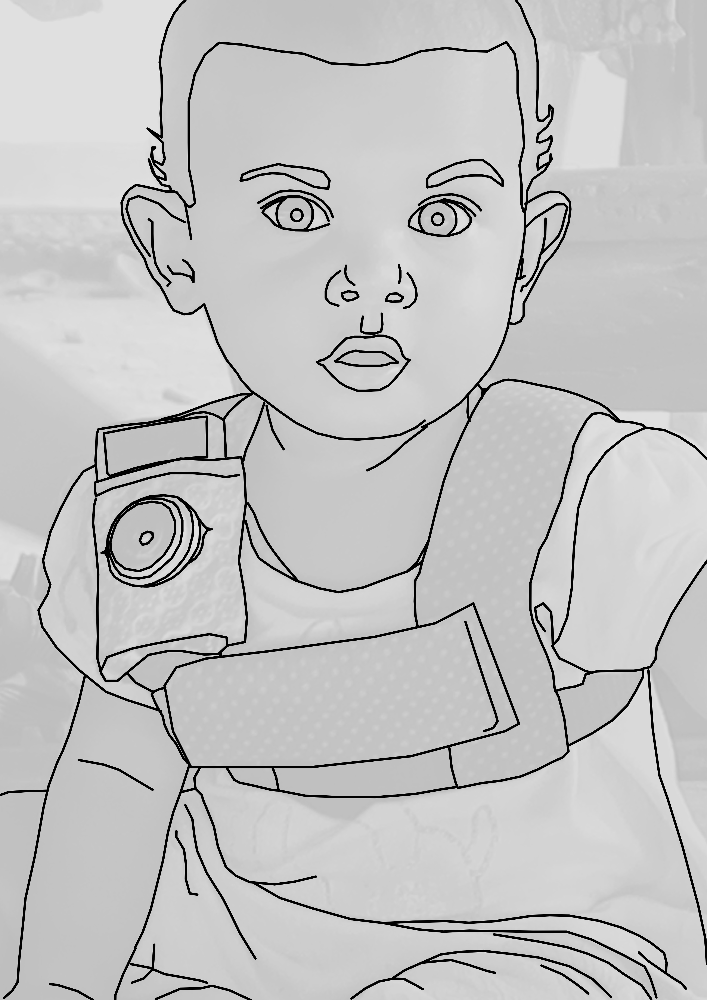

```{r load_packages, include=FALSE, echo=FALSE, warning=FALSE}
library(papaja)
library(ggplot2)
library(tidyverse)
library(viridis)
library(grid)
library(gridExtra)
#library(ggpirate)
library(lme4)
library(glmmTMB)
library(DHARMa)
library(bbmle)
library(broom.mixed)
source("0-Helper.R")
```

```{r analysis_presets, include=FALSE}
options(scipen=999)
data.path <- "transcripts/anon/" # text files exported from ELAN
metadata.path <- "metadata/"
plot.path <- "plots/" # output plots
shiny.input.path <- "shiny_input/"
shiny.input.img.path <- "www/"
seg.index.file <- paste0(metadata.path, "Segment-order-inventory.csv")
ptcp.info.file <- paste0(metadata.path, "recording-info.csv")
comparison.file <- paste0(metadata.path, "comparison_studies.csv")
samplelabels <- c("High activity  ", "Random  ")
col.sample.bu <- list(
  scale_fill_manual(labels=samplelabels, values=viridis(2)),
  scale_color_manual(labels=samplelabels, values=viridis(2)))
col.sample.bu3 <- list(
  scale_fill_manual(labels=samplelabels, values=viridis(3)),
  scale_color_manual(labels=samplelabels, values=viridis(3)))
allowed.overlap <- 1000 #ms
allowed.gap <- 2000 #ms
waking.hours <- 14
```

A great deal of work in developmental language science revolves around one central question: what kind of linguistic experience (and how much) is needed to support first language acquisition? In pursuing this topic, many researchers have fixed their sights on the speech addressed to children. In several languages, child-directed speech (CDS, speech designed for and directed toward a child recipient) has been demonstrated to be distinct from adult-directed speech (ADS) in that it is linguistically adapted for young listeners [e.g., @soderstrom2007beyond], interactionally rich [@bruner1983childs], preferred by infants [@manybabies2017], and facilitates early word learning [@cartmill2013quality; @hoff2003specificity; @rowe2008child; @weisleder2013talking].
<!--Due in part to its strong positive association with vocabulary size---a linguistic skill with economic value in modern post-industrial societies---CDS has also gained significant attention as a tool for 'successful' language development [REFS].-->

However, the role of CDS in typical language development is less clear once we take a broad view of the world's language learning environments. In any given linguistic community, the vast majority of children acquire the linguistic system and language behaviors that are needed for successful communication in the context in which they are raised. In many cases, prior ethnographic work suggests that successful adult-like communicative competence is typically achieved without frequent CDS [@brown2011cultural; @deleon2011language; @gaskins2006cultural; @ochs1984language]. If so, two important considerations arise: (a) while CDS is a powerful driver of learning in some contexts, it is unlikely to be universally fundamental for typical language development [@brown2014interactional; @brown2014language], and (b) we should do more to explore other types of linguistic experience and other features of the learning environment that allow children to extract the information they need to learn language, for example nearby speech addressed to other people.
<!--these cultural-linguistic contexts emphasize aspects of linguistic competence other than vocabulary size [@ochs1984language], undermining the idea that CDS is a universally crucial aspect of first language development. Indeed-->

Past work on child language development in communities with reportedly infrequent CDS [e.g., @brown2011cultural; @deleon2011language; @gaskins2006cultural; @ochs1984language] has tended to use rich linguistic and ethnographic methods that, while well-suited to characterizing language socialization, lack the quantitative rigor that would otherwise enable reproducible results derived from reasonably representative participant samples [but see @shneidman2012language]. This situation calls for work that applies quantitative methods from developmental language science in diverse ethnolinguistic contexts in order to build more robust theories of language learning. In this paper we investigate the language environment and early vocal development of 10 Tseltal Mayan children growing up in a community where caregivers have been previously reported to infrequently directly speak to young children [@brown1998conversational; @brown2011cultural; @brown2014interactional]. Our aims are to quantitatively ground these prior qualitative claims in order to reason about the fundamental factors for learning language in Tseltal Mayan (and similar) communities.

## Child-directed speech  {#intro-cds}
Prior work, conducted primarily in Western contexts, has shown that the amount of CDS children hear influences their language development; more CDS is associated with faster-growing receptive and productive vocabularies [e.g., @hart1995meaningful; @hoff2003specificity; @shneidman2012language], faster lexical retrieval [@weisleder2013talking], and faster syntactic development [@huttenlocher2010sources]. Given that CDS is designed for a child hearer, it is more likely than ADS or other-directed speech to align with the child's attention, and may thereby facilitate early language development. There are, however, a few caveats to the body of work relating CDS quantity and language development. We touch upon three issues here: its link to grammatical development, its varied use across activities, and its limited presence in other cultures.

First, while there is overwhelming evidence linking CDS quantity to vocabulary size, links to grammatical development are more scant [but see @brinchmann2019direct; @frankIPvariability; @huttenlocher2010sources]. While the advantage of CDS for referential word learning is clear, it is less obvious how it facilitates syntactic learning [@yurovsky2018communicative]. On the other hand, there is a wealth of evidence that syntactic knowledge is lexically specified [e.g., @lieven1997lexically], and that, cross-linguistically, children's vocabulary size is one of the most robust predictors of their early syntactic development [@frankIPvariability; @marchman2004language]---what is good for the lexicon may also be good for syntax.
<!-- For example, utterance length [a proxy for syntactic complexity; @wasow1997remarks] doesn't appear to increase with child age [@newport1977mother], and parents may be less likely to directly correct their children's syntactic errors than their semantic ones [@brown1997introduction; but see @chouinard2003adult]---sometimes themselves producing ungrammatical utterances to make individual words salient [@aslin1996models]. For now, a direct link between CDS and grammatical development still needs further exploration.-->

Second, most work on CDS quantity (i.e., how often children hear CDS) uses summary measures that average over the ebb and flow of the recorded session. In reality, verbal behaviors are highly temporally structured: infants' and adults' vocal behavior is clustered across multiple time scales of daylong recordings [@abney2017time], and nouns and verbs are used within short bursts separated by long periods across languages [@blasiIPhuman]. In fact, experimental work has shown that children sometimes learn better from bursty exposure to words [@schwab2016repetition].

What's more, the ebbs and flows in children's language exposure are likely to be associated with different activities during the day, each of which may carry their own linguistic profile (e.g., vocabulary used during bookreading vs. mealtime; @bruner1983childs; @tamislemonda2018routine). Different activities also elicit different quantities of talk; one study done in Canadian children's homes and daycares found that the highest density of adult speech came during storytime and organized playtimes (e.g., sing-alongs, painting)---these activities contained nearly twice as much talk as some others [e.g., mealtime; @soderstrom2013when]. Some of these activity-driven effects on CDS can even be observed based simply on time of day given the systematic timing of different activities in children's daily routines [@greenwood2011assessing; @soderstrom2013when]. If children indeed benefit from bursty, activity-driven patterns in CDS [@schwab2016repetition]---which appears to be characteristic of their input [@abney2017time; @blasiIPhuman; @bruner1983childs; @tamislemonda2018routine]---researchers should attend more to the typical range, distribution, and characteristics of the speech they encounter over the different parts of the day [@greenwood2011assessing; @soderstrom2013when].

Third, prior work has typically focused on Western (primarily North American) populations, limiting our ability to generalize effects of CDS to children elsewhere [@brown2014language; @henrich2010beyond; @nielsen2017persistent]. While we gain valuable insight by looking at within-population variation, we can more effectively find places where our assumptions break down by studying language development in communities that diverge meaningfully (linguistically and culturally) from those already well-studied. Linguistic anthropologists working in non-Western communities have long reported that caregiver-child interaction varies immensely from place to place, but that, despite this variation, children do not appear to show delays in the onset of major communicative benchmarks [e.g., pointing, first words; @brown2011cultural; @brown2014interactional; @brown2014language; @gaskins2006cultural; @liszkowski2012prelinguistic; @ochs1984language]. These findings have had a limited impact on mainstream theories of language development, partly due to a lack of directly comparable methods [@brown2014interactional; @brown2014language].

A number of recent or ongoing research projects have used standard psycholinguistic methods to investigate language-learning environments in traditional, non-Western communities, with several substantiating the claim that children in many parts of the world hear little CDS. Scaff, Cristia, and colleagues [-@cristia2017child; -@scaffIPlanguage] estimate, based on daylong recordings, that Tsimane children (Bolivian lowlands; forager-horticulturalist) hear a maximum of approximately 4.8 minutes of CDS per hour between ages 0;6 and 3;0 (Cristia et al., 2017; Scaff et al., in preparation; see also work by @vogt2015communicative with Mozambican infants). Shneidman and Goldin-Meadow [-@shneidman2012language] analyzed speech from one-hour at-home video recordings of children between 1;0 and 3;0 in a Yucatec Mayan and a North American community. Their analyses yielded four main findings: compared to the American children, (a) Yucatec children heard many fewer utterances per hour, (b) a much smaller proportion of the utterances they heard were child-directed, (c) the proportion of utterances that were child-directed increased dramatically with age, matching U.S. children's CDS proportion by 3;0, and (d) most of the added CDS in the Yucatec sample came from other children (e.g., older siblings/cousins). The lexical diversity of the CDS that Yucatec Mayan children heard at 24 months---particularly from adult speakers---predicted their vocabulary knowledge at 35 months, suggesting that CDS characteristics still play a role in that context. Notably, links between activity-type and CDS [e.g., @soderstrom2013when] have not yet been systematically investigated in any non-WEIRD community; known high-density CDS activities (e.g., bookreading) are reported to be vanishingly rare in some of these communities, and so the peaks in interactive talk may be associated with different routine activities at different times of day.

The current study aimed to address two of these three issues by using both daylong audio recordings and standard measures of vocal development to better understand how much CDS Tseltal Mayan children hear over the first three years of life, what times of day they are most likely to hear CDS, and how their spontaneous vocalizations change in maturity during that same period.
<!--For comparison, children from North American homes between ages 0;3 and 3;0 are estimated to hear ~11 minutes of CDS per hour in daylong recordings [@bergelsoncasillas2019what]. Note however, that these estimates from from a non-random sample of clips that were selected based on the presence of adult speech.-> 
<!--A growing number of researchers are using methods from developmental psycholinguistics to describe the linguistic development of children growing up in traditional or non-Western communities [see also @barrett2013early; @demuth2010three; @fortierURadhoc; @garcia2018thematic; @ganek2018using; @hernik2018infant]. We briefly highlight two recent efforts along these lines, but see Cristia and colleagues' [-@cristia2017child] and Mastin and Vogt's work [-@mastin2016infant; -@vogt2015communicative] for similar examples.-->
<!--Tsimane children also hear ~4.12 minutes of other-directed speech per hour (e.g., talk between adults) compared to the ~7 minutes per hour heard by young North American children [@bergelsoncasillas2019what]. This difference may be attributable to the fact that the Tsimane live in extended family clusters of 3--4 households, so speakers are typically in close proximity to 5--8 other people .-->

## Vocal maturity of spontaneous speech
Past ethnographic work has reported that, despite hearing little CDS, children in some contexts show no evidence of language delay [e.g., @brown2011cultural; @brown2014interactional; @brown2014language; @liszkowski2012prelinguistic]. We investigate this claim by comparing Tseltal children’s achievement of major speech production milestones to those already known for Western children. In so doing, we report on the ‘vocal maturity’ of Tseltal children’s spontaneous speech. Vocal maturity measures indicate children’s use of adult-like syllables when they vocalize, and are distinct from their overall rate of producing vocalizations. The vocal maturity measure we use here is designed to capture the transition from (a) non-canonical babble to canonical (‘speech-like’) babble, (b) canonical babble to first words, and (c) single-word utterances to multi-word utterances. This measure is, at best, a coarse approximation of children's true linguistic abilities, but it is an efficient means for getting a bird's eye view of children's speech as it becomes more linguistically complex over the first three years.
<!--The measure was originally designed with comparative language development in mind [REFS] and comes with tools for openly documenting and standardizing annotator training [REFS]. the data are not yet lemmatized or morphologically or syntactically annotated, but this would make it easier to do that quickly-->

Importantly, children's vocal maturity may be more subject to environmental factors as they grow older. The onset of canonical babbling during the first year appears to be overall relatively stable in response to variable language environments [e.g., @lee2018babbling; @oller1998late; @oller1995extreme]. That said, there is variation in the precise onset age of canonical babble; one longitudinal study showed an onset age range of 0;9 to 1;3 among British English-learning children [@mcgillion2017paves]. The same study showed that the age of onset for canonical babbling significantly predicted the age of onset for first words. Once children begin producing recognizable words, environmental effects become more apparent; vocabulary size---even very early vocabulary---is known to be sensitive to language environment factors such as maternal education and birth order [see, e.g., @frankIPvariability]. Early vocabulary size is also a robust cross-linguistic predictor of later syntactic development, including the age at which a child is likely to have begun combining words [@frankIPvariability; @marchman2004language]. Therefore, if we indeed find that Tseltal children hear relatively little CDS, prior literature would lead us to expect that the emergence of canonical babble would occur around the same age as it does in Western children, but that the emergence of single words and multi-word utterances would diverge from known middle-class Western norms. On the other hand, if prior ethnographic reports are accurate, then we should expect no sign of delay with respect to these vocal maturity benchmarks.

## The current study {#intro-currentstudy}
We examined the early language experience of 10 Tseltal Mayan children under age 3;0 using daylong photo-linked audio recordings. Prior ethnographic work suggests that Tseltal caregivers do not frequently directly speak to their children until the children themselves begin to actively initiate verbal interactions [@brown2014interactional; @brown2011cultural]. Nonetheless, Tseltal children develop language with no apparent delays [@brown2011cultural; @brown2014interactional; @liszkowski2012prelinguistic; see also @pye2017comparative]. We provide more details on the community and dataset in the [Methods section](#methods). We analyzed two basic measures of Tseltal children's language environments: (a) the quantity of speech directed to them (TCDS; target-child-directed speech) and (b) the quantity of other-directed speech (ODS; speech directed to anyone but the target child). We also then coarsely outline children's linguistic development using vocal maturity estimates from their spontaneous vocalizations.

Based on prior work, we predicted that Tseltal Mayan children would be infrequently directly addressed, that the amount of TCDS would increase with age, that most TCDS would come from other children, that TCDS would be most common during the morning and afternoon family gatherings, and that children's early vocal development would show no sign of delay with respect to known Western onset benchmarks.
<!-- We additionally predicted that children's language environments would be bursty---that high-intensity interactions would be brief and sparsely distributed throughout the day, accounting for the majority of children's daily TCDS.-->

# Method {#methods}
## Corpus {#methods-dataset}
The children in this dataset come from a small-scale, subsistence farming community in the highlands of Chiapas (Southern Mexico). The vast majority of children in the community grow up speaking Tseltal monolingually at home. Nuclear families are typically organized into patrilineal clusters of large, multi-generation households. <!--More than forty years of ethnographic work by the second author has supported the idea that Tseltal children's language environments are non-child-centered and non-object-centered-->Tseltal children's language environments have previously been characterized as non-child-centered and non-object-centered [@brown1998conversational; @brown2011cultural; @brown2014interactional].

During their waking hours, young infants are typically tied to their mother's back while she goes about her daily activities. The arc of a typical day for a mother might include waking and dressing for the day, a meal including most of the household, dispersal of household members for work in the field, at home, or elsewhere, a late afternoon snack with the most of the household now back home, visiting nearby family, food preparation for the next day, a final meal, and then dispersal for evening activities and, when it comes, sleep. If the mother goes to work in the field, the infant is sometimes left with other family members at home (e.g., an aunt or sibling), but is sometimes taken along. Young children are often cared for by other family members, especially older siblings, and may themselves begin to help watch their infant siblings once they reach age three and older.

Typically, TCDS is limited until children themselves begin to initiate interactions, usually around age 1;0. Interactional exchanges, when they do occur, are often brief or non-verbal (e.g., object exchange routines) and take place within a multi-participant context [@brown2014interactional]. Interactions tend to focus on appropriate actions and responses (not on words and their meanings), and young children are socialized to attend to the activities taking place around them [see also @deleon2011language; @rogoff2003firsthand]. By age five, most children are competent speakers who engage in daily chores and the caregiving of their younger siblings. The Tseltal approach to caregiving is similar to that described for other Mayan communities [e.g., @deleon2011language; @gaskins2000childrens; @pye1986quiche; @rogoff2003firsthand; @shneidman2012language].
<!--That said, other properties of Tseltal CDS may facilitate word and language learning, including conversational repetition and semantically specific verbs [@brown2011cultural]. -->
<!--Infants are rarely put on the ground. Therefore, children can't usually pick up the objects around them until they are old enough to walk. Toys are scarce and books are vanishingly rare, so the objects children do get their hands on tend to be natural or household objects (e.g., rocks, sticks, spoons, baskets, etc.). -->

The current data come from the Casillas HomeBank Corpus [@Casillas-HB], which includes raw daylong recordings and other developmental language data from more than 100 children under 4;0 across two small-scale, traditional indigenous communities: the Tseltal Mayan community described here and a Papua New Guinean community described elsewhere [@brown2011cultural; @brown2014interactional]. This Tseltal corpus, primarily collected in 2015, includes raw recordings from 55 children born to 43 mothers. The participating families typically only had 2 to 3 children (median = 2; range = 1--9), due to the fact that they come from a young subsample of the community (mothers: mean = 26.3 years; median = 25; range = 16--43 and fathers: mean = 30; median = 27; range = 17---52). Based on the ages of living children, we estimate that, on average, mothers were 20 years old when they had their first child (median = 19; range = 12--27), with a following average inter-child interval of 3 years (median = 2.8; range = 1--8.5). Twenty-eight percent of the participating families had two children under 4;0. Household size, defined in our dataset as the number of people sharing a kitchen or other primary living space, ranged between 3 and 15 people (mean = 7.2; median = 7). Although 32.7% of the target children are first-born, they were rarely the only child in their household. Most mothers had finished primary school (37%; 6 years of education) or secondary school (30%; 9 years of education), with a few more having completed preparatory school (12%; 12 years of education) or some university-level training (2% (one mother); 16 years of education); the remainder (23%) had no schooling or did not complete primary school. All fathers had finished primary school, with most completing secondary school (44%) or preparatory school (21%), and two completing some university-level training (5%). To our knowledge at the time of recording, all children were typically developing. 
<!--While 93% of the fathers grew up in the village where the recordings took place, only 53% of the mothers did because of the way clan membership influences marriage and land inheritance.-->

When possible, we collected dates of birth for children using a medical record card typically provided by the local health clinic within two weeks of birth. However, some children do not have this card. Cards are also sometimes created long after a child’s birth. We asked all parents to also tell us the approximate date of birth of the child, the child's age, and an estimate of the time between the child's birth and creation of the medical record card. We used these multiple sources of information to triangulate the child's most likely date of birth if the medical record card appeared to be unreliable, following up for more details from the families if necessary.

We used a novel combination of a lightweight stereo audio recorder (Olympus WS-832) and wearable photo camera (Narrative Clip 1) fitted with a fish-eye lens to track children's interactions over the course of a 9--11-hour period at home in which the experimenter was not present. Ambulatory children wore both devices at once (as shown in [Figure 1](#fig1)) while other children wore the recorder in a onesie while their primary caregiver wore the camera on an elastic vest. The camera was set to take photos at 30-second intervals and was synchronized to the audio in post-processing to generate snapshot-linked audio (media post-processing scripts at: https://github.com/marisacasillas/Weave). We used these recordings to capture a wide range of the linguistic patterns children encounter as they participate in different activities over the course of their day [@bergelson2018day; @greenwood2011assessing; @tamislemonda2018routine]. Participant consent processes and data collection were conducted in accordance with ethical guidelines approved by the Radboud University Social Sciences Ethics Committee.

``` {r fig1, echo=FALSE, fig.align = "center", fig.cap="The recording vest included an Olympus audio recorder in the front horizontal pocket and a miniature camera with a fish-eye lens on the shoulder strap.", out.width = '30%'}

```


```{r prepare_data, message=FALSE, warning=FALSE, include=FALSE, paged.print=FALSE}
# Read in annotation files
files <- list.files(path=data.path,pattern="*.txt")
all.data <- data.frame()
for (i in 1:length(files)) {
#  print(files[i])
  newfile <- read_csv(paste0(data.path, files[i]),
                      col_types = cols(val = col_character()))
  newfile$aclew_child_id <- unlist(strsplit(files[i], '\\.'))[1]
  all.data <- rbind(all.data, newfile)
}
all.data$row <- c(1:nrow(all.data))

# Read in supplementary data
ptcp.info <- read_csv(ptcp.info.file, col_types = cols()) %>%
  dplyr::select(-row)
seg.info <- read_csv(seg.index.file)

# Extract and convert start time of each sample
seg.info$start.hhmmss <- regmatches(seg.info$Media,
                                    regexpr("[[:digit:]]{6}", seg.info$Media))
seg.info$start.sec <- as.numeric(substr(seg.info$start.hhmmss,1,2))*3600 +
  as.numeric(substr(seg.info$start.hhmmss,3,4))*60 +
  as.numeric(substr(seg.info$start.hhmmss,5,6))
seg.info$start.hr <- round(seg.info$start.sec/3600, 3)

seg.info$clipoffset.hhmmss <- regmatches(seg.info$Media,
                                    regexpr("(?<=[[:digit:]]{6}_)[[:digit:]]{6}",
                                            seg.info$Media, perl = TRUE))
seg.info$clipoffset.sec <- as.numeric(substr(seg.info$clipoffset.hhmmss,1,2))*3600 +
  as.numeric(substr(seg.info$clipoffset.hhmmss,3,4))*60 +
  as.numeric(substr(seg.info$clipoffset.hhmmss,5,6))
seg.info$clipoffset.hr <- round(seg.info$clipoffset.sec/3600, 3)

# Add mean and sd values for participant-level predictors to ptcp.info
ptcp.info <- ptcp.info %>%
  mutate(
    tchiyr.m = mean(age_mo_round),
    motyr.m = mean(mother_age),
    nsb.m = mean(number_older_sibs),
    hsz.m = mean(household_size),
    tchiyr.sd = sd(age_mo_round),
    motyr.sd = sd(mother_age),
    nsb.sd = sd(number_older_sibs),
    hsz.sd = sd(household_size)
    )

# Merge in participant and segment info to the main data table
codes <- all.data %>% filter(tier == "code")

all.data <- all.data %>%
  filter(speaker != "") %>%
  left_join(ptcp.info, by = "aclew_child_id") %>%
  mutate(segment = "", sample = "",
         sample_type = "", segment_dur = 0)

for (i in 1:nrow(codes)) {
  rec <- codes$aclew_child_id[i]
  seg <- as.character(codes$val[i])
  seg.on <- codes$start[i]
  seg.off <- codes$stop[i]
  seg.idx <- which(all.data$aclew_child_id == rec &
                     all.data$start < seg.off &
                     all.data$stop > seg.on)
  all.data$segment[seg.idx] <- seg
}

# Label samples
all.data$sample[which(
  grepl('^random', all.data$segment))] <- "random"
all.data$sample[which(
  grepl('tt', all.data$segment))] <- "turn-taking"
all.data$sample[which(
  grepl('va', all.data$segment))] <- "high-activity"

# Label sample types and durations
random.samples <- which(grepl('^random', all.data$segment))
all.data$sample_type[random.samples] <- "random"
all.data$segment_dur[random.samples] <- 5

ext.samples <- which(grepl('^extension', all.data$segment))
all.data$sample_type[ext.samples] <- "extension"
all.data$segment_dur[ext.samples] <- 5

tt.samples <- which(grepl('^tt', all.data$segment))
all.data$sample_type[tt.samples] <- "turn-taking"
all.data$segment_dur[tt.samples] <- 1

va.samples <- which(grepl('^va', all.data$segment))
all.data$sample_type[va.samples] <- "high-activity"
all.data$segment_dur[va.samples] <- 1

# Add in segment start time
all.data <- all.data %>%
  left_join(dplyr::select(seg.info, c("aclew_id", "CodeName", "start.hhmmss",
                                      "start.sec", "start.hr")),
            by = c("aclew_child_id" = "aclew_id", "segment" = "CodeName"))

avg.utt.len.tseltal <- all.data %>%
  filter(speaker != "CHI") %>%
  dplyr::select(dur) %>%
  summarise(mean.utt.len = mean(dur),
            median.utt.len = median(dur))
```

## Data selection and annotation {#methods-samples}
Although the Tseltal corpus contains more than 500 hours of raw photo-linked audio, very little of it is useful without adding manual annotation. We estimated that we could fully transcribe approximately 10 hours of the corpus over the course of three 6-week field stays in the village between 2015 and 2018, given full-time help from a native member of the community on each trip. This estimate was approximately correct: average exhaustive transcription time for one minute of audio was around 50 minutes, given that many clips featured overlapping multi-speaker talk and/or significant background noise. Given the resource-intensive nature of annotation, we strategically sampled clips in a way that would let us ask about age-related changes in children's language experience, but with enough data per child to generate accurate estimates of their individual speech environments. Our solution was as follows:

We chose 10 children's recordings based on maximal spread in child age (0;0--3;0), child sex, and maternal education ([Table 1](#tab1); all had native Tseltal-speaking parents). We selected one hour's worth of non-overlapping clips for transcription from each recording in the following order: nine randomly selected 5-minute clips, five manually selected 1-minute top 'turn-taking' clips, five manually selected 1-minute top 'vocal activity' clips, and one manually selected 5-minute extension of the ‘best’ 1-minute clip (i.e., the clip with the most variable, most voluble interactive language use for that recording see Figure 2 for the clip distribution within recordings). The idea in creating these different subsamples was to measure properties of (a) children's _average_ language environments, (b) children's most _interactive-input-dense_ language environments, and (c) children's most _mature vocal behavior_, with these three sub-samples known as the "random", "turn-taking", and "vocal activity" samples, respectively. All the samples were taken between the moment the experimenter departed and the moment she returned.

```{r demog_table_prep, message=FALSE, warning=FALSE, include=FALSE, paged.print=FALSE}
sample.demog <- ptcp.info %>%
  mutate(mat_age_rd = as.integer(round(mother_age, 0)),
         fat_age_rd = as.integer(round(father_age, 0)),
         hszrd = as.integer(round(household_size + 1, 0))) %>%
  select(age_childes, child_sex, mat_age_rd, mat_ed, hszrd) %>%
  rename("Age" = age_childes, "Sex" = child_sex,
         "Mother's age" = mat_age_rd, "Level of maternal education" = mat_ed,
         "People in household" = hszrd)
```

```{r tab1, echo=FALSE, results='asis', message=FALSE, warning=FALSE}
apa_table(sample.demog, caption="Demographic overview of the 10 children whose recordings are sampled in the current study, including from left to right: child's age (years;months.days); child's sex (M/F); mother's age (years); level of maternal education (none/primary/secondary/preparatory/university); and the number of people living in the child's household.")
```

The turn-taking and high-activity clips were chosen by two trained annotators (the first author and a student assistant) who listened to each raw recording in its entirety at 1--2x speed while actively taking notes about potentially useful clips. The first author then reviewed the list of candidate clips and chose the best five 1-minute samples for each of the two activity types. Note that, because the manually selected clips did not overlap with the initial "random" clip selection, the "true" peak turn-taking and vocal-activity clips for the day could have possibly occurred during the random clips. High-quality turn-taking activity was defined as closely timed sequences of contingent vocalization between the target child and at least one other person (i.e., frequent vocalization exchanges). High-quality vocal activity clips were defined as periods in which the target child produced the most and most diverse spontaneous (i.e., not imitative) vocalizations (full instructions at https://git.io/fhdUm).

```{r fig2, echo=FALSE, fig.cap="Recording duration (black line) and sampled clips (colored boxes) for each of the 10 recordings analyzed, sorted by child age in months.", message=FALSE, warning=FALSE, fig.height=4}
ptcp.info <- mutate(ptcp.info,
                    rec.start.hr = lubridate::hour(start_of_recording) +
                      lubridate::minute(start_of_recording)/60 +
                      lubridate::second(start_of_recording)/3600,
                    rec.stop.hr = rec.start.hr + length_of_recording/3600) %>%
  arrange(age_mo_round) %>%
  mutate(order = seq(1:10))

used.clips <- seg.info %>%
  filter(Include == 1) %>%
  left_join(ptcp.info, by = c("aclew_id" = "aclew_child_id")) %>%
  mutate(clip.dur = ifelse(grepl(('random'), CodeName), 5,
                           ifelse(grepl('extension', CodeName), 6, 1)),
         sample.type = ifelse(grepl(('random'), CodeName), "Random",
                           ifelse(grepl('tt', CodeName),
                                  "Turn taking", "Vocal activity")))
used.clips$sample.type = factor(used.clips$sample.type,
                                levels = c("Random", "Turn taking", "Vocal activity"))
  
clip.distribution <- ggplot() +
  geom_segment(data = ptcp.info,
               aes(x = rec.start.hr, y = order, xend = rec.stop.hr, yend = order)) +
  geom_segment(data = used.clips,
               aes(x = start.hr, y = order, xend = start.hr + clip.dur/60, yend = order,
                   color = sample.type), size = 3) +
  theme_apa() +
  theme(legend.position = "bottom") +
  scale_x_continuous(breaks = 7:21) +
  scale_y_continuous(breaks = 1:10, labels = ptcp.info$age_mo_round) +
  ylab("Child age (mo)") + xlab("Time of day (hr)") + labs(color = "Sample type") +
  scale_color_manual(values = c(viridis(3)[1], viridis(3)[2], "blue"))
clip.distribution
```

The 10 hours of clips were then jointly transcribed and annotated by the first author and a native speaker of Tseltal who personally knows all the recorded families. Transcription was done in ELAN [@ELAN] using the ACLEW Annotation Scheme [full documentation at https://osf.io/b2jep/wiki/home/, @casillas2017ACLEWDAS]. Utterance-level annotations included: an orthographic transcription (Tseltal), a loose translation (Spanish), a vocal maturity rating for each target child utterance (non-linguistic/non-canonical babbling/canonical babbling/single words/multiple words), and the intended addressee type for all non-target-child utterances (target-child/other-child/adult/adult-and-child/animal/other-speaker-type). Intended addressee was determined using contextual and interactional information from the photos, audio, and preceding and following footage; utterances with no clear intended addressee were marked as 'unsure'. We annotated lexical utterances as single- or multi-word based on the word boundaries provided by the single native speaker who reviewed all transcriptions. Note that Tseltal is a mildly polysynthetic language, so words typically contain multiple morphemes. We did not annotate individual activity types in the clips; we instead use time of day as a proxy for the activities and daily routines associated with subsistence farming and family life in this community (see above).

## Data analysis {#methods-analysisinfo}
In what follows we first describe Tseltal children's speech environments based on the nine randomly selected 5-minute clips from each child. We investigate the effects of child age, time of day, household size, and number of speakers on both TCDS min/hr and ODS min/hr. We then repeat these analyses, only now looking at the high "turn-taking" clips. Finally, we wrap up by outlining a coarse trajectory of Tseltal children's early vocal development.

## Statistical models
All analyses were conducted in R with generalized linear mixed-effects regressions using the glmmTMB package, and all plots were generated with ggplot2 [@brooks2017modeling; @R-ggplot2; @R-base]. All data and analysis code can be found at https://github.com/marisacasillas/Tseltal-CLE Notably, both speech environment measures are naturally restricted to non-negative (0--infinity) values. This implicit boundary restriction at zero causes the distributional variance of the measures to become non-gaussian (i.e., with a long right tail). We handle this issue by using a negative binomial linking function in the regression, which estimates a dispersion parameter (in addition to the mean and variance) that allows the model to more closely fit our non-negative, overdispersed data [@brooks2017modeling; @smithson2013generalized]. When, in addition to this, extra cases of zero were evident in the distribution (e.g., TCDS min/hr was zero because the child was alone), we also added a zero-inflation model to the regression. A zero-inflation negative binomial regression creates two models: (a) a binary model to evaluate the likelihood of none vs. some presence of the variable (e.g., no vs. some TCDS) and (b) a count model of the variable (e.g., '3' vs. '5' TCDS min/hr), using the negative binomial distribution as the linking function. Alternative, gaussian linear mixed-effects regressions with logged dependent variables are available in the Supplementary Materials, but the results are broadly similar to what we report here.

# Results {#results}
Our model predictors were as follows: child age (months), household size (number of people), and number of non-target-child speakers present in that clip, all centered and standardized, plus time of day at the start of the clip (as a factor; "morning" = up until 11:00; "midday" = 11:00--13:00; and "afternoon" = 13:00 onwards). In addition, the model included two-way interactions between child age and: (a) the number of speakers present, (b) household size, and (c) time of day. We also added a random effect of child. For the zero-inflation models, we included the number of speakers present. We only report significant effects in the main text; full model outputs are available in the Supplementary Materials.

```{r quantity_prep, message=FALSE, warning=FALSE, include=FALSE, paged.print=FALSE}
# RANDOM
# Get min/hr speech measures
n.unique.rand.segs <- length(unique(all.data$segment[grepl("random", all.data$segment)]))
n.unique.recs <- length(unique(all.data$aclew_child_id))
all.rand.segments <- tibble(
  aclew_child_id = rep(unique(all.data$aclew_child_id),
                n.unique.rand.segs),
  segment = rep(unique(all.data$segment[grepl("random", all.data$segment)]),
                n.unique.recs))
# XDS
xds.per.seg.rand <- all.data %>%
  filter(sample == "random" & speaker != "CHI" &
           grepl("xds@", tier)) %>%
  group_by(aclew_child_id, segment, segment_dur) %>%
  summarise(xds_min = round(sum(dur)/60000,3)) %>%
  full_join(all.rand.segments, by = c("aclew_child_id", "segment")) %>%
  replace_na(list(segment_dur = 5, xds_min = 0)) %>%
  mutate(xds_mph = (xds_min/segment_dur)*60) %>%
  arrange(aclew_child_id, segment)
# ODS
ods.per.seg.rand <- all.data %>%
  filter(sample == "random" & speaker != "CHI" &
           grepl("xds@", tier) & val != "T") %>%
  group_by(aclew_child_id, segment, segment_dur) %>%
  summarise(ods_min = round(sum(dur)/60000,3)) %>%
  full_join(all.rand.segments, by = c("aclew_child_id", "segment")) %>%
  replace_na(list(segment_dur = 5, ods_min = 0)) %>%
  mutate(ods_mph = (ods_min/segment_dur)*60) %>%
  arrange(aclew_child_id, segment)
# TDS
tds.per.seg.rand <- all.data %>%
  filter(sample == "random" & speaker != "CHI" &
           grepl("xds@", tier) & val == "T") %>%
  group_by(aclew_child_id, segment, segment_dur) %>%
  summarise(tds_min = round(sum(dur)/60000,3)) %>%
  full_join(all.rand.segments, by = c("aclew_child_id", "segment")) %>%
  replace_na(list(segment_dur = 5, tds_min = 0)) %>%
  mutate(tds_mph = (tds_min/segment_dur)*60) %>%
  arrange(aclew_child_id, segment)
# All CDS
cds.per.seg.rand <- all.data %>%
  filter(sample == "random" & speaker != "CHI" &
           grepl("xds@", tier) & (val == "T" | val == "C")) %>%
  group_by(aclew_child_id, segment, segment_dur) %>%
  summarise(cds_min = round(sum(dur)/60000,3)) %>%
  full_join(all.rand.segments, by = c("aclew_child_id", "segment")) %>%
  replace_na(list(segment_dur = 5, cds_min = 0)) %>%
  mutate(cds_mph = (cds_min/segment_dur)*60) %>%
  arrange(aclew_child_id, segment)
# Number of speakers per clip
spkrs.per.seg.rand <- all.data %>%
  filter(sample == "random" & speaker != "CHI" &
           !(grepl("@", tier))) %>%
  group_by(aclew_child_id, segment) %>%
  summarise(n_spkrs_clip = length(unique(speaker)))
# All together
quantity.rand <- xds.per.seg.rand %>%
  full_join(ods.per.seg.rand, by = c("aclew_child_id", "segment", "segment_dur")) %>%
  full_join(tds.per.seg.rand, by = c("aclew_child_id", "segment", "segment_dur")) %>%
  full_join(cds.per.seg.rand, by = c("aclew_child_id", "segment", "segment_dur")) %>%
  full_join(spkrs.per.seg.rand, by = c("aclew_child_id", "segment")) %>%
  left_join(dplyr::select(seg.info, c("aclew_id", "CodeName", "start.hr")),
            by = c("aclew_child_id" = "aclew_id", "segment" = "CodeName")) %>%
  full_join(ptcp.info, by = "aclew_child_id") %>%
  replace_na(list(xds_min = 0, xds_mph = 0,
                  tds_min = 0, tds_mph = 0,
                  cds_min = 0, cds_mph = 0,
                  n_spkrs_clip = 0)) %>%
  mutate(prop_tds = tds_min/xds_min)
  # Don't replace NAs with 0s in this case; proportion is not meaningful w/o any speech
quantity.rand.bychild <- quantity.rand %>%
  group_by(aclew_child_id) %>%
  summarise(
    xds_min = mean(xds_min),
    xds_mph = mean(xds_mph),
    ods_min = mean(ods_min),
    ods_mph = mean(ods_mph),
    tds_min = mean(tds_min),
    tds_mph = mean(tds_mph),
    cds_min = mean(cds_min),
    cds_mph = mean(cds_mph),
    prop_tds = mean(prop_tds, na.rm = TRUE),
    m_n_spkrs = mean(n_spkrs_clip)) %>%
  full_join(ptcp.info, by = "aclew_child_id")

# Get xds and tds min/hr by speaker type
all.data$SpkrAge <- "Not known"
all.data$SpkrAge[grepl("FA|MA|UA", all.data$speaker)] <- "Adult"
all.data$SpkrAge[grepl("FC|MC|UC", all.data$speaker)] <- "Child"
all.rand.segments.sa <- tibble(
  aclew_child_id = rep(unique(all.data$aclew_child_id),
                2*n.unique.rand.segs),
  segment = rep(unique(all.data$segment[grepl("random", all.data$segment)]),
                2*n.unique.recs),
  SpkrAge = c(rep("Adult", (n.unique.rand.segs * n.unique.recs)),
              rep("Child", (n.unique.rand.segs * n.unique.recs))))

# Add in speaker sex
all.data$SpkrSex <- "Not known"
all.data$SpkrSex[grepl("FA|FC|FU", all.data$speaker)] <- "Female"
all.data$SpkrSex[grepl("MA|MC|MU", all.data$speaker)] <- "Male"
all.rand.segments.age.sx <- tibble(
  aclew_child_id = rep(unique(all.data$aclew_child_id),
                4*n.unique.rand.segs),
  segment = rep(unique(all.data$segment[grepl("random", all.data$segment)]),
                4*n.unique.recs),
  SpkrAge = c(rep("Adult", (n.unique.rand.segs * n.unique.recs)),
              rep("Child", (n.unique.rand.segs * n.unique.recs)),
              rep("Adult", (n.unique.rand.segs * n.unique.recs)),
              rep("Child", (n.unique.rand.segs * n.unique.recs))),
  SpkrSex = c(rep("Female", (n.unique.rand.segs * (2 * n.unique.recs))),
              rep("Male", (n.unique.rand.segs * (2 * n.unique.recs)))))

# XDS
xds.per.seg.rand.sa <- all.data %>%
  filter(sample == "random" & speaker != "CHI" & SpkrAge != "Not known" &
           grepl("xds@", tier)) %>%
  group_by(aclew_child_id, SpkrAge, segment, segment_dur) %>%
  summarise(xds_min.sa = round(sum(dur)/60000,3)) %>%
  full_join(all.rand.segments.sa, by = c("aclew_child_id", "segment", "SpkrAge")) %>%
  replace_na(list(segment_dur = 5, xds_min.sa = 0)) %>%
  mutate(xds_mph.sa = (xds_min.sa/segment_dur)*60) %>%
  arrange(aclew_child_id, segment, SpkrAge)
# ODS
ods.per.seg.rand.sa <- all.data %>%
  filter(sample == "random" & speaker != "CHI" & SpkrAge != "Not known" &
           grepl("xds@", tier) & val != "T") %>%
  group_by(aclew_child_id, SpkrAge, segment, segment_dur) %>%
  summarise(ods_min.sa = round(sum(dur)/60000,3)) %>%
  full_join(all.rand.segments.sa, by = c("aclew_child_id", "segment", "SpkrAge")) %>%
  replace_na(list(segment_dur = 5, ods_min.sa = 0)) %>%
  mutate(ods_mph.sa = (ods_min.sa/segment_dur)*60) %>%
  arrange(aclew_child_id, segment, SpkrAge)
# TDS
tds.per.seg.rand.sa <- all.data %>%
  filter(sample == "random" & speaker != "CHI" & SpkrAge != "Not known" &
           grepl("xds@", tier) & val == "T") %>%
  group_by(aclew_child_id, SpkrAge, segment, segment_dur) %>%
  summarise(tds_min.sa = round(sum(dur)/60000,3)) %>%
  full_join(all.rand.segments.sa, by = c("aclew_child_id", "segment", "SpkrAge")) %>%
  replace_na(list(segment_dur = 5, tds_min.sa = 0)) %>%
  mutate(tds_mph.sa = (tds_min.sa/segment_dur)*60) %>%
  arrange(aclew_child_id, segment, SpkrAge)
# All CDS
cds.per.seg.rand.sa <- all.data %>%
  filter(sample == "random" & speaker != "CHI" & SpkrAge != "Not known" &
           grepl("xds@", tier) & (val == "T" | val == "C")) %>%
  group_by(aclew_child_id, SpkrAge, segment, segment_dur) %>%
  summarise(cds_min.sa = round(sum(dur)/60000,3)) %>%
  full_join(all.rand.segments.sa, by = c("aclew_child_id", "segment", "SpkrAge")) %>%
  replace_na(list(segment_dur = 5, cds_min.sa = 0)) %>%
  mutate(cds_mph.sa = (cds_min.sa/segment_dur)*60) %>%
  arrange(aclew_child_id, segment, SpkrAge)
# Number of speakers per clip
spkrs.per.seg.rand.sa <- all.data %>%
  filter(sample == "random" & speaker != "CHI" & SpkrAge != "Not known" &
           !(grepl("@", tier))) %>%
  group_by(aclew_child_id, SpkrAge, segment) %>%
  summarise(n_spkrs_clip = length(unique(speaker)))
# All together
quantity.rand.sa <- xds.per.seg.rand.sa %>%
  full_join(ods.per.seg.rand.sa, by = c("aclew_child_id", "SpkrAge",
                                        "segment", "segment_dur")) %>%
  full_join(tds.per.seg.rand.sa, by = c("aclew_child_id", "SpkrAge",
                                        "segment", "segment_dur")) %>%
  full_join(cds.per.seg.rand.sa, by = c("aclew_child_id", "SpkrAge",
                                        "segment", "segment_dur")) %>%
  full_join(dplyr::select(quantity.rand, c("aclew_child_id", "segment", "tds_min")),
            by = c("aclew_child_id", "segment")) %>%
  full_join(spkrs.per.seg.rand.sa, by = c("aclew_child_id", "SpkrAge", "segment")) %>%
  left_join(dplyr::select(seg.info, c("aclew_id", "CodeName", "start.hr")),
            by = c("aclew_child_id" = "aclew_id", "segment" = "CodeName")) %>%
  full_join(ptcp.info, by = "aclew_child_id") %>%
  replace_na(list(xds_min.sa = 0, xds_mph.sa = 0,
                  ods_min.sa = 0, ods_mph.sa = 0,
                  tds_min.sa = 0, tds_mph.sa = 0,
                  cds_min.sa = 0, cds_mph.sa = 0,
                  n_spkrs_clip = 0)) %>%
  mutate(prop_tds.sa = tds_min.sa/xds_min.sa,
         prop_sa.tds = tds_min.sa/tds_min)
  # Don't replace NAs with 0s in this case; proportion is not meaningful w/o any speech


# NON-RANDOM
# Get min/hr speech measures
all.nonrand.segments <- seg.info %>%
  filter(!(grepl("random", CodeName))) %>%
  select(aclew_id, CodeName) %>%
  rename(aclew_child_id = aclew_id, segment = CodeName)
all.nonrand.segments$sample <- ifelse(grepl("va", all.nonrand.segments$segment),
                                      "high-activity","turn-taking")
all.nonrand.segments$sample_type <- ifelse(
  grepl("^va", all.nonrand.segments$segment), "high-activity",
  ifelse(grepl("^tt", all.nonrand.segments$segment),"turn-taking",
                                        "extension"))
# XDS
xds.per.seg.nonrand <- all.data %>%
  filter(sample != "random" & speaker != "CHI" &
           grepl("xds@", tier)) %>%
  group_by(aclew_child_id, segment, segment_dur) %>%
  summarise(xds_min = round(sum(dur)/60000,3)) %>%
  full_join(all.nonrand.segments, by = c("aclew_child_id", "segment")) %>%
  replace_na(list(segment_dur = 1, xds_min = 0)) %>%
  mutate(segment_dur = ifelse(grepl("ext", segment), 5, 1),
         xds_mph = (xds_min/segment_dur)*60) %>%
  arrange(aclew_child_id, segment)
# ODS
ods.per.seg.nonrand <- all.data %>%
  filter(sample != "random" & speaker != "CHI" &
           grepl("xds@", tier) & val != "T") %>%
  group_by(aclew_child_id, segment, segment_dur) %>%
  summarise(ods_min = round(sum(dur)/60000,3)) %>%
  full_join(all.nonrand.segments, by = c("aclew_child_id", "segment")) %>%
  replace_na(list(segment_dur = 1, ods_min = 0)) %>%
  mutate(segment_dur = ifelse(grepl("ext", segment), 5, 1),
         ods_mph = (ods_min/segment_dur)*60) %>%
  arrange(aclew_child_id, segment)
# TDS
tds.per.seg.nonrand <- all.data %>%
  filter(sample != "random" & speaker != "CHI" &
           grepl("xds@", tier) & val == "T") %>%
  group_by(aclew_child_id, segment, segment_dur) %>%
  summarise(tds_min = round(sum(dur)/60000,3)) %>%
  full_join(all.nonrand.segments, by = c("aclew_child_id", "segment")) %>%
  replace_na(list(segment_dur = 1, tds_min = 0)) %>%
  mutate(segment_dur = ifelse(grepl("ext", segment), 5, 1),
         tds_mph = (tds_min/segment_dur)*60) %>%
  arrange(aclew_child_id, segment)
# All CDS
cds.per.seg.nonrand <- all.data %>%
  filter(sample != "random" & speaker != "CHI" &
           grepl("xds@", tier) & (val == "T" | val == "C")) %>%
  group_by(aclew_child_id, segment, segment_dur) %>%
  summarise(cds_min = round(sum(dur)/60000,3)) %>%
  full_join(all.nonrand.segments, by = c("aclew_child_id", "segment")) %>%
  replace_na(list(segment_dur = 1, cds_min = 0)) %>%
  mutate(segment_dur = ifelse(grepl("ext", segment), 5, 1),
         cds_mph = (cds_min/segment_dur)*60) %>%
  arrange(aclew_child_id, segment)
# Number of speakers per clip
spkrs.per.seg.nonrand <- all.data %>%
  filter(sample != "random" & speaker != "CHI" & SpkrAge != "Not known" &
           !(grepl("@", tier))) %>%
  group_by(aclew_child_id, segment) %>%
  summarise(n_spkrs_clip = length(unique(speaker)))
# All together
quantity.nonrand <- xds.per.seg.nonrand %>%
  full_join(ods.per.seg.nonrand, by = c("aclew_child_id", "segment",
                                        "segment_dur", "sample", "sample_type")) %>%
  full_join(tds.per.seg.nonrand, by = c("aclew_child_id", "segment",
                                        "segment_dur", "sample", "sample_type")) %>%
  full_join(cds.per.seg.nonrand, by = c("aclew_child_id", "segment",
                                        "segment_dur", "sample", "sample_type")) %>%
  full_join(ptcp.info, by = "aclew_child_id") %>%
  full_join(spkrs.per.seg.nonrand, by = c("aclew_child_id", "segment")) %>%
  left_join(dplyr::select(seg.info, c("aclew_id", "CodeName", "start.hr")),
            by = c("aclew_child_id" = "aclew_id", "segment" = "CodeName")) %>%
  replace_na(list(xds_min = 0, xds_mph = 0,
                  ods_min = 0, ods_mph = 0,
                  tds_min = 0, tds_mph = 0,
                  cds_min = 0, cds_mph = 0,
                  n_spkrs_clip = 0)) %>%
  mutate(prop_tds = tds_min/xds_min)
  # Don't replace NAs with 0s in this case; proportion is not meaningful w/o any speech
quantity.nonrand.bychild <- quantity.nonrand %>%
  group_by(aclew_child_id, sample) %>%
  summarise(
    xds_min = mean(xds_min),
    xds_mph = mean(xds_mph),
    ods_min = mean(ods_min),
    ods_mph = mean(ods_mph),
    tds_min = mean(tds_min),
    tds_mph = mean(tds_mph),
    cds_min = mean(cds_min),
    cds_mph = mean(cds_mph),
    prop_tds = mean(prop_tds, na.rm = TRUE),
    m_n_spkrs = mean(n_spkrs_clip)) %>%
  full_join(ptcp.info, by = "aclew_child_id")

# Get xds and tds min/hr by speaker type
all.nonrand.segments.sa <- tibble(
  aclew_child_id = rep(all.nonrand.segments$aclew_child_id, 2),
  segment = rep(all.nonrand.segments$segment, 2),
  sample = rep(all.nonrand.segments$sample, 2),
  sample_type = rep(all.nonrand.segments$sample_type, 2),
  SpkrAge = c(rep("Adult", nrow(all.nonrand.segments)),
              rep("Child", nrow(all.nonrand.segments))))
# XDS
xds.per.seg.nonrand.sa <- all.data %>%
  filter(sample != "random" & speaker != "CHI" & SpkrAge != "Not known" &
           grepl("xds@", tier)) %>%
  group_by(aclew_child_id, SpkrAge, segment, segment_dur) %>%
  summarise(xds_min.sa = round(sum(dur)/60000,3)) %>%
  full_join(all.nonrand.segments.sa, by = c("aclew_child_id", "segment", "SpkrAge")) %>%
  replace_na(list(segment_dur = 1, xds_min.sa = 0)) %>%
  mutate(segment_dur = ifelse(grepl("ext", segment), 5, 1),
         xds_mph.sa = (xds_min.sa/segment_dur)*60) %>%
  arrange(aclew_child_id, segment, SpkrAge)
# ODS
ods.per.seg.nonrand.sa <- all.data %>%
  filter(sample != "random" & speaker != "CHI" & SpkrAge != "Not known" &
           grepl("xds@", tier) & val != "T") %>%
  group_by(aclew_child_id, SpkrAge, segment, segment_dur) %>%
  summarise(ods_min.sa = round(sum(dur)/60000,3)) %>%
  full_join(all.nonrand.segments.sa, by = c("aclew_child_id", "segment", "SpkrAge")) %>%
  replace_na(list(segment_dur = 1, ods_min.sa = 0)) %>%
  mutate(segment_dur = ifelse(grepl("ext", segment), 5, 1),
         ods_mph.sa = (ods_min.sa/segment_dur)*60) %>%
  arrange(aclew_child_id, segment, SpkrAge)
# TDS
tds.per.seg.nonrand.sa <- all.data %>%
  filter(sample != "random" & speaker != "CHI" & SpkrAge != "Not known" &
           grepl("xds@", tier) & val == "T") %>%
  group_by(aclew_child_id, SpkrAge, segment, segment_dur) %>%
  summarise(tds_min.sa = round(sum(dur)/60000,3)) %>%
  full_join(all.nonrand.segments.sa, by = c("aclew_child_id", "segment", "SpkrAge")) %>%
  replace_na(list(segment_dur = 1, tds_min.sa = 0)) %>%
  mutate(segment_dur = ifelse(grepl("ext", segment), 5, 1),
         tds_mph.sa = (tds_min.sa/segment_dur)*60) %>%
  arrange(aclew_child_id, segment, SpkrAge)
# All CDS
cds.per.seg.nonrand.sa <- all.data %>%
  filter(sample != "random" & speaker != "CHI" & SpkrAge != "Not known" &
           grepl("xds@", tier) & (val == "T" | val == "C")) %>%
  group_by(aclew_child_id, SpkrAge, segment, segment_dur) %>%
  summarise(cds_min.sa = round(sum(dur)/60000,3)) %>%
  full_join(all.nonrand.segments.sa, by = c("aclew_child_id", "segment", "SpkrAge")) %>%
  replace_na(list(segment_dur = 1, cds_min.sa = 0)) %>%
  mutate(segment_dur = ifelse(grepl("ext", segment), 5, 1),
         cds_mph.sa = (cds_min.sa/segment_dur)*60) %>%
  arrange(aclew_child_id, segment, SpkrAge)
# Number of speakers per clip
spkrs.per.seg.nonrand.sa <- all.data %>%
  filter(sample != "random" & speaker != "CHI" & SpkrAge != "Not known" &
           !(grepl("@", tier))) %>%
  group_by(aclew_child_id, SpkrAge, segment) %>%
  summarise(n_spkrs_clip = length(unique(speaker)))
# All together
quantity.nonrand.sa <- xds.per.seg.nonrand.sa %>%
  full_join(ods.per.seg.nonrand.sa, by = c("aclew_child_id", "SpkrAge",
                                           "segment", "segment_dur",
                                           "sample", "sample_type")) %>%
  full_join(tds.per.seg.nonrand.sa, by = c("aclew_child_id", "SpkrAge",
                                           "segment", "segment_dur",
                                           "sample", "sample_type")) %>%
  full_join(cds.per.seg.nonrand.sa, by = c("aclew_child_id", "SpkrAge",
                                           "segment", "segment_dur",
                                           "sample", "sample_type")) %>%
  full_join(select(quantity.nonrand, c("aclew_child_id", "segment", "tds_min")),
            by = c("aclew_child_id", "segment")) %>%
  full_join(ptcp.info, by = "aclew_child_id") %>%
  full_join(spkrs.per.seg.nonrand.sa, by = c("aclew_child_id", "SpkrAge", "segment")) %>%
  left_join(dplyr::select(seg.info, c("aclew_id", "CodeName", "start.hr")),
            by = c("aclew_child_id" = "aclew_id", "segment" = "CodeName")) %>%
  replace_na(list(xds_min.sa = 0, xds_mph.sa = 0,
                  ods_min.sa = 0, ods_mph.sa = 0,
                  tds_min.sa = 0, tds_mph.sa = 0,
                  cds_min.sa = 0, cds_mph.sa = 0,
                  n_spkrs_clip = 0)) %>%
  mutate(prop_tds.sa = tds_min.sa/xds_min.sa,
         prop_sa.tds = tds_min.sa/tds_min)
  # Don't replace NAs with 0s in this case; proportion is not meaningful w/o any speech

# Subset the non-random samples (used for differnt purposes)
quantity.nonrand.tt <- filter(quantity.nonrand, sample == "turn-taking")
quantity.nonrand.tt.sa <- filter(quantity.nonrand.sa, sample == "turn-taking")
quantity.nonrand.va <- filter(quantity.nonrand, sample != "turn-taking")
quantity.nonrand.va.sa <- filter(quantity.nonrand.sa, sample != "turn-taking")


## Get variables ready for modeling
# random sample
quantity.rand$child_sex <- as.factor(quantity.rand$child_sex)
quantity.rand$mat_ed <- as.factor(quantity.rand$mat_ed)
nspkrs.m <- mean(quantity.rand$n_spkrs_clip)
nspkrs.sd <- sd(quantity.rand$n_spkrs_clip)
quantity.rand <- quantity.rand %>%
  mutate(
    xds_mph.nz = ifelse(xds_mph > 0, 1, 0),
    ods_mph.nz = ifelse(ods_mph > 0, 1, 0),
    tds_mph.nz = ifelse(tds_mph > 0, 1, 0),
    cds_mph.nz = ifelse(cds_mph > 0, 1, 0),
    tchiyr.std = ((age_mo_round - tchiyr.m)/tchiyr.sd),
    chisx.std = recode_factor(child_sex,
                              "M" = "M", "F" = "F"),
    mated.std = recode_factor(mat_ed,
                              "none" = "none", "primary" = "primary",
                              "secondary" = "secondary", "preparatory" = "preparatory"),
    mated.bin = recode_factor(mat_ed,
                              "none" = "0-5", "primary" = "0-5",
                              "secondary" = "6+", "preparatory" = "6+"),
    motyr.std = ((mother_age - motyr.m)/motyr.sd),
    nsb.std = ((number_older_sibs - nsb.m)/nsb.sd),
    hsz.std = ((household_size - hsz.m)/hsz.sd),
    nsk.std = ((n_spkrs_clip - nspkrs.m)/nspkrs.sd),
    stthr.std = (start.hr - 12)/12,
    stthr.tri = ifelse(start.hr < 11, "morning",
                       ifelse(start.hr > 13, "afternoon", "midday")))
quantity.rand$stthr.tri <- factor(quantity.rand$stthr.tri,
                                  levels = c("midday", "morning", "afternoon"))
quantity.rand$stthr.tri.a <- factor(quantity.rand$stthr.tri,
                                  levels = c("afternoon", "midday", "morning"))
quantity.rand$stthr.tri.o <- factor(quantity.rand$stthr.tri,
                                  levels = c("morning", "afternoon", "midday"))

quantity.rand.sa$child_sex <- as.factor(quantity.rand.sa$child_sex)
quantity.rand.sa$mat_ed <- as.factor(quantity.rand.sa$mat_ed)
nspkrs.sa.m <- mean(quantity.rand.sa$n_spkrs_clip)
nspkrs.sa.sd <- sd(quantity.rand.sa$n_spkrs_clip)
quantity.rand.sa <- quantity.rand.sa %>%
  mutate(
    xds_mph.sa.nz = ifelse(xds_mph.sa > 0, 1, 0),
    ods_mph.sa.nz = ifelse(ods_mph.sa > 0, 1, 0),
    tds_mph.sa.nz = ifelse(tds_mph.sa > 0, 1, 0),
    cds_mph.sa.nz = ifelse(cds_mph.sa > 0, 1, 0),
    tchiyr.std = ((age_mo_round - tchiyr.m)/tchiyr.sd),
    chisx.std = recode_factor(child_sex,
                              "M" = "M", "F" = "F"),
    mated.std = recode_factor(mat_ed,
                              "none" = "none", "primary" = "primary",
                              "secondary" = "secondary", "preparatory" = "preparatory"),
    mated.bin = recode_factor(mat_ed,
                              "none" = "0-5", "primary" = "0-5",
                              "secondary" = "6+", "preparatory" = "6+"),
    motyr.std = ((mother_age - motyr.m)/motyr.sd),
    nsb.std = ((number_older_sibs - nsb.m)/nsb.sd),
    hsz.std = ((household_size - hsz.m)/hsz.sd),
    nsk.std = ((n_spkrs_clip - nspkrs.sa.m)/nspkrs.sa.sd),
    stthr.std = (start.hr - 12)/12,
    stthr.tri = ifelse(start.hr < 11, "morning",
                       ifelse(start.hr > 13, "afternoon", "midday")))
quantity.rand.sa$stthr.tri <- factor(quantity.rand.sa$stthr.tri,
                                     levels = c("midday", "morning", "afternoon"))
quantity.rand.sa$stthr.tri.a <- factor(quantity.rand.sa$stthr.tri,
                                       levels = c("afternoon", "midday", "morning"))
quantity.rand.sa$stthr.tri.o <- factor(quantity.rand.sa$stthr.tri,
                                       levels = c("morning", "afternoon", "midday"))


# tt sample
quantity.nonrand.tt$child_sex <- as.factor(quantity.nonrand.tt$child_sex)
quantity.nonrand.tt$mat_ed <- as.factor(quantity.nonrand.tt$mat_ed)
nspkrs.m <- mean(quantity.nonrand.tt$n_spkrs_clip)
nspkrs.sd <- sd(quantity.nonrand.tt$n_spkrs_clip)
quantity.nonrand.tt <- quantity.nonrand.tt %>%
  mutate(
    xds_mph.nz = ifelse(xds_mph > 0, 1, 0),
    ods_mph.nz = ifelse(ods_mph > 0, 1, 0),
    tds_mph.nz = ifelse(tds_mph > 0, 1, 0),
    cds_mph.nz = ifelse(cds_mph > 0, 1, 0),
    tchiyr.std = ((age_mo_round - tchiyr.m)/tchiyr.sd),
    chisx.std = recode_factor(child_sex,
                              "M" = "M", "F" = "F"),
    mated.std = recode_factor(mat_ed,
                              "none" = "none", "primary" = "primary",
                              "secondary" = "secondary", "preparatory" = "preparatory"),
    mated.bin = recode_factor(mat_ed,
                              "none" = "0-5", "primary" = "0-5",
                              "secondary" = "6+", "preparatory" = "6+"),
    motyr.std = ((mother_age - motyr.m)/motyr.sd),
    nsb.std = ((number_older_sibs - nsb.m)/nsb.sd),
    hsz.std = ((household_size - hsz.m)/hsz.sd),
    nsk.std = ((n_spkrs_clip - nspkrs.m)/nspkrs.sd),
    stthr.std = (start.hr - 12)/12,
    stthr.tri = ifelse(start.hr < 11, "morning",
                       ifelse(start.hr > 13, "afternoon", "midday")))
quantity.nonrand.tt$stthr.tri <- factor(quantity.nonrand.tt$stthr.tri,
                                        levels = c("midday", "morning", "afternoon"))
quantity.nonrand.tt$stthr.tri.a <- factor(quantity.nonrand.tt$stthr.tri,
                                          levels = c("afternoon", "midday", "morning"))
quantity.nonrand.tt$stthr.tri.o <- factor(quantity.nonrand.tt$stthr.tri,
                                          levels = c("morning", "afternoon", "midday"))

quantity.nonrand.tt.sa$child_sex <- as.factor(quantity.nonrand.tt.sa$child_sex)
quantity.nonrand.tt.sa$mat_ed <- as.factor(quantity.nonrand.tt.sa$mat_ed)
nspkrs.sa.m <- mean(quantity.nonrand.tt.sa$n_spkrs_clip)
nspkrs.sa.sd <- sd(quantity.nonrand.tt.sa$n_spkrs_clip)
quantity.nonrand.tt.sa <- quantity.nonrand.tt.sa %>%
  mutate(
    xds_mph.sa.nz = ifelse(xds_mph.sa > 0, 1, 0),
    ods_mph.sa.nz = ifelse(ods_mph.sa > 0, 1, 0),
    tds_mph.sa.nz = ifelse(tds_mph.sa > 0, 1, 0),
    cds_mph.sa.nz = ifelse(cds_mph.sa > 0, 1, 0),
    tchiyr.std = ((age_mo_round - tchiyr.m)/tchiyr.sd),
    chisx.std = recode_factor(child_sex,
                              "M" = "M", "F" = "F"),
    mated.std = recode_factor(mat_ed,
                              "none" = "none", "primary" = "primary",
                              "secondary" = "secondary", "preparatory" = "preparatory"),
    mated.bin = recode_factor(mat_ed,
                              "none" = "0-5", "primary" = "0-5",
                              "secondary" = "6+", "preparatory" = "6+"),
    motyr.std = ((mother_age - motyr.m)/motyr.sd),
    nsb.std = ((number_older_sibs - nsb.m)/nsb.sd),
    hsz.std = ((household_size - hsz.m)/hsz.sd),
    nsk.std = ((n_spkrs_clip - nspkrs.sa.m)/nspkrs.sa.sd),
    stthr.std = (start.hr - 12)/12,
    stthr.tri = ifelse(start.hr < 11, "morning",
                       ifelse(start.hr > 13, "afternoon", "midday")))
quantity.nonrand.tt.sa$stthr.tri <- factor(quantity.nonrand.tt.sa$stthr.tri,
                                           levels = c("midday", "morning", "afternoon"))
quantity.nonrand.tt.sa$stthr.tri.a <- factor(quantity.nonrand.tt.sa$stthr.tri,
                                             levels = c("afternoon", "midday", "morning"))
quantity.nonrand.tt.sa$stthr.tri.o <- factor(quantity.nonrand.tt.sa$stthr.tri,
                                             levels = c("morning", "afternoon", "midday"))

```

```{r quantity_plots, message=FALSE, warning=FALSE, paged.print=FALSE}
quantity.nonrand.tt.minimum <- dplyr::select(quantity.nonrand.tt,
                                             age_mo_round, xds_mph, ods_mph, tds_mph,
                                             prop_tds, n_spkrs_clip) %>%
                                             mutate(Sample = "Turn taking")
quantity.rand.minimum <- dplyr::select(quantity.rand,
                                       age_mo_round, xds_mph, ods_mph, tds_mph,
                                       prop_tds, n_spkrs_clip) %>%
                                       mutate(Sample = "Random")
quantity.rand_and_tt <- bind_rows(quantity.nonrand.tt.minimum, quantity.rand.minimum)

quantity.nonrand.sa.tt.minimum <- dplyr::select(quantity.nonrand.tt.sa,
                                             age_mo_round, prop_sa.tds, SpkrAge) %>%
                                             mutate(Sample = "Turn taking")
quantity.rand.sa.minimum <- dplyr::select(quantity.rand.sa,
                                       age_mo_round, prop_sa.tds, SpkrAge) %>%
                                       mutate(Sample = "Random")
quantity.sa.rand_and_tt <- bind_rows(
  quantity.nonrand.sa.tt.minimum, quantity.rand.sa.minimum)

write_csv(quantity.rand_and_tt,
          paste0(shiny.input.path,
                 "quantity-scores_rand-and-tt.csv"))

# ODS min/hr
odsmph.segments.rand_and_tt <- ggplot(quantity.rand_and_tt,
                          aes(x = age_mo_round, y = ods_mph, lty = Sample)) +
  geom_boxplot(aes(group = interaction(age_mo_round, Sample),
                   color = Sample), fill = "white", outlier.shape = NA,
               lty = "solid", alpha = 0.4) +
  geom_smooth(aes(fill = Sample, color = Sample), method = "lm") +
  ylab("ODS (min/hr)") + xlab("Child age (mo)")	+
  scale_y_continuous(limits=c(-10,80),
                     breaks=seq(0,80,20)) +
  scale_x_continuous(limits=c(0,38),
                     breaks=seq(0,38,6)) +
  coord_cartesian(ylim=c(0,80),xlim=c(0,38)) +
  scale_color_manual(values = viridis(3)) +
  scale_fill_manual(values = viridis(3)) +
  theme_apa() +
  theme(legend.position="none",
        axis.line = element_line(color="black", size = 0.4))

# TDS min/hr
tdsmph.segments.rand_and_tt <- ggplot(quantity.rand_and_tt,
                          aes(x = age_mo_round, y = tds_mph, lty = Sample)) +
  geom_boxplot(aes(group = interaction(age_mo_round, Sample),
                   color = Sample), fill = "white", outlier.shape = NA,
               lty = "solid", alpha = 0.4) +
  geom_smooth(aes(fill = Sample, color = Sample), method = "lm") +
  ylab("TCDS (min/hr)") + xlab("Child age (mo)")	+
  scale_y_continuous(limits=c(0,80),
                     breaks=seq(0,80,20)) +
  scale_x_continuous(limits=c(0,38),
                     breaks=seq(0,38,6)) +
  coord_cartesian(ylim=c(0,80),xlim=c(0,38)) +
  scale_color_manual(values = viridis(3)) +
  scale_fill_manual(values = viridis(3)) +
  theme_apa() +
  theme(legend.position="none",
        axis.line = element_line(color="black", size = 0.4))

# TDS min/hr - zoomed in
tdsmph.segments.rand_and_tt.zoomedin <- ggplot(quantity.rand_and_tt,
                          aes(x = age_mo_round, y = tds_mph, lty = Sample)) +
  geom_boxplot(aes(group = interaction(age_mo_round, Sample),
                   color = Sample), fill = "white", outlier.shape = NA,
               lty = "solid", alpha = 0.4) +
  geom_smooth(aes(fill = Sample, color = Sample), method = "lm") +
  ylab("TCDS (min/hr)") + xlab("Child age (mo)")	+
  scale_y_continuous(limits=c(0,40),
                     breaks=seq(0,40,10)) +
  scale_x_continuous(limits=c(0,38),
                     breaks=seq(0,38,6)) +
  coord_cartesian(ylim=c(0,40),xlim=c(0,38)) +
  scale_color_manual(values = viridis(3)) +
  scale_fill_manual(values = viridis(3)) +
  theme_apa() +
  theme(legend.position="none",
        axis.line = element_line(color="black", size = 0.4))

# TDS prop
tdsprp.segments.rand_and_tt <- ggplot(quantity.rand_and_tt,
                          aes(x = age_mo_round, y = prop_tds, lty = Sample)) +
  geom_boxplot(aes(group = interaction(age_mo_round, Sample),
                   color = Sample), fill = "white", outlier.shape = NA,
               lty = "solid", alpha = 0.4) +
  geom_smooth(aes(fill = Sample, color = Sample), method = "lm") +
  ylab("TCDS/All spch") + xlab("Child age (mo)")	+
  scale_y_continuous(limits=c(-.2,1.2),
                     breaks=seq(0,1,0.2)) +
  scale_x_continuous(limits=c(0,38),
                     breaks=seq(0,38,6)) +
  coord_cartesian(ylim=c(0,1),xlim=c(0,38)) +
  scale_color_manual(values = viridis(3)) +
  scale_fill_manual(values = viridis(3)) +
  theme_apa() +
  theme(legend.position="none",
        axis.line = element_line(color="black", size = 0.4))

# prop TDS from children
tdsprp.segments.rand_and_tt.sa <- ggplot(subset(quantity.sa.rand_and_tt,
                                                SpkrAge == "Child"),
                             aes(x = age_mo_round, y = prop_sa.tds, lty = Sample)) +
  geom_boxplot(aes(group = interaction(age_mo_round, Sample),
                   color = Sample), fill = "white", outlier.shape = NA,
               lty = "solid", alpha = 0.4) +
  geom_smooth(aes(fill = Sample, color = Sample), method = "lm") +
  ylab("Prop of TCDS") + xlab("Child age (mo)")	+
  scale_y_continuous(limits=c(-.2,1.2),
                     breaks=seq(0,1,0.2)) +
  scale_x_continuous(limits=c(0,38),
                     breaks=seq(0,38,6)) +
  coord_cartesian(ylim=c(0,1), xlim=c(0,38)) +
  scale_color_manual(values = viridis(3)) +
  scale_fill_manual(values = viridis(3)) +
  theme_apa() +
  theme(legend.position="none",
        axis.line = element_line(color="black", size = 0.4))

## TOD plots
quantity.nonrand.tt$Sample <- "Turn taking"
quantity.rand$Sample <- "Random"
quantity.rand_and_tt.all <- bind_rows(quantity.nonrand.tt, quantity.rand)
quantity.rand_and_tt.all$stthr.tri.centered <- factor(
  quantity.rand_and_tt.all$stthr.tri,
  levels = c("morning", "midday", "afternoon"))
quantity.rand_and_tt.all$SplitAge <- ifelse(
  quantity.rand_and_tt.all$age_mo_round < 13, "Under 1;0", "1;0+")
quantity.rand_and_tt.all$SplitAge <- factor(quantity.rand_and_tt.all$SplitAge,
  levels = c("Under 1;0", "1;0+"))

write_csv(quantity.rand_and_tt.all,
          paste0(shiny.input.path,
                 "quantity-scores_rand-and-tt-TOD.csv"))

tod.tcds <- ggplot(data = quantity.rand_and_tt.all, aes(
  y = round(tds_mph, 0), x = stthr.tri.centered,
  group = interaction(SplitAge, stthr.tri.centered),
  color = Sample,
  fill = Sample,
  alpha = SplitAge)) +
  geom_jitter() +
  geom_boxplot(color = "black") +
  facet_grid(~ Sample) +
  ylab("TCDS (min/hr)") + xlab("Time of day")	+
  labs(alpha = "Age") +
  scale_y_continuous(limits=c(-10,40),
                     breaks=c(0,10,20, 30, 40)) +
  scale_color_manual(guide = FALSE, values = viridis(3)) +
  scale_fill_manual(guide = FALSE, values = viridis(3)) +
  scale_alpha_discrete(range = c(0.2, 0.8)) +
  coord_cartesian(ylim=c(0,40)) +
  theme_apa() +
  theme(legend.position="right",
        axis.line = element_line(color="black", size = 0.4)) +
  guides(alpha = guide_legend(override.aes = list(
    fill = c("gray80", "gray30"))))

tod.ods <- ggplot(data = quantity.rand_and_tt.all, aes(
  y = round(ods_mph, 0), x = stthr.tri.centered,
  group = interaction(SplitAge, stthr.tri.centered),
  color = Sample,
  fill = Sample,
  alpha = SplitAge)) +
  geom_jitter() +
  geom_boxplot(color = "black") +
  facet_grid(~ Sample) +
  ylab("ODS (min/hr)") + xlab("Time of day")	+
  labs(alpha = "Age") +
  scale_y_continuous(limits=c(-10,80),
                     breaks=seq(0,80,20)) +
  scale_color_manual(guide = FALSE, values = viridis(3)) +
  scale_fill_manual(guide = FALSE, values = viridis(3)) +
  scale_alpha_discrete(range = c(0.2, 0.8)) +
  coord_cartesian(ylim=c(0,80)) +
  theme_apa() +
  theme(legend.position="right",
        axis.line = element_line(color="black", size = 0.4)) +
  guides(alpha = guide_legend(override.aes = list(
    fill = c("gray80", "gray30"))))

# individual TOD plots
tod.tcds.rand <- ggplot(
  data = subset(quantity.rand_and_tt.all, Sample == "Random"), aes(
  y = round(tds_mph, 0), x = stthr.tri.centered,
  group = interaction(SplitAge, stthr.tri.centered),
  color = Sample,
  fill = Sample,
  alpha = SplitAge)) +
  geom_jitter() +
  geom_boxplot(color = "black") +
  ylab("TCDS (min/hr)") + xlab("")	+
  ggtitle("Random") +
  labs(alpha = "Age") +
  scale_y_continuous(limits=c(-10,40),
                     breaks=c(0,10,20, 30, 40)) +
  scale_color_manual(guide = FALSE, values = viridis(3)) +
  scale_fill_manual(guide = FALSE, values = viridis(3)) +
  scale_alpha_discrete(range = c(0.2, 0.8)) +
  coord_cartesian(ylim=c(0,40)) +
  theme_apa() +
  theme(legend.position="none",
        axis.line = element_line(color="black", size = 0.4),
        plot.title = element_text(hjust = 0.5))

tod.ods.rand <- ggplot(
  data = subset(quantity.rand_and_tt.all, Sample == "Random"), aes(
  y = round(ods_mph, 0), x = stthr.tri.centered,
  group = interaction(SplitAge, stthr.tri.centered),
  color = Sample,
  fill = Sample,
  alpha = SplitAge)) +
  geom_jitter() +
  geom_boxplot(color = "black") +
  ylab("ODS (min/hr)") + xlab("")	+
  ggtitle("Random") +
  labs(alpha = "Age") +
  scale_y_continuous(limits=c(-10,80),
                     breaks=seq(0,80,20)) +
  scale_color_manual(guide = FALSE, values = viridis(3)) +
  scale_fill_manual(guide = FALSE, values = viridis(3)) +
  scale_alpha_discrete(range = c(0.2, 0.8)) +
  coord_cartesian(ylim=c(0,80)) +
  theme_apa() +
  theme(legend.position="none",
        axis.line = element_line(color="black", size = 0.4),
        plot.title = element_text(hjust = 0.5))

tod.tcds.tt <- ggplot(
  data = subset(quantity.rand_and_tt.all, Sample == "Turn taking"), aes(
  y = round(tds_mph, 0), x = stthr.tri.centered,
  group = interaction(SplitAge, stthr.tri.centered),
  color = Sample,
  fill = Sample,
  alpha = SplitAge)) +
  geom_jitter() +
  geom_boxplot(color = "black") +
  ylab("TCDS (min/hr)") + xlab("Time of day")	+
  ggtitle("Turn taking") +
  labs(alpha = "Age") +
  scale_y_continuous(limits=c(-10,40),
                     breaks=c(0,10,20, 30, 40)) +
  scale_color_manual(guide = FALSE,
                     values = c("#21908CFF", "#21908CFF", "#FDE725FF")) +
  scale_fill_manual(guide = FALSE,
                    values = c("#21908CFF", "#21908CFF", "#FDE725FF")) +
  scale_alpha_discrete(range = c(0.2, 0.8)) +
  coord_cartesian(ylim=c(0,40)) +
  theme_apa() +
  theme(legend.position="none",
        axis.line = element_line(color="black", size = 0.4),
        plot.title = element_text(hjust = 0.5))

tod.ods.tt <- ggplot(
  data = subset(quantity.rand_and_tt.all, Sample == "Turn taking"), aes(
  y = round(ods_mph, 0), x = stthr.tri.centered,
  group = interaction(SplitAge, stthr.tri.centered),
  color = Sample,
  fill = Sample,
  alpha = SplitAge)) +
  geom_jitter() +
  geom_boxplot(color = "black") +
  ylab("ODS (min/hr)") + xlab("Time of day")	+
  ggtitle("Turn taking") +
  labs(alpha = "Age") +
  scale_y_continuous(limits=c(-10,80),
                     breaks=seq(0,80,20)) +
  scale_color_manual(guide = FALSE,
                     values = c("#21908CFF", "#21908CFF", "#FDE725FF")) +
  scale_fill_manual(guide = FALSE,
                    values = c("#21908CFF", "#21908CFF", "#FDE725FF")) +
  scale_alpha_discrete(range = c(0.2, 0.8)) +
  coord_cartesian(ylim=c(0,80)) +
  theme_apa() +
  theme(legend.position="none",
        axis.line = element_line(color="black", size = 0.4),
        plot.title = element_text(hjust = 0.5))
```

```{r fig3, echo=FALSE, fig.cap="Estimates of TCDS min/hr (left) and ODS min/hr (right) across the sampled age range. Each box plot summarizes the data for one child from the randomly sampled clips (purple; solid) or the turn taking clips (green; dashed). Bands on the linear trends show 95% confidence intervals.", message=FALSE, warning=FALSE, fig.height=2.5}
grid.arrange(tdsmph.segments.rand_and_tt.zoomedin,
             odsmph.segments.rand_and_tt, nrow=1, ncol=2)
```

```{r fig4, echo=FALSE, fig.cap="Average CDS rates reported from at-home recordings across various populations and ages, including urban (empty shape) and rural or indigenous (filled shape) samples. Point size indicates the number of children represented (range = 1--26). Data sources: @bergelsoncasillas2019what US/Canada; @shneidman2010language US and Yucatec; @vogt2015communicative Dutch, Mozambique urban and rural; @scaffIPlanguage Tsimane.", message=FALSE, warning=FALSE, fig.height=2.5}
# Prep comparison data for matching figures
comparison.data <- read_csv(comparison.file)
tds.mph.tofill <- which(is.na(comparison.data$tds_mph) &
                          !(is.na(comparison.data$tds_uph)))
comparison.data$tds_mph[tds.mph.tofill] <- ((comparison.data$tds_uph[tds.mph.tofill] *
                                               avg.utt.len.tseltal$median.utt.len)/60000)
ods.mph.tofill <- which(is.na(comparison.data$ods_mph) &
                          !(is.na(comparison.data$ods_uph)))
comparison.data$ods_mph[ods.mph.tofill] <- ((comparison.data$ods_uph[ods.mph.tofill] *
                                               avg.utt.len.tseltal$median.utt.len)/60000)
xds.mph.tofill <- which(is.na(comparison.data$xds_mph) &
                          !(is.na(comparison.data$ods_mph)) &
                          !(is.na(comparison.data$tds_mph)))
comparison.data$xds_mph[xds.mph.tofill] <- comparison.data$ods_mph[xds.mph.tofill] +
  comparison.data$tds_mph[xds.mph.tofill]
# Add in current data
by.chi.rand.avgs <- quantity.rand %>%
  ungroup() %>%
  select(age_mo_round, ods_mph, cds_mph, tds_mph, xds_mph, prop_tds) %>%
  group_by(age_mo_round) %>%
  summarise(ods_mph = mean(ods_mph),
            cds_mph = mean(cds_mph),
            tds_mph = mean(tds_mph),
            xds_mph = mean(xds_mph),
            prp_tds = mean(prop_tds, na.rm = TRUE)) %>%
  rename(AgeMonths = age_mo_round) %>%
  mutate(ods_uph = NA,
         tds_uph = NA,
         xds_uph = NA,
         prp_tds_adu = NA,
         prp_tds_chi = NA,
         shape = 8,
         N = 1,
         Type = "Rural, non-WEIRD",
         Site = "Tseltal",
         Reference = "The current study",
         Notes = "")
comparison.data <- bind_rows(comparison.data, by.chi.rand.avgs)

comparison.data$Site <- factor(comparison.data$Site,
                               levels = unique(comparison.data$Site))
comparison.data$Site <- factor(comparison.data$Site, levels =
                                 c("US/Canada", "US", "Dutch", "MozambiqueUrb",
                                   "MozambiqueRur", "Tsimane", "Yucatec", "Tseltal"))
comparison.data.shapes <- unique(comparison.data$shape)

# TDS min/hr comparison
tdsmph.comparison <- ggplot(comparison.data,
                          aes(x = AgeMonths, y = tds_mph, stroke = 1,
                              color = Type, shape = Site, size = N)) +
  geom_point(fill = "gray50", alpha = 0.7) +
  scale_shape_manual(values=comparison.data.shapes) +
  ylab("(T)CDS (min/hr)") + xlab("Child age (mo)")	+
  scale_y_continuous(limits=c(0,20),
                     breaks=seq(0,20,5)) +
  scale_x_continuous(limits=c(0,38),
                     breaks=seq(0,38,6)) +
  coord_cartesian(ylim=c(0,20),xlim=c(0,38)) +
  scale_color_manual(values = c("black", "gray40")) +
  theme_apa() +
  guides(size = FALSE, color = FALSE) +
  theme(axis.line = element_line(color="black", size = 0.4))
tdsmph.comparison
```

```{r tcds_models, message=FALSE, warning=FALSE, paged.print=FALSE}
## TCDS random sample ####
tcds.random.distribution <- ggplot(quantity.rand,
                            aes(round(tds_mph,0))) +
  geom_histogram(binwidth = 2) +
  ylab("# of clips") +
  xlab ("TCDS min/hr") +
  basic.theme
ggsave(paste0(shiny.input.img.path, "TCDS_random_distribution.png"),
       plot = tcds.random.distribution,
       width = 8, height = 6, dpi = 300)
#sd(round(quantity.rand$tds_mph,0))^2
#mean(round(quantity.rand$tds_mph,0))
# mean is much smaller than variance
tds.rand.zinb <- glmmTMB(round(tds_mph,0) ~
                           tchiyr.std +
                           stthr.tri +
                           hsz.std +
                           nsk.std +
                           tchiyr.std:stthr.tri +
                           tchiyr.std:nsk.std +
                           (1|aclew_child_id),
                         data=quantity.rand,
                         ziformula=~nsk.std,
                         family="nbinom1")
#tds.rand.zinb.res = simulateResiduals(tds.rand.zinb)
#plot(tds.rand.zinb.res, rank = T) # (manually saved)
#summary(tds.rand.zinb)
# Data: quantity.rand
# 
#      AIC      BIC   logLik deviance df.resid 
#    397.9    430.4   -186.0    371.9       77 
# 
# Random effects:
# 
# Conditional model:
#  Groups         Name        Variance Std.Dev.
#  aclew_child_id (Intercept) 0.09779  0.3127  
# Number of obs: 90, groups:  aclew_child_id, 10
# 
# Overdispersion parameter for nbinom1 family (): 4.39 
# 
# Conditional model:
#                               Estimate Std. Error z value Pr(>|z|)   
# (Intercept)                    0.91432    0.36101   2.533  0.01132 * 
# tchiyr.std                     0.59969    0.35796   1.675  0.09387 . 
# stthr.trimorning               0.82768    0.39530   2.094  0.03628 * 
# stthr.triafternoon             0.48838    0.37341   1.308  0.19091   
# hsz.std                        0.00822    0.22447   0.037  0.97079   
# nsk.std                       -0.12070    0.16013  -0.754  0.45098   
# tchiyr.std:stthr.trimorning   -0.28375    0.38955  -0.728  0.46636   
# tchiyr.std:stthr.triafternoon -0.85346    0.37781  -2.259  0.02389 * 
# tchiyr.std:nsk.std             0.57376    0.19449   2.950  0.00318 **
# ---
# Signif. codes:  0 ‘***’ 0.001 ‘**’ 0.01 ‘*’ 0.05 ‘.’ 0.1 ‘ ’ 1
# 
# Zero-inflation model:
#             Estimate Std. Error z value Pr(>|z|)
# (Intercept)   -57.43   15426.18  -0.004    0.997
# nsk.std       -55.68   15691.06  -0.004    0.997
# save for reporting
tds.rand.zinb.disp <- round(sigma(tds.rand.zinb), 2)
tds.rand.zinb.COEF.age <-
  coef(summary(tds.rand.zinb))[[1]]["tchiyr.std",] 
tds.rand.zinb.COEF.midd.morn <-
  coef(summary(tds.rand.zinb))[[1]]["stthr.trimorning",] 
tds.rand.zinb.COEF.midd.aft <-
  coef(summary(tds.rand.zinb))[[1]]["stthr.triafternoon",] 
tds.rand.zinb.COEF.age.midd.morn <-
  coef(summary(tds.rand.zinb))[[1]]["tchiyr.std:stthr.trimorning",]
tds.rand.zinb.COEF.age.midd.aft <-
  coef(summary(tds.rand.zinb))[[1]]["tchiyr.std:stthr.triafternoon",]
tds.rand.zinb.COEF.agensk <-
  coef(summary(tds.rand.zinb))[[1]]["tchiyr.std:nsk.std",]

# test the other two-way effects of time of day
tds.rand.zinb.v2 <- glmmTMB(round(tds_mph,0) ~
                           tchiyr.std +
                           stthr.tri.a +
                           hsz.std +
                           nsk.std +
                           tchiyr.std:stthr.tri.a +
                           tchiyr.std:nsk.std +
                           (1|aclew_child_id),
                         data=quantity.rand,
                         ziformula=~nsk.std,
                         family="nbinom1")
#summary(tds.rand.zinb.v2)
# stthr.tri.amorning             0.339309   0.268777   1.262  0.20680    
# tchiyr.std:stthr.tri.amorning  0.569710   0.300505   1.896  0.05798 .  
# save for reporting
tds.rand.zinb.v2.COEF.aft.morn <-
  coef(summary(tds.rand.zinb.v2))[[1]]["stthr.tri.amorning",] 
tds.rand.zinb.v2.COEF.age.aft.morn <-
  coef(summary(tds.rand.zinb.v2))[[1]]["tchiyr.std:stthr.tri.amorning",] 

## TCDS tt sample ####
tcds.tt.distribution <- ggplot(quantity.nonrand.tt,
                            aes(round(tds_mph,0))) +
  geom_histogram(binwidth = 2) +
  ylab("# of clips") +
  xlab ("TCDS min/hr") +
  basic.theme
ggsave(paste0(shiny.input.img.path, "TCDS_turntaking_distribution.png"),
       plot = tcds.tt.distribution,
       width = 8, height = 6, dpi = 300)
#sd(round(quantity.nonrand.tt$tds_mph,0))^2
#mean(round(quantity.nonrand.tt$tds_mph,0))
# mean is much smaller than variance
# not zero-inflated (nature of this sample)
tds.tt.nb <- glmmTMB(round(tds_mph,0) ~
                       tchiyr.std +
                       stthr.tri +
                       hsz.std +
                       nsk.std +
                       tchiyr.std:stthr.tri +
                       tchiyr.std:nsk.std +
                       (1|aclew_child_id),
                     data=quantity.nonrand.tt,
                     family="nbinom1")
#tds.tt.nb.res = simulateResiduals(tds.tt.nb)
#plot(tds.tt.nb.res, rank = T) # (manually saved)
#summary(tds.tt.nb)
# Data: quantity.nonrand.tt
# 
#      AIC      BIC   logLik deviance df.resid 
#    432.2    455.0   -205.1    410.2       48 
# 
# Random effects:
# 
# Conditional model:
#  Groups         Name        Variance Std.Dev.
#  aclew_child_id (Intercept) 0.03781  0.1944  
# Number of obs: 59, groups:  aclew_child_id, 10
# 
# Overdispersion parameter for nbinom1 family (): 4.98 
# 
#                                Estimate Std. Error z value Pr(>|z|)   
# (Intercept)                    2.515650   0.222213  11.321 <0.001 ***
# tchiyr.std                     0.081027   0.212018   0.382  0.702    
# stthr.trimorning               0.138024   0.287574   0.480  0.631    
# stthr.triafternoon             0.062270   0.267289   0.233  0.816    
# hsz.std                        0.117579   0.136842   0.859  0.390    
# nsk.std                       -0.129227   0.105435  -1.226  0.220    
# tchiyr.std:stthr.trimorning   -0.133363   0.285654  -0.467  0.641    
# tchiyr.std:stthr.triafternoon  0.001369   0.236523   0.006  0.995    
# tchiyr.std:nsk.std             0.059666   0.131088   0.455  0.649  
# save for reporting
tds.tt.nb.disp <- round(sigma(tds.tt.nb), 2)

# test the other two-way effects of time of day
tds.tt.nb.v2 <- glmmTMB(round(tds_mph,0) ~
                       tchiyr.std +
                       stthr.tri.a +
                       hsz.std +
                       nsk.std +
                       tchiyr.std:stthr.tri.a +
                       tchiyr.std:nsk.std +
                       (1|aclew_child_id),
                     data=quantity.nonrand.tt,
                     family="nbinom1")
#summary(tds.tt.nb.v2)
# stthr.tri.amorning             0.07575    0.22426   0.338   0.736    
# tchiyr.std:stthr.tri.amorning -0.13474    0.26270  -0.513   0.608    
# no results to save for reporting
```

```{r tcds_models_gaussian, message=FALSE, warning=FALSE, paged.print=FALSE}
## TCDS random sample ####
tds.rand.gaus <- glmmTMB(log(tds_mph+1) ~
                           tchiyr.std +
                           stthr.tri +
                           hsz.std +
                           nsk.std +
                           tchiyr.std:stthr.tri +
                           tchiyr.std:nsk.std +
                           (1|aclew_child_id),
                         data=quantity.rand)
#tds.rand.gaus.res = simulateResiduals(tds.rand.gaus)
#plot(tds.rand.gaus.res, rank = T) # (manually saved)
#summary(tds.rand.gaus)
# Data: quantity.rand
# 
#      AIC      BIC   logLik deviance df.resid 
#    250.4    277.9   -114.2    228.4       79 
# 
# Random effects:
# 
# Conditional model:
#  Groups         Name        Variance Std.Dev.
#  aclew_child_id (Intercept) 0.04233  0.2057  
#  Residual                   0.70589  0.8402  
# Number of obs: 90, groups:  aclew_child_id, 10
# 
# Dispersion estimate for gaussian family (sigma^2): 0.706 
# 
# Conditional model:
#                               Estimate Std. Error z value  Pr(>|z|)    
# (Intercept)                     0.8188     0.1891   4.329  0.000015 ***
# tchiyr.std                      0.5404     0.2235   2.418  0.01560 *
# stthr.trimorning                0.5048     0.2505   2.015  0.04386 *  
# stthr.triafternoon              0.2897     0.2211   1.310  0.19012    
# hsz.std                        -0.1547     0.1565  -0.989  0.32269    
# nsk.std                         0.2290     0.1185   1.933  0.05328 .
# tchiyr.std:stthr.trimorning    -0.1737     0.2676  -0.649  0.51642    
# tchiyr.std:stthr.triafternoon  -0.6810     0.2388  -2.851  0.00436 ** 
# tchiyr.std:nsk.std              0.2308     0.1392   1.658  0.09726 .  
# DIFFERENCES between z-i nb and logged gaussian?
# broadly similar

# test the other two-way effects of time of day
tds.rand.gaus.v2 <- glmmTMB(log(tds_mph+1) ~
                           tchiyr.std +
                           stthr.tri.a +
                           hsz.std +
                           nsk.std +
                           tchiyr.std:stthr.tri.a +
                           tchiyr.std:nsk.std +
                           (1|aclew_child_id),
                         data=quantity.rand)
#summary(tds.rand.gaus.v2)
# stthr.tri.amorning              0.2151     0.2193   0.981  0.32662    
# tchiyr.std:stthr.tri.amorning   0.5073     0.2298   2.207  0.02729 *  
# DIFFERENCES between z-i nb and logged gaussian?
# broadly similar

## TCDS tt sample ####
tds.tt.gaus <- glmmTMB(log(tds_mph+1) ~
                       tchiyr.std +
                       stthr.tri +
                       hsz.std +
                       nsk.std +
                       tchiyr.std:stthr.tri +
                       tchiyr.std:nsk.std +
                       (1|aclew_child_id),
                     data=quantity.nonrand.tt)
#tds.tt.gaus.res = simulateResiduals(tds.tt.gaus)
#plot(tds.tt.gaus.res, rank = T) # (manually saved)
#summary(tds.tt.gaus)
# Data: quantity.nonrand.tt
# 
#      AIC      BIC   logLik deviance df.resid 
#    153.2    176.1    -65.6    131.2       48 
# 
# Random effects:
# 
# Conditional model:
#  Groups         Name        Variance Std.Dev.
#  aclew_child_id (Intercept) 0.04876  0.2208  
#  Residual                   0.50110  0.7079  
# Number of obs: 59, groups:  aclew_child_id, 10
# 
# Dispersion estimate for gaussian family (sigma^2): 0.501 
# 
# Conditional model:
#                               Estimate Std. Error z value  Pr(>|z|)    
# (Intercept)                    2.40519    0.25565   9.408 <0.001 ***
# tchiyr.std                     0.08664    0.23371   0.371  0.711    
# stthr.trimorning               0.12696    0.33565   0.378  0.705    
# stthr.triafternoon             0.05228    0.30508   0.171  0.864    
# hsz.std                        0.13424    0.15072   0.891  0.373    
# nsk.std                       -0.13719    0.11791  -1.164  0.245    
# tchiyr.std:stthr.trimorning   -0.16565    0.31907  -0.519  0.604    
# tchiyr.std:stthr.triafternoon  0.04031    0.27258   0.148  0.882    
# tchiyr.std:nsk.std             0.07303    0.14829   0.492  0.622    
# DIFFERENCES between z-i nb and logged gaussian?
# broadly similar


# test the other two-way effects of time of day
tds.tt.gaus.v2 <- glmmTMB(log(tds_mph+1) ~
                       tchiyr.std +
                       stthr.tri.a +
                       hsz.std +
                       nsk.std +
                       tchiyr.std:stthr.tri.a +
                       tchiyr.std:nsk.std +
                       (1|aclew_child_id),
                     data=quantity.nonrand.tt)
#summary(tds.tt.gaus.v2)
# stthr.tri.amorning             0.07467    0.25899   0.288   0.773    
# tchiyr.std:stthr.tri.amorning -0.20595    0.29278  -0.703   0.482    
# DIFFERENCES between z-i nb and logged gaussian?
# broadly similar

# Write model results out for input to shiny
TCDS.models <- bind_rows(
  broom.mixed::tidy(tds.rand.zinb) %>%
    mutate(model = "TCDS_random_z-inb"),
  broom.mixed::tidy(tds.rand.zinb.v2) %>%
    mutate(model = "TCDS_random_z-inb.v2"),
  broom.mixed::tidy(tds.rand.gaus) %>%
    mutate(model = "TCDS_random_log_gaus"),
  broom.mixed::tidy(tds.rand.gaus.v2) %>%
    mutate(model = "TCDS_random_log_gaus.v2"),
  broom.mixed::tidy(tds.tt.nb) %>%
    mutate(model = "TCDS_turntaking_nb"),
  broom.mixed::tidy(tds.tt.nb.v2) %>%
    mutate(model = "TCDS_turntaking_nb.v2"),
  broom.mixed::tidy(tds.tt.gaus) %>%
    mutate(model = "TCDS_turntaking_log_gaus"),
  broom.mixed::tidy(tds.tt.gaus.v2) %>%
    mutate(model = "TCDS_turntaking_log_gaus.v2"))
```

## Target-child-directed speech (TCDS)
The children in our sample were directly spoken to for an average of `r round(mean(quantity.rand.bychild$tds_mph),2)` minutes per hour in the random sample (median = `r round(median(quantity.rand.bychild$tds_mph),2)`; range = `r round(min(quantity.rand.bychild$tds_mph),2)`--`r round(max(quantity.rand.bychild$tds_mph),2)`; [Figure 3](#fig3)). These estimates are similar to those reported for Yucatec Mayan children [@shneidman2012language], as illustrated in [Figure 4](#fig4) (see @scaffIPlanguage for more detailed cross-language comparisons). Note that, to make this comparison, we have converted Shneidman's (2010) utterance/hr estimates to min/hr using the median Tseltal utterance duration for non-target child speakers (`r avg.utt.len.tseltal$median.utt.len` msec), motivated by the fact that Yucatec and Tseltal are related languages spoken in comparably rural indigenous communities.

We modeled TCDS min/hr in the random clips with a zero-inflated negative binomial regression<!--(N = `r nobs(tds.rand.zinb)`, log-likelihood = `r logLik(tds.rand.zinb)[1]`, overdispersion estimate = `r tds.rand.zinb.disp`)-->. TCDS rate numerically increased with age, but the effect was not significant (B = `r round(tds.rand.zinb.COEF.age[[1]],2)`, SD = `r round(tds.rand.zinb.COEF.age[[2]],2)`, z = `r round(tds.rand.zinb.COEF.age[[3]],2)`, p = `r round(tds.rand.zinb.COEF.age[[4]],2)`). The rate of TCDS in the randomly sampled clips _was_ affected by factors relating to the time of day (see [Figure 5](#fig5) for an overview of time-of-day findings). The count model showed that the children were more likely to hear TCDS in the mornings than at midday (B = `r round(tds.rand.zinb.COEF.midd.morn[[1]],2)`, SD = `r round(tds.rand.zinb.COEF.midd.morn[[2]],2)`, z = `r round(tds.rand.zinb.COEF.midd.morn[[3]],2)`, p = `r round(tds.rand.zinb.COEF.midd.morn[[4]],2)`), with no difference between morning and afternoon (p = `r round(tds.rand.zinb.v2.COEF.aft.morn[[4]],2)`) or midday and afternoon (p = `r round(tds.rand.zinb.COEF.midd.aft[[4]],2)`). These time-of-day effects also varied by age: while younger children heard little TCDS from midday onwards, older children showed a significantly larger decrease in TCDS only in the afternoon; TCDS rates in the afternoon were significantly lower for older children than they were at midday (B = `r round(tds.rand.zinb.COEF.age.midd.aft[[1]],2)`, SD = `r round(tds.rand.zinb.COEF.age.midd.aft[[2]],2)`, z = `r round(tds.rand.zinb.COEF.age.midd.aft[[3]],2)`, p = `r round(tds.rand.zinb.COEF.age.midd.aft[[4]],2)`) and marginally lower than they were morning (B = `r round(tds.rand.zinb.v2.COEF.age.aft.morn[[1]],2)`, SD = `r round(tds.rand.zinb.v2.COEF.age.aft.morn[[2]],2)`, z = `r round(tds.rand.zinb.v2.COEF.age.aft.morn[[3]],2)`, p = `r round(tds.rand.zinb.v2.COEF.age.aft.morn[[4]],2)`). Older target children were also significantly more likely to hear TCDS when more speakers were present, compared to younger children (B = `r round(tds.rand.zinb.COEF.agensk[[1]],2)`, SD = `r round(tds.rand.zinb.COEF.agensk[[2]],2)`, z = `r round(tds.rand.zinb.COEF.agensk[[3]],2)`, p `r ifelse(round(tds.rand.zinb.COEF.agensk[[4]],2) < .01, "< 0.01", paste0("= ", round(tds.rand.zinb.COEF.agensk[[4]],2)))`). There were no other significant effects in either the count or the zero-inflation model.

``` {r fig5, echo=FALSE, fig.cap="Estimates of TCDS min/hr (left panels) and ODS min/hr (right panels) across the recorded day in the random clips (top panels) and turn-taking (bottom panels) clips. Each box plot summarizes the data for children age 1;0 and younger (light) or age 1;0 and older (dark) at the given time of day.", message=FALSE, warning=FALSE, fig.height=4}
grid.arrange(tod.tcds.rand, tod.ods.rand,
             tod.tcds.tt, tod.ods.tt, nrow=2, ncol=2)
```

``` {r chitcdscorrs, message=FALSE, warning=FALSE, paged.print=FALSE}
# Aggregate to one point per child and then test a correlation with age
# random
propchitcds.rand <- subset(quantity.rand.sa[
  which(!is.na(quantity.rand.sa$prop_sa.tds)),],
  SpkrAge == "Child")
propchitcds.rand.corr_age <- propchitcds.rand %>%
  group_by(aclew_child_id, tchiyr.std, age_mo_round) %>%
  summarise(avg_prpchitcds = mean(prop_sa.tds))
propchitcds.rand.corr_age.test <- cor.test(
  ~ age_mo_round + avg_prpchitcds,
  data = propchitcds.rand.corr_age, method = "spearman")
# turn taking
propchitcds.tt <- subset(quantity.nonrand.tt.sa[
  which(!is.na(quantity.nonrand.tt.sa$prop_sa.tds)),],
  SpkrAge == "Child")
propchitcds.tt.corr_age <- propchitcds.tt %>%
  group_by(aclew_child_id, tchiyr.std, age_mo_round) %>%
  summarise(avg_prpchitcds = mean(prop_sa.tds))
propchitcds.tt.corr_age.test <- cor.test(
  ~ age_mo_round + avg_prpchitcds,
  data = propchitcds.tt.corr_age, method = "spearman")

tds.per.seg.rand.age.sx <- all.data %>%
  filter(sample == "random" & speaker != "CHI" & SpkrAge != "Not known" &
           grepl("xds@", tier) & val == "T") %>%
  group_by(aclew_child_id, SpkrAge, SpkrSex, segment, segment_dur) %>%
  summarise(tds_min.age.sx = round(sum(dur)/60000,3)) %>%
  full_join(all.rand.segments.age.sx, by = c("aclew_child_id", "segment", "SpkrAge", "SpkrSex")) %>%
  replace_na(list(segment_dur = 5, tds_min.age.sx = 0)) %>%
  mutate(tds_mph.age.sx = (tds_min.age.sx/segment_dur)*60) %>%
  arrange(aclew_child_id, segment, SpkrAge, SpkrSex) %>%
  group_by(aclew_child_id, SpkrAge, SpkrSex) %>%
  summarize(m_tds_mph.age.sx = mean(tds_mph.age.sx))
tds.per.seg.rand.age.sx.FA <- filter(tds.per.seg.rand.age.sx,
                                     SpkrAge == "Adult" & SpkrSex == "Female") %>%
  rename(m_tds_mph.age.sx.FA = m_tds_mph.age.sx)
tds.per.seg.rand.age.sx.MA <- filter(tds.per.seg.rand.age.sx,
                                     SpkrAge == "Adult" & SpkrSex == "Male") %>%
  rename(m_tds_mph.age.sx.MA = m_tds_mph.age.sx)
adu.sx.ratio <- full_join(tds.per.seg.rand.age.sx.FA, tds.per.seg.rand.age.sx.MA,
                          by = "aclew_child_id") %>%
  mutate(ratioFAMA = m_tds_mph.age.sx.FA/m_tds_mph.age.sx.MA) %>%
  dplyr::select(aclew_child_id, ratioFAMA)

```

In contrast to findings from @shneidman2012language on Yucatec Mayan, most TCDS in the current data came from adult speakers (mean = `r round(mean(1-propchitcds.rand.corr_age$avg_prpchitcds),4)*100`%, median = `r round(median(1-propchitcds.rand.corr_age$avg_prpchitcds),4)*100`%, range = `r round(min(1-propchitcds.rand.corr_age$avg_prpchitcds),4)*100`%--`r round(max(1-propchitcds.rand.corr_age$avg_prpchitcds),4)*100`%), with no evidence that TCDS from _other_ children increases with target child age (Spearman's _rho_ = `r round(propchitcds.rand.corr_age.test$estimate[[1]],2)`; _p_ = `r round(propchitcds.rand.corr_age.test$p.value[[1]],2)`). Among adults, the vast majority of TCDS came from women: `r sum(is.infinite(adu.sx.ratio$ratioFAMA))` children heard no adult male TCDS at all in the samples and, between the other `r 10-sum(is.infinite(adu.sx.ratio$ratioFAMA))` children, total TCDS from women was, on average, `r round(mean(subset(adu.sx.ratio, !is.infinite(ratioFAMA))$ratioFAMA),2)` times the total TCDS time from men (median = `r round(median(subset(adu.sx.ratio, !is.infinite(ratioFAMA))$ratioFAMA),2)`, range = `r round(min(adu.sx.ratio$ratioFAMA),2)`--`r round(max(subset(adu.sx.ratio, !is.infinite(ratioFAMA))$ratioFAMA),2)`).

```{r ods_models, message=FALSE, warning=FALSE, paged.print=FALSE}
## ODS random sample ####
ods.random.distribution <- ggplot(quantity.rand,
                            aes(round(ods_mph,0))) +
  geom_histogram(binwidth = 2) +
  ylab("# of clips") +
  xlab ("ODS min/hr") +
  basic.theme
ggsave(paste0(shiny.input.img.path, "ODS_random_distribution.png"),
       plot = ods.random.distribution,
       width = 8, height = 6, dpi = 300)
#sd(round(quantity.rand$ods_mph,0))^2
#mean(round(quantity.rand$ods_mph,0))
# mean is much smaller than variance
ods.rand.zinb <- glmmTMB(round(ods_mph,0) ~
                           tchiyr.std +
                           stthr.tri +
                           hsz.std +
                           nsk.std +
                           tchiyr.std:stthr.tri +
                           tchiyr.std:nsk.std +
                           (1|aclew_child_id),
                         data=quantity.rand,
                         ziformula=~nsk.std,
                         family="nbinom1")
#ods.rand.zinb.res = simulateResiduals(ods.rand.zinb)
#plot(ods.rand.zinb.res, rank = T) # (manually saved)
#summary(ods.rand.zinb)
# Data: quantity.rand
# 
#      AIC      BIC   logLik deviance df.resid 
#    542.9    575.4   -258.4    516.9       77 
# 
# Random effects:
# 
# Conditional model:
#  Groups         Name        Variance                      Std.Dev.         
#  aclew_child_id (Intercept) 0.000000000000000000000003448 0.000000000001857
# Number of obs: 90, groups:  aclew_child_id, 10
# 
# Overdispersion parameter for nbinom1 family ():  6.5 
# 
# Conditional model:
#                               Estimate Std. Error z value   Pr(>|z|)    
# (Intercept)                    2.70946    0.16060  16.871 < 0.0001 ***
# tchiyr.std                    -0.38657    0.15935  -2.426   0.0153 *  
# stthr.trimorning               0.44961    0.18051   2.491   0.0127 *  
# stthr.triafternoon             0.32721    0.16402   1.995   0.0461 *  
# hsz.std                       -0.12098    0.07965  -1.519   0.1288    
# nsk.std                        0.68245    0.09360   7.291   0.0001 ***
# tchiyr.std:stthr.trimorning    0.26334    0.20038   1.314   0.1888    
# tchiyr.std:stthr.triafternoon  0.42014    0.17366   2.419   0.0155 *  
# tchiyr.std:nsk.std             0.14446    0.11210   1.289   0.1975    
# -
# Signif. codes:  0 ‘***’ 0.001 ‘**’ 0.01 ‘*’ 0.05 ‘.’ 0.1 ‘ ’ 1
# 
# Zero-inflation model:
#             Estimate Std. Error z value Pr(>|z|)
# (Intercept)   -51.51   13502.22  -0.004    0.997
# nsk.std       -55.02   13734.07  -0.004    0.997
# save for reporting
ods.rand.zinb.disp <- round(sigma(ods.rand.zinb), 2)
ods.rand.zinb.COEF.age <-
  coef(summary(ods.rand.zinb))[[1]]["tchiyr.std",] 
ods.rand.zinb.COEF.midd.morn <-
  coef(summary(ods.rand.zinb))[[1]]["stthr.trimorning",] 
ods.rand.zinb.COEF.midd.aft <-
  coef(summary(ods.rand.zinb))[[1]]["stthr.triafternoon",] 
ods.rand.zinb.COEF.nsk <-
  coef(summary(ods.rand.zinb))[[1]]["nsk.std",] 
ods.rand.zinb.COEF.age.midd.morn <-
  coef(summary(ods.rand.zinb))[[1]]["tchiyr.std:stthr.trimorning",]
ods.rand.zinb.COEF.age.midd.aft <-
  coef(summary(ods.rand.zinb))[[1]]["tchiyr.std:stthr.triafternoon",]

# test the other two-way effects of time of day
# !! singular convergence !!
# likely due to insufficient data for the afternoon vs. morning contrast
ods.rand.zinb.v2 <- glmmTMB(round(ods_mph,0) ~
                              tchiyr.std +
                              stthr.tri.a +
                              hsz.std +
                              nsk.std +
                              tchiyr.std:stthr.tri.a +
                              tchiyr.std:nsk.std +
                              (1|aclew_child_id),
                            data=quantity.rand,
                            ziformula=~nsk.std,
                            family="nbinom1")
#ods.rand.zinb.v2.res = simulateResiduals(ods.rand.zinb.v2)
#plot(ods.rand.zinb.v2.res, rank = T) # (manually saved)
# residuals look okay and the other estimates look similar
# to those from the converging model above, so I will go with these
# results for now (hopefully more data in the future will help here)
# save for reporting
#summary(ods.rand.zinb.v2)
# stthr.tri.amorning             0.12240    0.14739   0.830               0.4063    
# tchiyr.std:stthr.tri.amorning -0.15681    0.16012  -0.979               0.3274    
ods.rand.zinb.v2.COEF.aft.morn <-
  coef(summary(ods.rand.zinb.v2))[[1]]["stthr.tri.amorning",] 
ods.rand.zinb.v2.COEF.age.aft.morn <-
  coef(summary(ods.rand.zinb.v2))[[1]]["tchiyr.std:stthr.tri.amorning",] 

## ODS tt sample ####
ods.tt.distribution <- ggplot(quantity.nonrand.tt,
                            aes(round(ods_mph,0))) +
  geom_histogram(binwidth = 2) +
  ylab("# of clips") +
  xlab ("ODS min/hr") +
  basic.theme
ggsave(paste0(shiny.input.img.path, "ODS_turntaking_distribution.png"),
       plot = ods.tt.distribution,
       width = 8, height = 6, dpi = 300)
#sd(round(quantity.nonrand.tt$ods_mph,0))^2
#mean(round(quantity.nonrand.tt$ods_mph,0))
# mean is much smaller than variance
# still zero-inflated
# !! non-convergence w/ standard stthr.tri predictor, so
# used the alternative stthr.tri.o to get both two-way
# time-of-day comparisons
ods.tt.zinb <- glmmTMB(round(ods_mph,0) ~
                         tchiyr.std +
                         stthr.tri.o +
                         hsz.std +
                         nsk.std +
                         tchiyr.std:stthr.tri.o +
                         tchiyr.std:nsk.std +
                         (1|aclew_child_id),
                       data=quantity.nonrand.tt,
                       ziformula=~nsk.std,
                       family="nbinom1")
#ods.tt.zinb.res = simulateResiduals(ods.tt.zinb)
#plot(ods.tt.zinb.res, rank = T) # (manually saved)
#summary(ods.tt.zinb)
# Data: quantity.nonrand.tt
# 
#      AIC      BIC   logLik deviance df.resid 
#    365.7    392.7   -169.8    339.7       46 
# 
# Random effects:
# 
# Conditional model:
#  Groups         Name        Variance                     Std.Dev.         
#  aclew_child_id (Intercept) 0.00000000000000000000004144 0.000000000006437
# Number of obs: 59, groups:  aclew_child_id, 10
# 
# Overdispersion parameter for nbinom1 family (): 4.22 
# 
# Conditional model:
#                                  Estimate Std. Error z value   Pr(>|z|)    
# (Intercept)                      2.642703   0.164931  16.023 < 0.000001 ***
# tchiyr.std                      -0.803159   0.234119  -3.431   0.000602 ***
# stthr.tri.oafternoon            -0.608341   0.251958  -2.414   0.015759 *  
# stthr.tri.omidday               -0.002503   0.263993  -0.009   0.992434    
# hsz.std                         -0.184692   0.087090  -2.121   0.033948 *  
# nsk.std                          0.627375   0.097367   6.443   0.000001 ***
# tchiyr.std:stthr.tri.oafternoon  0.475480   0.294358   1.615   0.106243    
# tchiyr.std:stthr.tri.omidday     0.536286   0.302352   1.774   0.076111 .  
# tchiyr.std:nsk.std              -0.012219   0.134777  -0.091   0.927763    
# ---
# Signif. codes:  0 ‘***’ 0.001 ‘**’ 0.01 ‘*’ 0.05 ‘.’ 0.1 ‘ ’ 1
# 
# Zero-inflation model:
#             Estimate Std. Error z value Pr(>|z|)
# (Intercept)   -31.97   11304.01  -0.003    0.998
# nsk.std       -31.33   11122.86  -0.003    0.998
# save for reporting
ods.tt.zinb.disp <- round(sigma(ods.tt.zinb), 2)
ods.tt.zinb.COEF.age <-
  coef(summary(ods.tt.zinb))[[1]]["tchiyr.std",] 
ods.tt.zinb.COEF.morn.aft <-
  coef(summary(ods.tt.zinb))[[1]]["stthr.tri.oafternoon",] 
ods.tt.zinb.COEF.morn.midd <-
  coef(summary(ods.tt.zinb))[[1]]["stthr.tri.omidday",] 
ods.tt.zinb.COEF.hsz <-
  coef(summary(ods.tt.zinb))[[1]]["hsz.std",] 
ods.tt.zinb.COEF.nsk <-
  coef(summary(ods.tt.zinb))[[1]]["nsk.std",] 
ods.tt.zinb.COEF.age.morn.aft <-
  coef(summary(ods.tt.zinb))[[1]]["tchiyr.std:stthr.tri.oafternoon",] 
ods.tt.zinb.COEF.age.morn.midd <-
  coef(summary(ods.tt.zinb))[[1]]["tchiyr.std:stthr.tri.omidday",] 

# test the other two-way effects of time of day
ods.tt.zinb.v2 <- glmmTMB(round(ods_mph,0) ~
                            tchiyr.std +
                            stthr.tri.a +
                            hsz.std +
                            nsk.std +
                            tchiyr.std:stthr.tri.a +
                            tchiyr.std:nsk.std +
                            (1|aclew_child_id),
                          data=quantity.nonrand.tt,
                          ziformula=~nsk.std,
                          family="nbinom1")
#summary(ods.tt.zinb.v2)
# save for reporting
# stthr.tri.amidday              0.60584    0.29290   2.068   0.0386 *  
# tchiyr.std:stthr.tri.amidday   0.06081    0.31055   0.196   0.8448    
ods.tt.zinb.v2.COEF.aft.midd <-
  coef(summary(ods.tt.zinb.v2))[[1]]["stthr.tri.amidday",] 
ods.tt.zinb.v2.COEF.age.aft.midd <-
  coef(summary(ods.tt.zinb.v2))[[1]]["tchiyr.std:stthr.tri.amidday",] 
```

```{r ods_models_gaussian, message=FALSE, warning=FALSE, paged.print=FALSE}
## ODS random sample ####
ods.rand.gaus <- glmmTMB(log(ods_mph+1) ~
                           tchiyr.std +
                           stthr.tri +
                           hsz.std +
                           nsk.std +
                           tchiyr.std:stthr.tri +
                           tchiyr.std:nsk.std +
                           (1|aclew_child_id),
                         data=quantity.rand)
#ods.rand.gaus.res = simulateResiduals(ods.rand.gaus)
#plot(ods.rand.gaus.res, rank = T) # (manually saved)
#summary(ods.rand.gaus)
# Data: quantity.rand
# 
#      AIC      BIC   logLik deviance df.resid 
#    220.6    248.1    -99.3    198.6       79 
# 
# Random effects:
# 
# Conditional model:
#  Groups         Name        Variance        Std.Dev.  
#  aclew_child_id (Intercept) 0.0000000008073 0.00002841
#  Residual                   0.5317946982101 0.72924255
# Number of obs: 90, groups:  aclew_child_id, 10
# 
# Dispersion estimate for gaussian family (sigma^2): 0.532 
# 
# Conditional model:
#                               Estimate Std. Error z value   Pr(>|z|)    
# (Intercept)                    2.04376    0.15287  13.369 < 0.000001 ***
# tchiyr.std                    -0.26450    0.17715  -1.493   0.135415    
# stthr.trimorning               0.23286    0.21438   1.086   0.277397    
# stthr.triafternoon             0.35269    0.18999   1.856   0.063407 .  
# hsz.std                       -0.37882    0.11236  -3.371   0.000748 ***
# nsk.std                        1.55757    0.09555  16.302 < 0.000001 ***
# tchiyr.std:stthr.trimorning    0.07095    0.22658   0.313   0.754176    
# tchiyr.std:stthr.triafternoon  0.42755    0.20507   2.085   0.037084 *  
# tchiyr.std:nsk.std             0.17956    0.11344   1.583   0.113435    
# DIFFERENCES between z-i nb and logged gaussian?
# some non-sig <-> sig (age, morn-vs-midd, hsz), but all going in the same direction

# test the other two-way effects of time of day
ods.rand.gaus.v2 <- glmmTMB(log(ods_mph+1) ~
                              tchiyr.std +
                              stthr.tri.a +
                              hsz.std +
                              nsk.std +
                              tchiyr.std:stthr.tri.a +
                              tchiyr.std:nsk.std +
                              (1|aclew_child_id),
                            data=quantity.rand)
#summary(ods.rand.gaus.v2)
# stthr.tri.amorning            -0.11983    0.18738  -0.640   0.522494    
# tchiyr.std:stthr.tri.amorning -0.35659    0.19600  -1.819   0.068861 .  
# save for reporting
# DIFFERENCES between z-i nb and logged gaussian?
# broadly similar

## ODS tt sample ####
ods.tt.gaus <- glmmTMB(log(ods_mph+1) ~
                         tchiyr.std +
                         stthr.tri +
                         hsz.std +
                         nsk.std +
                         tchiyr.std:stthr.tri +
                         tchiyr.std:nsk.std +
                         (1|aclew_child_id),
                       data=quantity.nonrand.tt)
#ods.tt.gaus.res = simulateResiduals(ods.tt.gaus)
#plot(ods.tt.gaus.res, rank = T) # (manually saved)
#summary(ods.tt.gaus)
# Random effects:
# 
# Conditional model:
#  Groups         Name        Variance        Std.Dev.  
#  aclew_child_id (Intercept) 0.0000000001595 0.00001263
#  Residual                   0.4803202867131 0.69305143
# Number of obs: 59, groups:  aclew_child_id, 10
# 
# Dispersion estimate for gaussian family (sigma^2): 0.48 
# 
# Conditional model:
#                               Estimate Std. Error z value   Pr(>|z|)    
# (Intercept)                    2.34259    0.21441  10.926 < 0.00001 ***
# tchiyr.std                    -0.14993    0.20131  -0.745   0.45642    
# stthr.trimorning              -0.24611    0.28518  -0.863   0.38813    
# stthr.triafternoon            -0.71950    0.25935  -2.774   0.00553 ** 
# hsz.std                       -0.26907    0.11809  -2.278   0.02270 *  
# nsk.std                        1.09149    0.10899  10.015 < 0.00001 ***
# tchiyr.std:stthr.trimorning   -0.24622    0.28606  -0.861   0.38940    
# tchiyr.std:stthr.triafternoon  0.05821    0.25601   0.227   0.82013    
# tchiyr.std:nsk.std            -0.08266    0.13667  -0.605   0.54531  
# DIFFERENCES between z-i nb and logged gaussian?
# some non-sig <-> sig (age), but all going in the same direction

# test the other two-way effects of time of day
ods.tt.gaus.v2 <- glmmTMB(log(ods_mph+1) ~
                            tchiyr.std +
                            stthr.tri.a +
                            hsz.std +
                            nsk.std +
                            tchiyr.std:stthr.tri.a +
                            tchiyr.std:nsk.std +
                            (1|aclew_child_id),
                          data=quantity.nonrand.tt)
#summary(ods.tt.gaus.v2)
# stthr.tri.amorning             0.47338    0.24385   1.941              0.05222 .  
# tchiyr.std:stthr.tri.amorning -0.30443    0.26895  -1.132              0.25767    
# save for reporting
# DIFFERENCES between z-i nb and logged gaussian?
# broadly similar

# Write model results out for input to shiny
ODS.models <- bind_rows(
  broom.mixed::tidy(ods.rand.zinb) %>%
    mutate(model = "ODS_random_z-inb"),
  broom.mixed::tidy(ods.rand.zinb.v2) %>%
    mutate(model = "ODS_random_z-inb.v2"),
  broom.mixed::tidy(ods.rand.gaus) %>%
    mutate(model = "ODS_random_log_gaus"),
  broom.mixed::tidy(ods.rand.gaus.v2) %>%
    mutate(model = "ODS_random_log_gaus.v2"),
  broom.mixed::tidy(ods.tt.zinb) %>%
    mutate(model = "ODS_turntaking_z-inb"),
  broom.mixed::tidy(ods.tt.zinb.v2) %>%
    mutate(model = "ODS_turntaking_z-inb.v2"),
  broom.mixed::tidy(ods.tt.gaus) %>%
    mutate(model = "ODS_turntaking_log_gaus"),
  broom.mixed::tidy(ods.tt.gaus.v2) %>%
    mutate(model = "ODS_turntaking_log_gaus.v2"))
```

## Other-directed speech (ODS)
Children heard an average of `r round(mean(quantity.rand.bychild$ods_mph),2)` minutes of ODS per hour in the random sample (median = `r round(median(quantity.rand.bychild$ods_mph),2)`; range = `r round(min(quantity.rand.bychild$ods_mph),2)`--`r round(max(quantity.rand.bychild$ods_mph),2)`): that is, nearly six times as much speech as was directed to them, on average. We modeled ODS min/hr in the random clips with a zero-inflated negative binomial regression<!--(N = `r nobs(ods.rand.zinb)`, log-likelihood = `r logLik(ods.rand.zinb)[1]`, overdispersion estimate = `r ods.rand.zinb.disp`)-->. The count model of ODS in the randomly selected clips revealed a significant decrease with child age (B = `r round(ods.rand.zinb.COEF.age[[1]],2)`, SD = `r round(ods.rand.zinb.COEF.age[[2]],2)`, z = `r round(ods.rand.zinb.COEF.age[[3]],2)`, p = `r round(ods.rand.zinb.COEF.age[[4]],2)`). In addition to this decrease in age, the model also revealed that the presence of more speakers was strongly associated with more ODS (B = `r round(ods.rand.zinb.COEF.nsk[[1]],2)`, SD = `r round(ods.rand.zinb.COEF.nsk[[2]],2)`, z = `r round(ods.rand.zinb.COEF.nsk[[3]],2)`, p `r ifelse(round(ods.rand.zinb.COEF.nsk[[4]],2) < .001, "< 0.001", paste0("= ", round(ods.rand.zinb.COEF.nsk[[4]],2)))`). There were an average of `r round(mean(quantity.rand$n_spkrs_clip), 2)` speakers present other than the target child in the randomly selected clips (median = `r round(median(quantity.rand$n_spkrs_clip),2)`; range = `r round(min(quantity.rand$n_spkrs_clip),2)`--`r round(max(quantity.rand$n_spkrs_clip),2)`), more than half of whom were typically adults.
<!--That said, these estimates may be comparable to young North American infants (6--7 months) living in nuclear family homes [@bergelson2018day], so a high incidence of ODS may be common for infants in many cultural contexts.-->

ODS was also strongly affected by time of day ([Figure 5](#fig5)), showing its lowest point overall around midday. Compared to midday, target children were significantly more likely to hear ODS in both the mornings (B = `r round(ods.rand.zinb.COEF.midd.morn[[1]],2)`, SD = `r round(ods.rand.zinb.COEF.midd.morn[[2]],2)`, z = `r round(ods.rand.zinb.COEF.midd.morn[[3]],2)`, p = `r round(ods.rand.zinb.COEF.midd.morn[[4]],2)`) and the afternoons (B = `r round(ods.rand.zinb.COEF.midd.aft[[1]],2)`, SD = `r round(ods.rand.zinb.COEF.midd.aft[[2]],2)`, z = `r round(ods.rand.zinb.COEF.midd.aft[[3]],2)`, p = `r round(ods.rand.zinb.COEF.midd.aft[[4]],2)`), with no significant difference between ODS rates in the mornings versus afternoons (p = `r round(ods.rand.zinb.v2.COEF.aft.morn[[4]],2)`). As before, ODS rate varied across the day depending on the target child's age: the increase in ODS between the midday and afternoon was significantly larger for older children (B = `r round(ods.rand.zinb.COEF.age.midd.aft[[1]],2)`, SD = `r round(ods.rand.zinb.COEF.age.midd.aft[[2]],2)`, z = `r round(ods.rand.zinb.COEF.age.midd.aft[[3]],2)`, p = `r round(ods.rand.zinb.COEF.age.midd.aft[[4]],2)`), with no significant differences in child age for the morning-to-midday difference (p = `r round(ods.rand.zinb.COEF.age.midd.morn[[4]],2)`) or the difference between morning and afternoon (p = `r round(ods.rand.zinb.v2.COEF.age.aft.morn[[4]],2)`). There were no other significant effects on ODS rate, and no significant effects in the zero-inflation models.

## TCDS and ODS during interactional peaks
The estimates just given for TCDS and ODS are based on a random sample of clips from the day; they represent baseline rates of speech in children's environment and the overall effects of child age, time of day, and number of speakers on the rates of speech. We could instead investigate these measures using clips where we know interaction is taking place: how much speech do children hear during the interactional peaks that are distributed throughout the day? To answer this question we repeated the same analyses of TCDS and ODS as above, only this time using the high turn-taking clips in the sample instead of the random ones (see the green/dashed summaries in [Figures 3](#fig3) and [5](#fig5)).

Children heard much more TCDS in the turn-taking clips---`r round(mean(subset(quantity.nonrand.bychild, sample == "turn-taking")$tds_mph),2)` min/hr (nearly four times the random sample rate; median = `r round(median(subset(quantity.nonrand.bychild, sample == "turn-taking")$tds_mph),2)`; range = `r round(min(subset(quantity.nonrand.bychild, sample == "turn-taking")$tds_mph),2)`--`r round(max(subset(quantity.nonrand.bychild, sample == "turn-taking")$tds_mph),2)`)---while also hearing less ODS---`r round(mean(subset(quantity.nonrand.bychild, sample == "turn-taking")$ods_mph),2)` min/hr (nearly half the random sample rate; median = `r round(median(subset(quantity.nonrand.bychild, sample == "turn-taking")$ods_mph),2)`; range = `r round(min(subset(quantity.nonrand.bychild, sample == "turn-taking")$ods_mph),2)`--`r round(max(subset(quantity.nonrand.bychild, sample == "turn-taking")$ods_mph),2)`). We analyzed both TCDS and ODS rate with parallel models to those used for the random sample, though this time we did not include a zero-inflation component for TCDS given that the child was, by definition, directly addressed at least once in these clips (i.e., there were no cases of zero TCDS in the turn-taking sample). Full model outputs are available in the Supplementary Materials.

The models revealed that none of the predictors---child age, time of day, household size, number of speakers present, or their combinations---significantly impacted the rate of TCDS children heard during peak interactivity clips. Put another way, although child age, time of day, and number of speakers impacted the pattern of TCDS when viewing children's linguistic input in the _random_ baseline, none of these factors significantly predicted the rate of TCDS used when we only look at the interactive peaks for the day, probably because the TCDS rate in this set of clips is near the ceiling of what caregivers do when interacting with young children.

In the model of ODS, we still saw a significant decrease with child age (B = `r round(ods.tt.zinb.COEF.age[[1]],2)`, SD = `r round(ods.tt.zinb.COEF.age[[2]],2)`, z = `r round(ods.tt.zinb.COEF.age[[3]],2)`, p = `r ifelse(round(ods.tt.zinb.COEF.age[[4]],2) < .001, "< 0.001", paste0("= ", round(ods.tt.zinb.COEF.age[[4]],2)))`) and a significant increase when more speakers were present (B = `r round(ods.tt.zinb.COEF.nsk[[1]],2)`, SD = `r round(ods.tt.zinb.COEF.nsk[[2]],2)`, z = `r round(ods.tt.zinb.COEF.nsk[[3]],2)`, p = `r ifelse(round(ods.tt.zinb.COEF.nsk[[4]],2) < .01, "< 0.01", paste0("= ", round(ods.tt.zinb.COEF.nsk[[4]],2)))`). This result suggests that child age and the number of speakers present are consistent predictors of ODS quantity across different language environment contexts.

The rate of ODS during interactional peaks was also still impacted by time of day, but the lowest point in ODS came later, in the afternoon, rather than at midday (morning-vs-afternoon: B = `r round(ods.tt.zinb.COEF.morn.aft[[1]],2)`, SD = `r round(ods.tt.zinb.COEF.morn.aft[[2]],2)`, z = `r round(ods.tt.zinb.COEF.morn.aft[[3]],2)`, p = `r round(ods.tt.zinb.COEF.morn.aft[[4]],2)`; afternoon-vs-midday: B = `r round(ods.tt.zinb.v2.COEF.aft.midd[[1]],2)`, SD = `r round(ods.tt.zinb.v2.COEF.aft.midd[[2]],2)`, z = `r round(ods.tt.zinb.v2.COEF.aft.midd[[3]],2)`, p = `r round(ods.tt.zinb.v2.COEF.aft.midd[[4]],2)`), with no difference between ODS rates at morning and midday (p = `r round(ods.tt.zinb.COEF.morn.midd[[4]],2)`) and no interactions between child age and time of day. Finally, the model also revealed an unexpected significant decrease in ODS with increased household size (B = `r round(ods.tt.zinb.COEF.hsz[[1]],2)`, SD = `r round(ods.tt.zinb.COEF.hsz[[2]],2)`, z = `r round(ods.tt.zinb.COEF.hsz[[3]],2)`, p = `r round(ods.tt.zinb.COEF.hsz[[4]],2)`), a result we come back to in the [Discussion section](#disc).


``` {r dist_tt_samples, message=FALSE, warning=FALSE, paged.print=FALSE}
# decided not to pursue this b/c they wanted fewer results and not more... plus this is really too little data
# Overall, the results from the randomly selected clips suggest that kids are most likely to hear TCDS in the mornings and ODS in the mornings and afternoons. Does this distribution hold up for the top 5 interactive clips in the day?
```

In sum, our results provide compelling evidence in support of prior work claiming that Tseltal children hear very little directly addressed speech [@brown1998conversational; @brown2011cultural; @brown2014interactional] and that their speech input is non-uniformly distributed over the course of the day [@abney2017time; @blasiIPhuman], primarily occurring in the mornings (TCDS and ODS) and afternoons (ODS), when most of the household is likely to be present. Do Tseltal children then show any obvious evidence of delay in their early vocal development?

``` {r all_model_tables, message=FALSE, warning=FALSE, paged.print=FALSE}
all.models <- bind_rows(TCDS.models, ODS.models)
write_csv(all.models, paste0(shiny.input.path, "all_model_tables.csv"))
```


## Vocal maturity
``` {r vocmat_prep, message=FALSE, warning=FALSE, paged.print=FALSE}
# all vocalization types
chi.vm.lx.utts <- all.data %>%
  filter((tier == "vcm@CHI" | tier == "lex@CHI" | tier == "mwu@CHI") & !is.na(val)) %>%
  mutate(voc.rating = ifelse(val == "M", 4,
                             ifelse((val == "1" | val == "W"), 3,
                                    ifelse((val == "0" | val == "C"), 2,
                                           ifelse(val == "N", 1, 0))))) %>%
  filter(voc.rating > 0) %>%
  group_by(aclew_child_id, segment, sample, start) %>%
  summarise(max_voc.rtg = max(voc.rating))
all.voc.types.per.child <- tibble(
  aclew_child_id = rep(ptcp.info$aclew_child_id, 4),
  max_voc.rtg = c(rep(1, length(ptcp.info$aclew_child_id)),
                  rep(2, length(ptcp.info$aclew_child_id)),
                  rep(3, length(ptcp.info$aclew_child_id)),
                  rep(4, length(ptcp.info$aclew_child_id)))
)
chi.nvocs <- chi.vm.lx.utts %>%
  group_by(aclew_child_id) %>%
  summarise(n_vocs = n())
chi.vm.lx.voc.type.props <- chi.vm.lx.utts %>%
  group_by(aclew_child_id, max_voc.rtg) %>%
  summarise(n_voc.type = n()) %>%
  full_join(all.voc.types.per.child, by = c("aclew_child_id", "max_voc.rtg")) %>%
  replace_na(list(n_voc.type = 0)) %>%
  full_join(chi.nvocs, by = "aclew_child_id") %>%
  mutate(prop_voc.type = round(n_voc.type/n_vocs, 3)) %>%
  arrange(aclew_child_id, max_voc.rtg) %>%
  full_join(ptcp.info, by = "aclew_child_id")

# speech-like vs. non-speech-like only, only under 19mo
chi.vm.lx.utts.all <- all.data %>%
  filter((tier == "vcm@CHI" | tier == "lex@CHI" | tier == "mwu@CHI") &
           !is.na(val) & age_mo_round < 19) %>%
  mutate(voc.rating = ifelse(val == "M", 1,
                             ifelse((val == "1" | val == "W"), 1,
                                    ifelse((val == "0" | val == "C"), 1, 0)))) %>%
  group_by(aclew_child_id, segment, sample, start) %>%
  summarise(max_voc.rtg = max(voc.rating))
all.voc.types.per.child.all <- tibble(
  aclew_child_id = rep(ptcp.info$aclew_child_id, 2),
  max_voc.rtg = c(rep(0, length(ptcp.info$aclew_child_id)),
                  rep(1, length(ptcp.info$aclew_child_id)))
)
chi.nvocs.all <- chi.vm.lx.utts.all %>%
  group_by(aclew_child_id) %>%
  summarise(n_vocs = n())
chi.vm.lx.voc.type.props.bin <- chi.vm.lx.utts.all %>%
  group_by(aclew_child_id, max_voc.rtg) %>%
  summarise(n_voc.type = n()) %>%
  left_join(all.voc.types.per.child.all, by = c("aclew_child_id", "max_voc.rtg")) %>%
  replace_na(list(n_voc.type = 0)) %>%
  left_join(chi.nvocs.all, by = "aclew_child_id") %>%
  mutate(prop_voc.type = round(n_voc.type/n_vocs, 3)) %>%
  arrange(aclew_child_id, max_voc.rtg) %>%
  left_join(ptcp.info, by = "aclew_child_id")
```

``` {r vocmat_plots, message=FALSE, warning=FALSE, paged.print=FALSE}
chi.vm.lx.voc.type.props <- chi.vm.lx.voc.type.props %>%
  mutate(voc.type = factor(as.factor(max_voc.rtg),
                           labels = c("NCB", "CB", "SW", "MW")))
write_csv(chi.vm.lx.voc.type.props,
          paste0(shiny.input.path,
                 "all_vocmat-types_proportions.csv"))
voc.mat.by.age <- ggplot(
  data = chi.vm.lx.voc.type.props,
  aes(x = age_mo_round, y = prop_voc.type, group = as.factor(voc.type))) +
  geom_point(aes(color = as.factor(voc.type))) +
  geom_smooth(aes(color = as.factor(voc.type),
                  fill = as.factor(voc.type)), method = "loess") +
  ylab("Prop of linguistic vocs") + xlab("Child age (mo)") +
  labs(fill='Voc type') +
  labs(color='Voc type') +
  scale_color_manual(values = c("gray80", "gray54",
                                  "gray27", "black")) +
  scale_fill_manual(values = c("gray80", "gray54",
                                  "gray27", "black")) +
  scale_y_continuous(limits=c(-0.5,1.5),
                     breaks=seq(0,1,0.2)) +
  scale_x_continuous(limits=c(0,38),
                     breaks=seq(0,38,6)) +
  coord_cartesian(ylim=c(0,1), xlim=c(0,38)) +
  theme_apa() + theme(
    legend.position = c(0.9, 0.85),
    legend.background = element_rect(fill="transparent"),
    axis.line = element_line(color="black", size = 0.4))
```

We assessed whether the Tseltal children's vocalizations demonstrated transitions from (a) non-canonical babble to canonical babble, (b) canonical babble to first words, and (c) single-word utterances to multi-word utterances, at approximately the same ages as would be expected in a Western context. We generated descriptive statistics (summarized in [Figure 6](#fig6)) for the proportional use of all linguistic vocalization types in the children's utterances (non-canonical babble, canonical babble, single words, and multiple words). These figures are based on all annotated vocalizations from the random, turn-taking, and high vocal activity samples together (N = `r sum(chi.nvocs$n_vocs)` linguistic vocalizations; non-canonical babble, canonical babble, and lexical speech). As a reminder, we had predicted that the emergence of canonical babble would occur around the same age as it does in Western children, but that the emergence of single words and multi-word utterances might theoretically diverge from known middle-class Western norms if Tseltal children indeed hear little CDS.

In fact, we find that Tseltal children's vocalizations closely resemble the typical "onset" benchmarks established for Western speech development, from canonical babble through first word combinations. Western children have been shown to begin producing non-canonical babbling around 0;2, with canonical babbling appearing sometime around 0;7, first words around 1;0, and first multi-word utterances appearing just after 1;6 [@frankIPvariability; @kuhl2004early; @pine1993reanalysing; @slobin1970universals; @tomasello1999early; @warlaumont2014social]. These rough benchmarks can also be seen in the Tseltal children's vocalizations, which are summarized in [Figure 6](#fig6): there is a decline in the use of non-canonical babble and an accompanying increase in the use of canonical babble between 0;6 and 1;0; recognizable words are observed for all six children of age 1;0 and older; and multi-word utterances appear in all five recordings from children age 1;2 and later, making up 45% of the oldest child's (3;0) vocalizations.

```{r fig6, echo=FALSE, fig.cap="Proportion of vocalization types used by children across age (NCB = Non-canonical babble, CB = Canonical babble, SW = single word utterance, MW = multi-word utterance).", message=FALSE, warning=FALSE, fig.height=3.5}
voc.mat.by.age
```

### Frequency of vocalizations
We can use these same data to roughly infer how _often_ children use speech-like vocalizations (i.e., "usage" instead of "onset" measures; Warlaumont et al. (2014); @cychoszIPchivocOSF). The six Tseltal children between 2 and 14 months demonstrated a large increase in the proportion of speech-like vocalizations (canonical babbling and lexical speech): from `r round(mean(subset(chi.vm.lx.voc.type.props.bin, max_voc.rtg == 1 & age_mo_round < 6)$prop_voc.type*100,2))`% before 0;6 to `r round(mean(subset(chi.vm.lx.voc.type.props.bin, max_voc.rtg == 1 & age_mo_round > 10)$prop_voc.type*100,2))`% between 0;10 and 1;2. Notably, this usage rate for speech-like syllables far exceeds the threshold associated with later language delay in American infants [@oller1998late]. There is very little published data with which we can directly compare these patterns, but we see that around age 1;0, the Tseltal children's use of speech-like vocalizations (`r round(mean(subset(chi.vm.lx.voc.type.props.bin, max_voc.rtg == 1 & age_mo_round > 10)$prop_voc.type*100,2))`%) is nearly identical to that reported by @warlaumont2014social for American children around age 1;0 in an socioeconomically diverse sample (approximately 60%). Further, in a separate study, a subset of these Tseltal vocalizations have been independently re-annotated and compared to vocalizations from children acquiring five other non-related languages, with very similar results: the ratio of speech-like vocalizations to all linguistic vocalizations [canonical babbling ratio, e.g., @lee2018babbling] increases similarly under a variety of different linguistic and childrearing environments between ages 0;2 and 3;0, during which time children in all six communities begin to produce their first words and multi-word utterances [@cychoszIPchivocOSF].
<!--Speech-like vs. non-speech-like comparisons are limited to age 1;6 in the ACLEW Annotation Scheme.-->
<!--Warlaumont and colleagues (2014) found that infants used ~60% speech-like vocalizations (speech, non-word babble, and singing) around age 1;0 in their ~0.85 at age fourSES-variable dataset of 106 children. For We estimated the number of speech-like (canonical babbling and lexical speech) and non-speech-like (cries, laughter, and non-canonical babbles) vocalizations from Tseltal children 14 months and younger across the random, turn-taking, and high vocal activity samples (N = `r sum(chi.nvocs.all$n_vocs)` from `r length(unique(chi.nvocs.all$aclew_child_id))` children).-->

We also found that, in general, the Tseltal children did not vocalize very often: they produced an average of `r round(mean(chi.nvocs$n_vocs)/60,2)` linguistic vocalizations per minute (median = `r round(median(chi.nvocs$n_vocs)/60,2)`; range = `r round(min(chi.nvocs$n_vocs)/60,2)`--`r round(max(chi.nvocs$n_vocs)/60,2)`) during their full one hour of annotated audio (including the high vocal activity minutes). This rate is consistent with prior estimates for the frequency of child-initiated prompts in Tseltal interaction [@brown2011cultural]. Given that our age range goes all the way up to 3;0, this rate is lower than what would be expected based on recordings made in the lab with American infant-caregiver pairs [e.g., @oller1995extreme], in which a rate of 6--9 vocalizations per minute was evident at 16 months across a socioeconomically diverse sample. The lower rate of vocalization in Tseltal is consistent with caregivers' encouragement that children attend to the events going on around them, but is also in-line with the idea that rate of vocalization is sensitive to the language environment [@oller1995extreme; @warlaumont2014social]. However, vocalization rate estimates from daylong recordings would be necessary to more validly make this comparison.
<!--The rate of infant vocalizations, may influence caregiver CDS patterns in Tseltal, as it appears to in a U.S. context, [@warlaumont2014social], which means that even though children are using relatively sophisticated ...
-->

# Discussion {#disc}
We analyzed 10 Tseltal Mayan children's speech environments to find out how often they had the opportunity to attend and respond to speech and to also sketch out a basic trajectory of their early vocal development. Based on prior work, we predicted infrequent and non-uniform use of TCDS throughout the day, an increase in TCDS with child age, and that a large proportion of children's TCDS would come from other children. We had also predicted that children's vocal development would show no obvious signs of delay compared to similar benchmarks in Western children. Only some of these predictions were borne out in the analyses. We did find evidence for infrequent use of TCDS and for its non-uniform use over the day; as predicted, children were most likely to hear speech in the mornings and afternoons---times of day when the household members are likely to be gathered for meals and socializing. Relatedly, the sheer number of speakers present was a robust predictor of the quantity of ODS the children heard, above and beyond the time of day. We also saw that Tseltal children’s speech showed approximately similar benchmark ages for the onset of canonical babble, first words, and first word combinations based on Western children’s data. These findings indicate no obvious delay in development: Tseltal children are able to extract enough information from their linguistic environments to produce at least some words and multi-word utterances at comparable ages to the emergence of those behaviors in Western children.

That said, we did _not_ find evidence that an increasing majority of TCDS comes from other children. Instead, we saw that the majority of TCDS came from adults, and that the quantity of directed speech from both adults and children was stable across the first three years of life. The present findings therefore only partly replicate estimates of child language input in previous work on Yucatec Mayan and Tseltal Mayan communities (Yucatec: Shneidman & Goldin-Meadow 2012; Tseltal: Brown, 1998, 2011, 2014), and bring new questions to light regarding the distribution of child-directed speech over activities and interactant types in Mayan children's speech environments.

## Learning Tseltal with little child-directed speech
A main goal of our analysis was to find out how much speech Tseltal children hear: we wanted to know how often they were directly spoken to and how often they might have been able to listen to speech directed to others. Consistent with prior work, the children were only infrequently directly spoken to: a day-wide average of `r round(mean(quantity.rand.bychild$tds_mph),2)` minutes per hour in the random sample. This average TCDS rate for Tseltal is approximately a third of that found for North American children [@bergelsoncasillas2019what], but is comparable to that for Tsimane children [@scaffIPlanguage] and Yucatec Mayan children [@shneidman2012language] in a similar age range. Meanwhile, we found that the children heard an enormous quantity of other-directed speech in their environment, averaging `r round(mean(quantity.rand.bychild$ods_mph),2)` minutes per hour in the random sample, which is more than has been previously reported for other cultural settings [e.g., @bergelsoncasillas2019what; @scaffIPlanguage]. In a nutshell, our findings from daylong recordings confirm prior claims that Tseltal children, like other Mayan children, are infrequently directly spoken to. Again, despite this, Tseltal children somehow extract enough information about their language to produce at least some canonical babbles, single words, and multi-word utterances at approximately the same ages that Western children do. The important question is then: how do children manage to extract the information they need from their language environments without frequent TCDS?
<!-- When they are, much of their speech comes in interactional sequences in which children only play a minor part---directly contingent turn transitions between children and their interlocutors are relatively rare. However, we coarsely estimate that the typical child under age 3;0 experiences nearly two cumulative hours of high-intensity contingent interaction with TCDS per day.-->

### Other-directed speech
One proposal is that Mayan children become experts at observing and learning from the interactions and behaviors taking place around them [@deleon2011language; @rogoff2003firsthand; @shneidman2010language; @shneidman2012language]. In the randomly selected clips, children were within hearing distance of other-directed speech for an average of  `r round(mean(quantity.rand.bychild$ods_mph),2)` minutes per hour. This large quantity of ODS is likely due to the fact that Tseltal children tend to live in households with more people than the typical North American child does [@shneidman2012language]. Two factors in our analysis impacted the quantity of ODS children heard: the presence of more speakers was associated with more ODS, but older children heard less ODS than younger ones. This latter effect---that older children hear less ODS---is boosted by the complementary finding that older children are more likely to hear TCDS when more speakers are around, compared to younger children. Together, these results ring true with Brown's [-@brown2011cultural; -@brown2014interactional] claim that this Tseltal community is non-child-centric; the presence of more people primarily increases talk between those people (i.e., not to young children). But, as children become more sophisticated language users, they are more likely to participate in others' talk or perhaps walk away from the other-directed talk to seek other activities. This latter hypothesis is, in fact, similar to one proposed for North American children based on manual annotations of daylong audio recordings [@bergelsoncasillas2019what]. We also saw that, during the interactional peaks, children in larger households heard significantly less ODS. This effect goes against expectations, but may reflect both our relatively small sample (10 children) and the fact that household size is a less stable proxy for overheard speech than the number of speakers present at any given moment, which shows consistent strong effects on ODS in both the random and the turn-taking samples. The sum of evidence, in our view, does not support the idea that Tseltal children's early vocal development relies heavily on ODS. First, it is most frequent when children are youngest and, if anything, we see less ODS at later ages, when children are independently mobile. Second, an increase in the number of speakers is also likely associated with an increase in the amount of overlapping speech, which likely presents additional processing difficulties [@scaffIPlanguage]. Third, just because speech is hearable does not mean the children are attending to it; follow-up work on the role of ODS in language development must better define what constitutes likely "listened to" speech by the child. For now, we suggest that attention to ODS is unlikely to be a primary mechanism driving early Tseltal development.

### Increased TCDS with age
Another possibility is that speakers more frequently address children who are more communicatively competent [i.e., increased TCDS with age, e.g.,@warlaumont2014social]. In their longitudinal study of Yucatec Mayan children, Shneidman and Goldin-Meadow [-@shneidman2012language] found that TCDS increased tremendously with age, though most of the increase came from other children speaking to the target child. Their finding is consistent with other reports that Mayan children are more often cared for by their older siblings from later infancy onward [@brown2014interactional; @brown2011cultural]. In our data, there was no evidence for an overall increase in TCDS with age, neither from adult speakers nor from child speakers. This non-increase in TCDS with age may be due to the fact that TCDS from other children was, overall, simply rare in our data. TCDS from other children may have been rare because: (a) the target children were relatively young and so spent much of their time with their mothers, (b) these particular children did not have many older siblings, and (c) in the daylong recording context more adults were present to talk to each other than would be typical in a short-format recording [as used in @shneidman2012language]. That aside, we conclude for now that an increase in TCDS with age is also unlikely to be a primary mechanism driving early Tseltal development.

### Learning during interactional bursts
<!--Interactional peaks are one source of stable, high-engagement linguistic experience available to Tseltal children in the first few years of life. 
-->
A third possibility is that children learn effectively from short, routine language encounters. Bursty input appears to be the norm across a number of linguistic and interactive scales [e.g., @abney2017time; @blasiIPhuman], and experiment-based work suggests that children can benefit from massed presentation of new information [@schwab2016repetition]. We propose two mechanisms through which Tseltal children might capitalize on the distribution of speech input in their environment: (a) they experience most language input during routine activities, giving them a more constrained, predictable entry into early interaction (b) they consolidate their language experiences during the downtime between interactive peaks. Neither of these mechanisms are proposed to be particular to Tseltal children, but might be employed to help explain their language development without frequent CDS.

Tseltal children's linguistic input is not uniformly distributed over the day: children were most likely to encounter directed, contingent speech in the mornings. Older children, who are less often carried and were therefore probably more free to seek out interactions, showed these time of day effects more strongly, eliciting TCDS both in the mornings (when the entire household was likely present) _and_ around midday (when many people had likely dispersed for work), and hearing less ODS overall and less ODS in the presence of other speakers compared to younger children [see also @bergelsoncasillas2019what]. Prior work with North American children's daylong recordings has also shown a decrease in environmental speech just after midday [@greenwood2011assessing; @soderstrom2013when].  Similar time of day effects across multiple cultural contexts could arise from coincidental similarities in the types of activities that occur in the mornings and afternoons, for example, morning meal gatherings or short bouts of infant sleep [@soderstrom2013when]. That said, in the North American data [@soderstrom2013when], the highest density speech input came during storytime and organized playtime (e.g., sing-alongs, painting), while mealtime was associated with less speech. We expect that follow-up research tracking TCDS during activities in Tseltal will lead to very different conclusions: storytime and organized playtime are vanishingly rare in this non-child-centric community, and mealtime may present opportunities for  routine and rich linguistic experience. In both cases, however, the underlying association with activity (not hour) implies a role for action routines that help children optimally extract information about what words, agents, objects, and actions they will encounter and what they are expected to do in response [see, e.g., @bruner1983childs; @tamislemonda2018routine]. Our study is the first to show these time of day effects in a subsistence farming community, and to show that time of day effects differ depending on child age and that time of day differentially affects CDS and ODS. That said, without actual information about the ongoing activities in each household [as in @soderstrom2013when] we cannot accurately assess the potential role of routine in Tseltal language development.

A more speculative possibility is that Tseltal children learn language on a natural input-consolidation cycle: the rarity of interactional peaks throughout the day may be complemented by an opportunity to consolidate new information. Sleep has been shown to benefit language learning tasks in both adults [@frost2017sleep; @mirkovic2016does] and children [@horvath2016daytime; @hupbach2009nap; @gomez2006naps], including word learning, phonotactic constraints, and syntactic structure. Our impression, both from the recordings and informal observations made during visits to the community, is that young Tseltal children frequently sleep for short periods throughout the day, particularly at younger ages when they spend much of their day wrapped within the shawl on their mother's back. Mayan children tend to pick their own breastfeeding and resting times; there are no formalized "sleep" times, even at night [@morelli1992cultural], and Mayan mothers take special care to keep infants in a calm and soothing environment in the first few months of life [e.g., @deleon2011language; @pye1986quiche]. There is little quantitative data on Mayan children's daytime and nighttime sleeping patterns, but one study estimates that Yucatec Mayan children between 0;0 and 2;0 sleep or rest approximately 15% of the time between morning and evening [@gaskins2000childrens], doing so at times that suited the child [@morelli1992cultural]. If Tseltal children's interactional peaks are bookended by short sleeping periods, it could contribute to efficient consolidation of new information encountered. How often Tseltal children sleep, how deeply, and how their sleeping patterns may relate to their linguistic development is an important topic for future research.

## Limitations and Future Work {#disc-limfut}
The current findings are based on a cross-sectional analysis of 600 annotated recording minutes, divided among only ten children. The data are limited to verbal activity; we cannot analyze gaze and gestural behavior. We have also used very coarse indices of language development in a small, cross-sectional sample with little existing data to which we can make direct comparisons (but see Oller et al., 1998; Warlaumont et al., 2014; Cychosz et al., in preparation). More detailed measures of phonological, lexical, and syntactic growth will be crucial for shedding light on the relation between what Tseltal children hear and how they develop early language skills, building on past work [@brown2014interactional; @brown2014language; @brown2011cultural; @brown1998conversational].  In short, more and more diverse data are needed to enrich this initial description of Tseltal children's language environments. Importantly, the current analyses are based on a corpus that is still under active development. We point those interested in citing these speech environment characteristics to check the most accurate and up-to-date summaries at https://middycasillas.shinyapps.io/Tseltal_Child_Language_Environment/, which will show analyses for all current data in the corpus, including new data, annotations, and analyses added after this publication.
<!--To fully understand the extent to which language learning mechanisms are shared across ethnolinguistically diverse samples we cannot simply continue to compare developmental benchmarks. More promising long-term approaches include a focus on how within-community differences and/or cross-linguistic differences for related languages drive variation in learning [e.g., @pye2017comparative; @weisleder2013talking]-->

## Conclusion {#disc-conclusion}
We estimate that, over the course of a waking day, Tseltal children under age 3;0 hear an average of `r round(mean(quantity.rand.bychild$tds_mph),2)` minutes of directed speech per hour. However, during their peak moments of interactivity, children hear TCDS at an average rate of `r round(mean(subset(quantity.nonrand.bychild, sample == "turn-taking")$tds_mph),2)` minutes per hour, and the quantity of speech they hear is influenced by the time of day, both on its own and in combination with the child's age. Despite the fact that children hear infrequent TCDS, our preliminary measures of the onset of canonical babble, first words, and first word combinations show no delay compared to Western norms. These findings raising a challenge for future work: how do Tseltal children efficiently extract the information they need from their linguistic environments? In our view, a promising avenue for continued research is to more closely investigate how directed speech is distributed over daily activities and to explore a possible input-consolidation cycle for language exposure in early development. While this study substantiates prior ethnographic claims about the language environments of young Mayan children (and, indirectly, those of children in other small-scale traditional societies) it also adds important new complexity to prior quantitative descriptions of input (cf. Shneidman & Goldin-Meadow, 2012), particularly with respect to CDS over the course of the day and change with age. We use this new view of the children’s input to evaluate a number of mechanisms that could be used to explain how Tseltal children extract language from their speech environments, setting up multiple avenues for future observational and experimental research. By better understanding how children in this community learn Tseltal, we hope to help uncover how human language learning mechanisms are adaptive to the many thousands of ethnolinguistic environments in which children develop.

<!--Notes and bits of text to hold on to-->
<!--A large meta-analysis of children's sleep across non-industrial and industrialized cultures suggests that between 0;0 and 2;0, children take an average number of 1.7 naps with no differences across the countries compared [@galland2012normal]. At an estimated ~2 hours per nap and assuming an observation window of 12 hours (i.e., morning to evening, as in @gaskins2000childrens), the average proportion of time spent napping during the day is 28% for children from industrialized and non-industrial societies. That is, nearly two times as much sleep as the Mayan children are reported to get. Is that really the case? This needs checking up on :)-->

<!--Morelli and colleagues' -@morelli1992cultural investigation of children's sleep in a Mayan community in Guatemala, suggests that bed-sharing, on-demand breastfeeding, and no bedtime routine (i.e., children fall asleep when they are ready, typically in someone's arms) contributes to a stronger similarity between daytime and nighttime sleep in Mayan children compared to US children. If the Tseltal children are similar, we would expect to see more daytime sleeping (because of shorter night-->

<!--Work on children acquiring Tseltal in this same community has previously suggested somewhat later early vocal development. The in-depth study of two Tseltal children's early language production during longitudinal, short-format, at-home recordings showed that their first intelligible words emerged around 1;6 and their first verbs with an argument (one type of multi-word utterance) appeared at ages 1;10 and 2;1, repsectively [@brown1998childrens; @brown1998early; @brown1997isolating]. That said, low-frequency events, such as first words and first multi-word sequences, are less likely to be captured during short-format naturalistic recordings than they are during daylong recordings. Particularly considering that we include utterances manually selected as the child's most mature vocal activity over the entire day, it is unsurprising that children in the current analysis look slightly more precocious than those studied previously.-->

<!--One serious issue is how we define adult-like linguistic competence, especially within models in which we consider that adults still continue learning and that individual differences are rampant between adults in both linguistic knowledge and skill at every level, from phonetics to syntax to pragmatics, and of course vocabulary too. When we talk about language acquisition, especially cross-culturally, we have to be careful about what we think the "target" is and what are considered to be the developmental benchmarks children achieve. The focus recently has been on vocabulary acquisition, for some of the reasons outline above. However, vocabulary is a particularly literacy-centric view of language development. If we were to go back in time and set the seed of developmental language science in another culture, we might be much more concerned about the acquisition of kinship systems and other complex relational language, or in the ability to design elaborately indirect speech acts. Acquiring a language involves the mastery of a shockingly diverse array of skills and knowledge: not just linguistic symbols and systems, but also the infrastructure underlying their use (e.g., interactional skills), the cognitive-general skills supporting those systems. There's no reason _a priori_ to believe that every aspect of language acquisition is equally influenced by environmental features. For example, children's pointing frequency is influenced by the amount of pointing in their environment, but the age of pointing onset---the age which they first begin to point---appears unaffected by the frequency of pointing in their environment (REFS: Matthews, Liszkowski).-->

<!--Mayan work not yet mentioned:
de Leon, 1998??
Gaskins, 1990??
Gaskins, 1999??
Redfield & Villa Rojas, 1934??
Rogoff et al., 1993??-->

# Acknowledgements {#acknowledgements}
We thank and ackowledge Rebeca Guzmán López, Humbertina Gómez Pérez, Juan Méndez Girón, and Antun Gusman Osil, who made the collection and annotation of these recordings possible. We are also enormously grateful to the participating families and to the community at large for their support. Thanks also go to Maartje Weenink and Daphne Jansen for their help with manual clip selection and vocal maturity annotation. This work is supported by a NWO Veni Innovational Scheme grant (275-89-033) to MC and by an ERC Advanced grant (269484 INTERACT) to SCL. This paper was written using the papaja library in RStudio [@R-papaja].

\newpage

# References {#refs}

```{r create_r-references}
r_refs(file = "Tseltal-CLE.bib")
```

\begingroup
\setlength{\parindent}{-0.5in}
\setlength{\leftskip}{0.5in}

<div id = "refs"></div>
\endgroup
