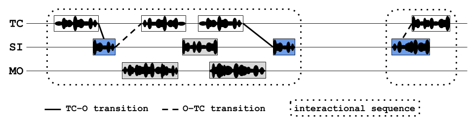

```{r load_packages, include=FALSE, echo=FALSE, warning=FALSE}
library(papaja)
library(ggplot2)
library(tidyverse)
library(viridis)
library(grid)
library(gridExtra)
library(ggpirate)
library(lme4)
library(glmmTMB)
library(DHARMa)
library(bbmle)
source("0-Helper.R")
```

```{r analysis_presets, include=FALSE}
options(scipen=999)
data.path <- "transcripts/anon/" # text files exported from ELAN
plot.path <- "plots/" # output plots
seg.index.file <- "Segment-order-inventory.csv"
ptcp.info.file <- "recording-info.csv"
comparison.file <- "comparison_studies.csv"
samplelabels <- c("High activity  ", "Random  ")
col.sample.bu <- list(
  scale_fill_manual(labels=samplelabels, values=viridis(2)),
  scale_color_manual(labels=samplelabels, values=viridis(2)))
col.sample.bu3 <- list(
  scale_fill_manual(labels=samplelabels, values=viridis(3)),
  scale_color_manual(labels=samplelabels, values=viridis(3)))
allowed.overlap <- 1000 #ms
allowed.gap <- 2000 #ms
```

# Introduction {#intro}
A great deal of work in developmental language science revolves around one central question: What linguistic evidence (i.e., what types and how much) is needed to support first language acquisition? In pursuing this topic, many researchers have fixed their sights on the quantity and characteristics of speech addressed to children; that is, speech designed for young recipients who may have limited attention and understanding [e.g., @golinkoff2015baby; @hoff2006social]. In several languages, child-directed speech (CDS^[Throughout this article, we use 'child-directed speech' and 'CDS' in the most literal sense: speech designed for and directed toward a child recipient.]) is linguistically accommodated to young listeners [@cristia2013input; @soderstrom2007beyond], interactionally rich [@estigarribia2007getting; @butterworth2003pointing; @masataka2003onset; @bruner1983childs], and preferred by infants [@manybabies2017; @segal2015infant; @cooper1990preference]. In those same linguistic communities, these properties of CDS have been found to facilitate early word learning [e.g., @hirshpasek2015contribution; @cartmill2013quality; @weisleder2013talking; @shneidman2012counts; @shneidman2012language; @hurtado2008does; @rowe2008child; @hoff2003specificity]. Yet ethnographic reports from a number of traditional, non-Western communities suggest that children easily acquire their community's language(s) even when the children are infrequently directly addressed [@brown2011cultural]. If so, large quantities of CDS may not be essential for learning language; just useful for facilitating certain aspects of language development. In this paper we investigate the language environment and early development of 10 Tseltal Mayan children growing up in a community where caregivers are reported to infrequently directly address speech to infants and young children [@brown2014interactional; @brown2011cultural; @brown1998conversational].

## Child-directed speech  {#intro-cds}
Prior work on CDS in Western contexts has shown that the amount of CDS children hear influences their language development; more CDS is associated with larger and faster-growing receptive and productive vocabularies in young children [e.g., @hart1995meaningful; @hoff2003specificity; @hurtado2008does; @shneidman2012language; @shneidman2012counts; @weisleder2013talking; @ramirezesparza2014look; @ramirezesparza2017look; @peterIPindividual]. CDS has also been linked to young children's speed of lexical retrieval [@hurtado2008does; @weisleder2013talking; but see @peterIPindividual] and syntactic development [@huttenlocher2010sources]. The conclusion drawn from much of this work is that speech directed to children is well designed for learning words---especially concrete nouns and verbs---because it is optimized for a child's attention in the moment it is spoken.  Even outside of first-person interaction, infants and young children prefer listening to attention-grabbing CDS over adult-directed speech [@manybabies2017]. There are, however, a few significant caveats to the body of work relating CDS quantity to language development.

First, while there is overwhelming evidence linking CDS quantity to vocabulary size, links to grammatical development are more scant [e.g., @brinchmann2019direct; @huttenlocher2010sources; @frankIPvariability]. While the advantage of CDS for referential word learning is clear, it is less obvious how CDS facilitates syntactic learning. For example, utterance length [a proxy for syntactic complexity; @wasow1997remarks] doesn't appear to increase with child age [@newport1977mother], and parents may be less likely to directly correct their children's syntactic errors than their semantic ones [@brown1997introduction; but see @chouinard2003adult]---even sometimes themselves producing ungrammatical utterances to make individual words salient to their young interlocutors [@aslin1996models; see also @yurovsky2018communicative]. On the other hand, there is a wealth of evidence that syntactic knowledge is lexically specified [e.g., @arnold2004avoiding; @goldberg2003constructions; @lieven1997lexically], and that, crosslinguistically, children's vocabulary size is one of the most robust predictors of their early syntactic development [@marchman2004language; @bates1997inseparability; @frankIPvariability]. In short, what is good for the lexicon may also be good for syntax. For now, however, the link between CDS and other aspects of grammatical development still needs to be more thoroughly tested.

A second caveat is that most work on CDS quantity uses summary measures that average over the ebb and flow of interaction (e.g., proportion CDS). In both child and adult interactions, verbal behaviors are highly structured: while some occur at fairly regular intervals ('periodic' <!--, e.g., discourse connectives such as 'alright', 'okay', and 'well'-->), others occur in shorter, more intense bouts separated by long periods of inactivity ['bursty' <!--, e.g., content words, descriptions-->; @abney2018bursts; @fusaroli2014synergy]. For example, Abney and colleagues [-@abney2017time] found that, across multiple time scales of daylong recordings, both infants' and adults' vocal behavior was clustered. Focusing on lexical development, Blasi and colleagues [-@blasiIPhuman] also found that nouns and verbs were used burstily in child-proximal speech across all six of the languages in their typologically diverse sample. Infrequent words were somewhat more bursty overall, leading them to propose that burstiness may play a key and universal role in acquiring otherwise-rare linguistic units. Experiment-based work also shows that two-year-olds learn novel words better from a massed presentation of object labels versus a distributed presentation [@schwab2016repetition; but see @ambridge2006distributed and @childers2002two]. Structured temporal characteristics in children's language experience imply new roles for attention and memory in language development. Ideally, then, we should be investigating how CDS is distributed over children's daily experiences [@soderstrom2013when].

Finally, prior work has typically focused on Western (primarily North American) populations, limiting our ability to generalize these effects to children acquiring language worldwide [@nielsen2017persistent; @brown2014language; @henrich2010beyond; @lieven1994crosslinguistic]. While we do gain valuable insight by looking at _within-population_ variation (e.g., different socioeconomic or sub-cultures), we can more effectively find places where our assumptions break down by studying _new_ populations. Linguistic anthropologists working in non-Western communities have long reported that caregiver interaction styles vary immensely from place to place, with some caregivers using little child-directed speech with young children [@brown2014language; @gaskins2006cultural; @lieven1994crosslinguistic]. Children in these communities reportedly acquire language with 'typical'-looking benchmarks. For example, they start pointing and talking around the same time we would expect for Western middle-class infants [@brown2014language; @brown2014interactional; @brown2011cultural; @liszkowski2012prelinguistic; but see @salomo2013sociocultural]. These findings have had little impact on mainstream theories of word learning and language acquisition, partly due to a lack of directly comparable measures [@brown2014language; @brown2014interactional]. If, however, children in these communities indeed acquire language without delay, despite infrequent CDS, we must reconsider what kind of linguistic evidence is necessary for children to learn language.

## Language development in non-WEIRD communities {#intro-nonweird}
A growing number of researchers are using methods from developmental psycholinguistics to describe the language environments and linguistic development of children growing up in traditional and/or non-Western communities [see also @ganek2018using; @garcia2018thematic; @hernik2018infant; @barrett2013early; @demuth2010three; @fortierURadhoc]. We briefly highlight two recent efforts along these lines, but see Cristia and colleagues' [-@cristia2017child] and Mastin and Vogt's work [-@mastin2016infant; -@vogt2015communicative] for similar examples.

Scaff, Cristia, and colleagues [-@cristia2017child; -@scaffIPlanguage] have used a number of methods to estimate how much speech children hear in a Tsimane forager-horticulturalist population in the Bolivian lowlands. From daylong audio recordings, they estimate that Tsimane children between 0;6 and 6;0 hear maximally ~4.8 minutes of directly addressed speech per hour, regardless of their age [@scaffIPlanguage; @cristia2017child]. For comparison, children from North American homes between ages 0;3 and 3;0 are estimated to hear ~11 minutes of CDS per hour in daylong recordings [@bergelsoncasillas2018what]. <!--Tsimane children also hear ~4.12 minutes of other-directed speech per hour (e.g., talk between adults) compared to the ~7 minutes per hour heard by young North American children [@bergelsoncasillas2018what]. This difference may be attributable to the fact that the Tsimane live in extended family clusters of 3--4 households, so speakers are typically in close proximity to 5--8 other people .-->

Shneidman and colleagues [-@shneidman2012language; -@shneidman2010language] analyzed speech from one-hour at-home video recordings of children between ages 1;0 and 3;0 in two communities: Yucatec Mayan (Southern Mexico) and North American (a major U.S. city). Their analyses yielded four main findings: compared to the American children, (a) the Yucatec children heard many fewer utterances per hour, (b) a much smaller proportion of the utterances they heard were child-directed, (c) the proportion of utterances that were child-directed increased dramatically with age, matching U.S. children's by 3;0 months, and (d) most of the added CDS came from other children (e.g., older siblings and cousins). They also demonstrated that the lexical diversity of the CDS they hear at 24 months---particularly from adult speakers---predicted children's vocabulary knowledge at 35 months.

## The current study {#intro-currentstudy}
We examine the early language experience of 10 Tseltal Mayan children under age 3;0. Prior ethnographic work suggests that Tseltal caregivers do not frequently speak directly to their children until the children themselves begin to actively initiate verbal interactions [@brown2014interactional; @brown2011cultural]. Nonetheless, Tseltal children develop language with no apparent delays. Tseltal Mayan language and culture has much in common with the Yucatec Mayan communities Shneidman reports on, allowing us to compare differences in child language environments between the two sites more directly than before.^[For a review of comparative work on language socialization in Mayan cultures, see @pye2017comparative.] We provide more details on this community and dataset in the [Methods section](#methods).

We analyzed basic measures of Tseltal children's language environments including: (a) the quantity of speech directed to them, (b) the quantity of other-directed speech they could overhear from nearby speakers, (c) the rate of contingent responses to their vocalizations, (d) the rate of their own contingent responses to others' vocalizations, and (e) the duration of their interactional dyadic sequences. To link these findings to prior work on speech environment and development, we also rougly estimated the number of minutes per day they spent in "high turn-taking" interaction and outlined a basic trajectory for early vocal development (i.e., from non-canonical babbles to multi-word utterances).

Based on prior work, we predicted that Tseltal Mayan children are infrequently directly addressed, that the amount of CDS and contingent responses they hear increases with age, that most CDS comes from other children, and that, despite this, their early vocal development is on par with Western children. We additionally predicted that children's language environments would be bursty---that high-intensity interactions would be brief and sparsely distributed throughout the day, accounting for the majority of children's daily CDS. 

# Methods {#methods}
## Community {#methods-community}
The children in our dataset come from a small-scale, subsistence farming community in the highlands of Chiapas in Southern Mexico. The vast majority of children grow up speaking Tseltal monolingually at home. The first few years of primary school are conducted mainly in Tseltal, but the remainder of primary school, secondary school, and any further education is conducted exclusively in Spanish. Nuclear families are often large (5+ children) and live in patrilineal clusters. Nearly all families grow staple crops such as corn and beans, but also cultivate bananas, chilies, squash, coffee, and more. Household and farming work is divided among men, women, and older children. Women do much of the daily cleaning and food preparation, but also frequently work in the garden, haul water and/or firewood, and do other physical labor. A few community members (both men and women) earn incomes as teachers and shopkeepers but are still expected to regularly contribute to their family's household work.

More than forty years of ethnographic work by the second author has supported the idea that Tseltal children's language environments are non-child-centered and non-object-centered [@brown2014interactional; @brown2011cultural; @brown1998conversational]. During their waking hours, Tseltal infants are typically tied to their mother's back while she goes about her work for the day. Infants receive very little direct speech until they themselves begin to initiate interactions, usually as they approach their first birthdays. Even then, interactional exchanges are often brief or non-verbal (e.g., object exchange routines) and take place within a multi-participant context [@brown2014interactional]. Rarely is attention given to words and their meanings, even when objects are central to the activity. Instead, interactions tend to focus on appropriate actions and responses, and young children are socialized to attend to the interactions taking place around them [see also @deleon2011language; @deleon2000emergent; @rogoff2003firsthand]. That said, @brown2014interactional points out that other language- and culture-specific properties may facilitate word and language learning, including conversational repetition, specific verbs, and the centrality of gesture and gaze in learning the spatial system.

Young children are often cared for by other family members, especially older siblings. Even when not on their mother's back, infants are rarely put on the ground. Therefore, children can't usually pick up the objects around them until they are old enough to walk. Toys are scarce and books are vanishingly rare, so the objects children do get their hands on tend to be natural or household objects (e.g., rocks, sticks, spoons, baskets, etc.). By age five, most children are competent speakers who engage daily in chores and the caregiving of their younger siblings. The Tseltal approach to caregiving is similar to that described for other Mayan communities [e.g., @shneidman2012language; @deleon2011language; @rogoff2003firsthand; @gaskins1999childrens; @deleon1998emergent; @gaskins1996how; @rogoff1993guided; @pye1986quiche].

## Corpus {#methods-corpus}
The current data come from the Casillas HomeBank Corpus [@Casillas-HB; @HomeBank], which includes daylong recordings and other developmental language data from more than 100 children under 4;0 across two indigenous, non-WEIRD communities: the Tseltal Mayan community described here and a Papua New Guinean community described elsewhere [@brown2014interactional; @brown2011cultural; @brownIPchildrearing].

The Tseltal data, primarily collected in 2015, include recordings from 55 children born to 43 mothers. The families in our dataset typically only had 2--3 children (median = 2; range = 1--9), due to the fact that the participating families come from a young subsample of the community (mothers: mean = 26.3 years; median = 25; range = 16--43 and fathers: mean = 30; median = 27; range = 17---52). On average, mothers were 20 years old when they had their first child (median = 19; range = 12--27), with a following inter-child interval of 3 years (median = 2.8; range = 1--8.5).^[These estimates do not include miscarriages or children who passed away.]. As a result, 28% of the participating families had two children under 4;0. To our knowledge at time of recording, all children were typically developing. We calculated the precise age of children based on the birthdates given by their caregivers, though these ages should be taken with a pinch of salt because documentation of birthdates is less rigorous than would be typically expected in Western post-industrial populations. Households size, defined in our dataset by the number of people sharing a kitchen or other primary living space, ranged between between 3 and 15 people (mean = 7.2; median = 7). Although 32.7% (18/55) of the target children are first-born, they were rarely the only child in their household. Most mothers had finished primary (37%) or secondary (30%) school, with a few more having completed preparatory (12%) or university (2%; 1 mother); the remainder (23%) had no schooling or did not complete primary school. All fathers had finished primary school, with most completing secondary school (44%) or preparatory school (21%), and two completing a university-level training (5%). Clan membership influences marriage and land inheritance such that 93% of the fathers grew up in the village where the recordings took place, while only 53% of the mothers did.

### Recordings {#methods-corpus-recs}
We used a novel combination of a lightweight stereo audio recorder (Olympus^®^ WS-832) and wearable photo camera (Narrative Clip 1^®^) fitted with a fish-eye lens, to track children's movements and interactions over the course of a 9--11-hour period in which the experimenter was not present.  Each recording was made during a single day at home in which the recorder and/or camera was attached to the child. Ambulatory children wore both devices on an elastic vest (see [Figure 1](#fig1)). Non-ambulatory children wore the recorder in a onesie while their primary caregiver wore the camera on an elastic vest. The camera was set to take photos at 30-second intervals and was synchronized to the audio in post-processing to create a video file featuring the snapshot-linked audio from the child's recording.^[Documentation and scripts for post-processing are available at and https://github.com/marisacasillas/Weave.] We used these recordings to capture a wider range of the linguistic patterns children hear as they participate in different activities with different speakers over the course of their day [@bergelson2018day; @tamislemonda2017power; @greenwood2011assessing].

``` {r fig1, echo=FALSE, fig.align = "center", fig.cap="The recording vest fit over children's chests with an audio recording device in the front horizontal pocket and a camera fitted with a fisheye lens attached to the a shoulder strap.", out.width = '50%'}
knitr::include_graphics("Tseltal-CLE_files/TseltalCLE-RecordingVest.jpg")
```


```{r prepare_data, message=FALSE, warning=FALSE, include=FALSE, paged.print=FALSE}
# Read in annotation files
files <- list.files(path=data.path,pattern="*.txt")
all.data <- data.frame()
for (i in 1:length(files)) {
#  print(files[i])
  newfile <- read_csv(paste0(data.path, files[i]), col_types = cols(val = col_character()))
  newfile$aclew_child_id <- unlist(strsplit(files[i], '\\.'))[1]
  all.data <- rbind(all.data, newfile)
}
all.data$row <- c(1:nrow(all.data))

# Read in supplementary data
ptcp.info <- read_csv(ptcp.info.file, col_types = cols()) %>%
  dplyr::select(-row)
seg.info <- read_csv(seg.index.file)

# Extract and convert start time of each sample
seg.info$start.hhmmss <- regmatches(seg.info$Media,
                                    regexpr("[[:digit:]]{6}", seg.info$Media))
seg.info$start.sec <- as.numeric(substr(seg.info$start.hhmmss,1,2))*3600 +
  as.numeric(substr(seg.info$start.hhmmss,3,4))*60 +
  as.numeric(substr(seg.info$start.hhmmss,5,6))
seg.info$start.hr <- round(seg.info$start.sec/3600, 3)

seg.info$clipoffset.hhmmss <- regmatches(seg.info$Media,
                                    regexpr("(?<=[[:digit:]]{6}_)[[:digit:]]{6}",
                                            seg.info$Media, perl = TRUE))
seg.info$clipoffset.sec <- as.numeric(substr(seg.info$clipoffset.hhmmss,1,2))*3600 +
  as.numeric(substr(seg.info$clipoffset.hhmmss,3,4))*60 +
  as.numeric(substr(seg.info$clipoffset.hhmmss,5,6))
seg.info$clipoffset.hr <- round(seg.info$clipoffset.sec/3600, 3)

# Add mean and sd values for participant-level predictors to ptcp.info
ptcp.info <- ptcp.info %>%
  mutate(
    tchiyr.m = mean(age_mo_round),
    motyr.m = mean(mother_age),
    nsb.m = mean(number_older_sibs),
    hsz.m = mean(household_size),
    tchiyr.sd = sd(age_mo_round),
    motyr.sd = sd(mother_age),
    nsb.sd = sd(number_older_sibs),
    hsz.sd = sd(household_size)
    )

# Merge in participant and segment info to the main data table
codes <- all.data %>% filter(tier == "code")

all.data <- all.data %>%
  filter(speaker != "") %>%
  left_join(ptcp.info, by = "aclew_child_id") %>%
  mutate(segment = "", sample = "",
         sample_type = "", segment_dur = 0)

for (i in 1:nrow(codes)) {
  rec <- codes$aclew_child_id[i]
  seg <- as.character(codes$val[i])
  seg.on <- codes$start[i]
  seg.off <- codes$stop[i]
  seg.idx <- which(all.data$aclew_child_id == rec &
                     all.data$start < seg.off &
                     all.data$stop > seg.on)
  all.data$segment[seg.idx] <- seg
}

# Label samples
all.data$sample[which(
  grepl('^random', all.data$segment))] <- "random"
all.data$sample[which(
  grepl('tt', all.data$segment))] <- "turn-taking"
all.data$sample[which(
  grepl('va', all.data$segment))] <- "high-activity"

# Label sample types and durations
random.samples <- which(grepl('^random', all.data$segment))
all.data$sample_type[random.samples] <- "random"
all.data$segment_dur[random.samples] <- 5

ext.samples <- which(grepl('^extension', all.data$segment))
all.data$sample_type[ext.samples] <- "extension"
all.data$segment_dur[ext.samples] <- 5

tt.samples <- which(grepl('^tt', all.data$segment))
all.data$sample_type[tt.samples] <- "turn-taking"
all.data$segment_dur[tt.samples] <- 1

va.samples <- which(grepl('^va', all.data$segment))
all.data$sample_type[va.samples] <- "turn-taking"
all.data$segment_dur[va.samples] <- 1

# Add in segment start time
all.data <- all.data %>%
  left_join(dplyr::select(seg.info, c("aclew_id", "CodeName", "start.hhmmss",
                                      "start.sec", "start.hr")),
            by = c("aclew_child_id" = "aclew_id", "segment" = "CodeName"))

avg.utt.len.tseltal <- all.data %>%
  filter(speaker != "CHI") %>%
  dplyr::select(dur) %>%
  summarise(mean.utt.len = mean(dur),
            median.utt.len = median(dur))
```

## Data selection and annotation {#methods-samples}
We annotated video clips from 10 of the 55 children's recordings. We chose these 10 recordings to maximize variance in three demographic variables: child age (0--3;0), child sex, and maternal education. The sample is summarized in [Table 1](#tab1). We then selected one hour's worth of non-overlapping clips from each recording in the following order: nine randomly selected 5-minute clips, five 1-minute clips manually selected as the top 'turn-taking' minutes of the recording, five 1-minute clips manually selected as the top 'vocal activity' minutes of the recording, and one, manually selected 5-minute extension of the best 1-minute sample (see [Figure 2](#fig2)). We created these different subsamples of each day to measure properties of (a) children's _average_ language environments (random samples) and (b) their _most input-dense_ language environments (turn-taking samples). The third sample (high-activity) gave us insight into children's productive speech abilities, but is discussed elsewhere [@casillasIPtrajectory].

```{r demog_table_prep, message=FALSE, warning=FALSE, include=FALSE, paged.print=FALSE}
sample.demog <- ptcp.info %>%
  mutate(mat_age_rd = as.integer(round(mother_age, 0)),
         fat_age_rd = as.integer(round(father_age, 0)),
         agev2 = gsub("[[:alpha:]]", "", age),
         hszrd = as.integer(round(household_size + 1, 0))) %>%
  select(homebank_child_id, agev2, child_sex, mat_age_rd, mat_ed, hszrd) %>%
#  select(homebank_child_id, agev2, child_sex, mat_age_rd, mat_ed, fat_age_rd, fat_ed, hszrd) %>%
  rename("HB ID" = homebank_child_id, "Age" = agev2, "Sex" = child_sex,
         "Mot age" = mat_age_rd, "Mot edu" = mat_ed,
#         "Fat age" = father_age, "Fat edu" = fat_ed,
         "Ppl in house" = hszrd)
```

```{r tab1, echo=FALSE, results='asis', message=FALSE, warning=FALSE}
apa_table(sample.demog, caption="Demographic overview of the 10 children whose recordings we sampled.")
```

The turn-taking and high-activity clips were chosen by two trained annotators (the first author and a student assistant) who listened to each recording in its entirety at 1--2x speed while actively taking notes about potentially useful clips. Afterwards, the first author reviewed the list of candidate clips, listened again to each one (at 1x speed with multiple repetitions), and chose the best five 1-minute samples for each of the two types of activity. Good turn-taking activity was defined as closely timed sequences of contingent vocalization between the target child and at least one other person (i.e., frequent vocalization exchanges). The 'best' turn-taking clips were chosen because they had the most and most clear turn-switching activity between the target child and the other speaker(s). Good vocal activity clips were defined as clips in which the target child produced the most and most diverse spontaneous (i.e., not imitative) vocalizations. The 'best' vocal activity clips were chosen for representing the most linguistically mature and/or diverse vocalizations made by the child over the day. All else being equal, candidate clips were prioritized when they contained less background noise or featured speakers and speech that were not otherwise frequently represented (e.g., CDS from older males). The best turn-taking clips and vocal activity clips often overlapped; turn-taking clips were selected from the list of candidates first, and then vocal-activity clips were chosen from the remainder. Again, these manually selected clips were chosen from audio that did not overlap with the initial "random" clip selection. Therefore the true peak turn-taking and vocal-activity clips for the day could possibly occur during the random clips---the manually selected samples are the best examples from the remaining 8--10 hours of audio. The instructions for manually selecting clips and the notes from our Tseltal clip selection can be found at https://github.com/marisacasillas/Tseltal-CLE/blob/master/audio_scanning_instructions.md.

```{r fig2, echo=FALSE, fig.cap="Recording duration (black line) and sampled clips (colored boxes) for each recording analyzed, sorted by child age.", message=FALSE, warning=FALSE, fig.height=2.5}
ptcp.info <- mutate(ptcp.info,
                    rec.start.hr = lubridate::hour(start_of_recording) +
                      lubridate::minute(start_of_recording)/60 +
                      lubridate::second(start_of_recording)/3600,
                    rec.stop.hr = rec.start.hr + length_of_recording/3600) %>%
  arrange(age_mo_round) %>%
  mutate(order = seq(1:10))

used.clips <- seg.info %>%
  filter(Include == 1) %>%
  left_join(ptcp.info, by = c("aclew_id" = "aclew_child_id")) %>%
  mutate(clip.dur = ifelse(grepl(('random'), CodeName), 5,
                           ifelse(grepl('extension', CodeName), 6, 1)),
         sample.type = ifelse(grepl(('random'), CodeName), "Random",
                           ifelse(grepl('tt', CodeName), "Turn taking", "High activity")))
used.clips$sample.type = factor(used.clips$sample.type, levels = c("Random", "Turn taking", "High activity"))
  
clip.distribution <- ggplot() +
  geom_segment(data = ptcp.info,
               aes(x = rec.start.hr, y = order, xend = rec.stop.hr, yend = order)) +
  geom_segment(data = used.clips,
               aes(x = start.hr, y = order, xend = start.hr + clip.dur/60, yend = order,
                   color = sample.type), size = 3) +
  theme_apa() +
  theme(legend.position = "bottom") +
  scale_x_continuous(breaks = 7:21) +
  scale_y_continuous(breaks = 1:10, labels = ptcp.info$age_mo_round) +
  ylab("Child age (mo)") + xlab("Time of day (hr)") + labs(color = "Sample type") +
  scale_color_manual(values = c(viridis(3)[1], viridis(3)[2], "black"))
clip.distribution
```

The first author and a native speaker of Tseltal jointly transcribed and annotated each clip in ELAN [@ELAN] using the ACLEW Annotation Scheme [@casillas2017ACLEWDAS]. The native Tseltal speaker lives in the community and knows most of the recorded families personally. The annotations include the transcription of (nearly) all hearable utterances in Tseltal, a loose translation of each utterance into Spanish, vocal maturity measures of each target child utterance (non-linguistic vocalizations/non-canonical babbling/non-word canonical babbling/single words/multiple words), and addressee annotations for all non-target-child utterances (target-child-directed/other-child-directed/adult-directed/adult-and-child-directed/animal-directed/other-speaker-type-directed). We annotated each utterance for intended addressee using contextual interactional information from the photos, audio, and preceding/following footage; we used an 'unsure' category for utterances with no clear classification.^[Full documentation, including training materials, for the ACLEW Annotation Scheme can be found at https://osf.io/b2jep/wiki/home/.] We exported each ELAN file as tab-separated values for all analysis.

## Data analysis {#methods-analysisinfo}
Our aim in this paper is to describe the quantitative characteristics of Tseltal children’s speech environments, as captured by the nine randomly selected five-minute clips from each child. We analyze five measures of children's speech environment: rate of target-child-directed speech (TCDS min/hr) and rate of other-directed speech (ODS min/hr), the rate of target-child-to-other turn transitions (TC--O transitions/min) and other-to-target-child turn transitions (O--TC transitions/min), and the duration of the target child’s interactional sequences in seconds. For each of these five measures we investigate the effects of child age, time of day, household size, and number of speakers present. We then briefly report on a comparative analysis modelind the same effects on these five measures in the high turn-taking clips. We wrap up with two descriptive analyses: an initial estimate of the amount of time Tseltal children spend in high turn-taking interaction over the course of an entire day and an outline of the trajectory for early vocal maturity.

# Results {#results}
## Data analysis
Unless otherwise stated, all analyses were conducted with generalized linear mixed-effects regressions using the glmmTMB package and all plots are generate with ggplot2 in R [@R-glmmTMB; @R-ggplot2; @R-base].^[The data and analysis code are freely available on the web ([retracted for review]), as is a summary of the results which will be updated as more transcriptions become available ([retracted for review]).] Notably, all five speech environment measures are restricted to non-negative values (min/hr, turn transitions/min, and duration in seconds), with a subset of them also displaying extra cases of zero in the randomly sampled clips (min/hr, turn transitions/min; e.g., when the child is napping). The consequence of these boundary restrictions is that the variance of the distributions becomes non-gaussian (i.e., a long right tail). We account for this issue by using negative binomial regression, whish is useful for overdispersed count data [@brooks2017modeling; @smithson2013generalized]. When extra cases of zero are present due to, e.g., no speakers being present, we used a zero-inflation negative binomial regression, which creates two models: (a) a binary model to evaluate the likelihood of none vs. some presence of the variable (e.g., TCDS) and (b) a count model of the variable (e.g., '3' vs. '5' TCDS min/hr), using the negative binomial distribution as the linking function. Alternative analyses using gaussian models with logged dependent variables are available in the Supplementary Materials, but are qualitatively similar to the results we report here.

Our primary predictors were as follows: child age (months), household size (number of people), and number of non-target-child speakers present in that clip, all centered and standardized, plus squared time of day at the start of the clip (in decimal hours; centered on noon and standardized). We always used squared time of day to model the cycle of activity at home: the mornings and evenings should be more similar to each other than midday because people tend to disperse for chores after breakfast. To this we also added two-way interactions between child age and number of speakers present, household size, and time of day. Finally, we included a random effect of child, with random slopes of time of day, unless doing so resulted in model non-convergence. Finally, for the zero-inflation models, we included child age, number of speakers present, and time of day. We have noted below when models needed to deviate from this core design to achieve convergence. We only report significant effects here; full model outputs are available in the Supplementary Materials.

```{r quantity_prep, message=FALSE, warning=FALSE, include=FALSE, paged.print=FALSE}
# RANDOM
# Get min/hr speech measures
n.unique.rand.segs <- length(unique(all.data$segment[grepl("random", all.data$segment)]))
n.unique.recs <- length(unique(all.data$aclew_child_id))
all.rand.segments <- tibble(
  aclew_child_id = rep(unique(all.data$aclew_child_id),
                n.unique.rand.segs),
  segment = rep(unique(all.data$segment[grepl("random", all.data$segment)]),
                n.unique.recs))
# XDS
xds.per.seg.rand <- all.data %>%
  filter(sample == "random" & speaker != "CHI" &
           grepl("xds@", tier)) %>%
  group_by(aclew_child_id, segment, segment_dur) %>%
  summarise(xds_min = round(sum(dur)/60000,3)) %>%
  full_join(all.rand.segments, by = c("aclew_child_id", "segment")) %>%
  replace_na(list(segment_dur = 5, xds_min = 0)) %>%
  mutate(xds_mph = (xds_min/segment_dur)*60) %>%
  arrange(aclew_child_id, segment)
# ODS
ods.per.seg.rand <- all.data %>%
  filter(sample == "random" & speaker != "CHI" &
           grepl("xds@", tier) & val != "T") %>%
  group_by(aclew_child_id, segment, segment_dur) %>%
  summarise(ods_min = round(sum(dur)/60000,3)) %>%
  full_join(all.rand.segments, by = c("aclew_child_id", "segment")) %>%
  replace_na(list(segment_dur = 5, ods_min = 0)) %>%
  mutate(ods_mph = (ods_min/segment_dur)*60) %>%
  arrange(aclew_child_id, segment)
# TDS
tds.per.seg.rand <- all.data %>%
  filter(sample == "random" & speaker != "CHI" &
           grepl("xds@", tier) & val == "T") %>%
  group_by(aclew_child_id, segment, segment_dur) %>%
  summarise(tds_min = round(sum(dur)/60000,3)) %>%
  full_join(all.rand.segments, by = c("aclew_child_id", "segment")) %>%
  replace_na(list(segment_dur = 5, tds_min = 0)) %>%
  mutate(tds_mph = (tds_min/segment_dur)*60) %>%
  arrange(aclew_child_id, segment)
# All CDS
cds.per.seg.rand <- all.data %>%
  filter(sample == "random" & speaker != "CHI" &
           grepl("xds@", tier) & (val == "T" | val == "C")) %>%
  group_by(aclew_child_id, segment, segment_dur) %>%
  summarise(cds_min = round(sum(dur)/60000,3)) %>%
  full_join(all.rand.segments, by = c("aclew_child_id", "segment")) %>%
  replace_na(list(segment_dur = 5, cds_min = 0)) %>%
  mutate(cds_mph = (cds_min/segment_dur)*60) %>%
  arrange(aclew_child_id, segment)
# Number of speakers per clip
spkrs.per.seg.rand <- all.data %>%
  filter(sample == "random" & speaker != "CHI" &
           !(grepl("@", tier))) %>%
  group_by(aclew_child_id, segment) %>%
  summarise(n_spkrs_clip = length(unique(speaker)))
# All together
quantity.rand <- xds.per.seg.rand %>%
  full_join(ods.per.seg.rand, by = c("aclew_child_id", "segment", "segment_dur")) %>%
  full_join(tds.per.seg.rand, by = c("aclew_child_id", "segment", "segment_dur")) %>%
  full_join(cds.per.seg.rand, by = c("aclew_child_id", "segment", "segment_dur")) %>%
  full_join(spkrs.per.seg.rand, by = c("aclew_child_id", "segment")) %>%
  left_join(dplyr::select(seg.info, c("aclew_id", "CodeName", "start.hr")),
            by = c("aclew_child_id" = "aclew_id", "segment" = "CodeName")) %>%
  full_join(ptcp.info, by = "aclew_child_id") %>%
  replace_na(list(xds_min = 0, xds_mph = 0,
                  tds_min = 0, tds_mph = 0,
                  cds_min = 0, cds_mph = 0,
                  n_spkrs_clip = 0)) %>%
  mutate(prop_tds = tds_min/xds_min)
  # Don't replace NAs with 0s in this case; proportion is not meaningful w/o any speech
quantity.rand.bychild <- quantity.rand %>%
  group_by(aclew_child_id) %>%
  summarise(
    xds_min = mean(xds_min),
    xds_mph = mean(xds_mph),
    ods_min = mean(ods_min),
    ods_mph = mean(ods_mph),
    tds_min = mean(tds_min),
    tds_mph = mean(tds_mph),
    cds_min = mean(cds_min),
    cds_mph = mean(cds_mph),
    prop_tds = mean(prop_tds, na.rm = TRUE),
    m_n_spkrs = mean(n_spkrs_clip)) %>%
  full_join(ptcp.info, by = "aclew_child_id")

# Get xds and tds min/hr by speaker type
all.data$SpkrAge <- "Not known"
all.data$SpkrAge[grepl("FA|MA|UA", all.data$speaker)] <- "Adult"
all.data$SpkrAge[grepl("FC|MC|UC", all.data$speaker)] <- "Child"
all.rand.segments.sa <- tibble(
  aclew_child_id = rep(unique(all.data$aclew_child_id),
                2*n.unique.rand.segs),
  segment = rep(unique(all.data$segment[grepl("random", all.data$segment)]),
                2*n.unique.recs),
  SpkrAge = c(rep("Adult", (n.unique.rand.segs * n.unique.recs)),
              rep("Child", (n.unique.rand.segs * n.unique.recs))))
# XDS
xds.per.seg.rand.sa <- all.data %>%
  filter(sample == "random" & speaker != "CHI" & SpkrAge != "Not known" &
           grepl("xds@", tier)) %>%
  group_by(aclew_child_id, SpkrAge, segment, segment_dur) %>%
  summarise(xds_min.sa = round(sum(dur)/60000,3)) %>%
  full_join(all.rand.segments.sa, by = c("aclew_child_id", "segment", "SpkrAge")) %>%
  replace_na(list(segment_dur = 5, xds_min.sa = 0)) %>%
  mutate(xds_mph.sa = (xds_min.sa/segment_dur)*60) %>%
  arrange(aclew_child_id, segment, SpkrAge)
# ODS
ods.per.seg.rand.sa <- all.data %>%
  filter(sample == "random" & speaker != "CHI" & SpkrAge != "Not known" &
           grepl("xds@", tier) & val != "T") %>%
  group_by(aclew_child_id, SpkrAge, segment, segment_dur) %>%
  summarise(ods_min.sa = round(sum(dur)/60000,3)) %>%
  full_join(all.rand.segments.sa, by = c("aclew_child_id", "segment", "SpkrAge")) %>%
  replace_na(list(segment_dur = 5, ods_min.sa = 0)) %>%
  mutate(ods_mph.sa = (ods_min.sa/segment_dur)*60) %>%
  arrange(aclew_child_id, segment, SpkrAge)
# TDS
tds.per.seg.rand.sa <- all.data %>%
  filter(sample == "random" & speaker != "CHI" & SpkrAge != "Not known" &
           grepl("xds@", tier) & val == "T") %>%
  group_by(aclew_child_id, SpkrAge, segment, segment_dur) %>%
  summarise(tds_min.sa = round(sum(dur)/60000,3)) %>%
  full_join(all.rand.segments.sa, by = c("aclew_child_id", "segment", "SpkrAge")) %>%
  replace_na(list(segment_dur = 5, tds_min.sa = 0)) %>%
  mutate(tds_mph.sa = (tds_min.sa/segment_dur)*60) %>%
  arrange(aclew_child_id, segment, SpkrAge)
# All CDS
cds.per.seg.rand.sa <- all.data %>%
  filter(sample == "random" & speaker != "CHI" & SpkrAge != "Not known" &
           grepl("xds@", tier) & (val == "T" | val == "C")) %>%
  group_by(aclew_child_id, SpkrAge, segment, segment_dur) %>%
  summarise(cds_min.sa = round(sum(dur)/60000,3)) %>%
  full_join(all.rand.segments.sa, by = c("aclew_child_id", "segment", "SpkrAge")) %>%
  replace_na(list(segment_dur = 5, cds_min.sa = 0)) %>%
  mutate(cds_mph.sa = (cds_min.sa/segment_dur)*60) %>%
  arrange(aclew_child_id, segment, SpkrAge)
# Number of speakers per clip
spkrs.per.seg.rand.sa <- all.data %>%
  filter(sample == "random" & speaker != "CHI" & SpkrAge != "Not known" &
           !(grepl("@", tier))) %>%
  group_by(aclew_child_id, SpkrAge, segment) %>%
  summarise(n_spkrs_clip = length(unique(speaker)))
# All together
quantity.rand.sa <- xds.per.seg.rand.sa %>%
  full_join(ods.per.seg.rand.sa, by = c("aclew_child_id", "SpkrAge",
                                        "segment", "segment_dur")) %>%
  full_join(tds.per.seg.rand.sa, by = c("aclew_child_id", "SpkrAge",
                                        "segment", "segment_dur")) %>%
  full_join(cds.per.seg.rand.sa, by = c("aclew_child_id", "SpkrAge",
                                        "segment", "segment_dur")) %>%
  full_join(dplyr::select(quantity.rand, c("aclew_child_id", "segment", "tds_min")),
            by = c("aclew_child_id", "segment")) %>%
  full_join(spkrs.per.seg.rand.sa, by = c("aclew_child_id", "SpkrAge", "segment")) %>%
  left_join(dplyr::select(seg.info, c("aclew_id", "CodeName", "start.hr")),
            by = c("aclew_child_id" = "aclew_id", "segment" = "CodeName")) %>%
  full_join(ptcp.info, by = "aclew_child_id") %>%
  replace_na(list(xds_min.sa = 0, xds_mph.sa = 0,
                  ods_min.sa = 0, ods_mph.sa = 0,
                  tds_min.sa = 0, tds_mph.sa = 0,
                  cds_min.sa = 0, cds_mph.sa = 0,
                  n_spkrs_clip = 0)) %>%
  mutate(prop_tds.sa = tds_min.sa/xds_min.sa,
         prop_sa.tds = tds_min.sa/tds_min)
  # Don't replace NAs with 0s in this case; proportion is not meaningful w/o any speech


# NON-RANDOM
# Get min/hr speech measures
all.nonrand.segments <- seg.info %>%
  filter(!(grepl("random", CodeName))) %>%
  select(aclew_id, CodeName) %>%
  rename(aclew_child_id = aclew_id, segment = CodeName)
all.nonrand.segments$sample <- ifelse(grepl("va", all.nonrand.segments$segment),
                                      "high-activity","turn-taking")
all.nonrand.segments$sample_type <- ifelse(grepl("^va", all.nonrand.segments$segment),
                                      "high-activity", ifelse(
                                        grepl("^tt", all.nonrand.segments$segment),"turn-taking",
                                        "extension"))
# XDS
xds.per.seg.nonrand <- all.data %>%
  filter(sample != "random" & speaker != "CHI" &
           grepl("xds@", tier)) %>%
  group_by(aclew_child_id, segment, segment_dur) %>%
  summarise(xds_min = round(sum(dur)/60000,3)) %>%
  full_join(all.nonrand.segments, by = c("aclew_child_id", "segment")) %>%
  replace_na(list(segment_dur = 1, xds_min = 0)) %>%
  mutate(segment_dur = ifelse(grepl("ext", segment), 5, 1),
         xds_mph = (xds_min/segment_dur)*60) %>%
  arrange(aclew_child_id, segment)
# ODS
ods.per.seg.nonrand <- all.data %>%
  filter(sample != "random" & speaker != "CHI" &
           grepl("xds@", tier) & val != "T") %>%
  group_by(aclew_child_id, segment, segment_dur) %>%
  summarise(ods_min = round(sum(dur)/60000,3)) %>%
  full_join(all.nonrand.segments, by = c("aclew_child_id", "segment")) %>%
  replace_na(list(segment_dur = 1, ods_min = 0)) %>%
  mutate(segment_dur = ifelse(grepl("ext", segment), 5, 1),
         ods_mph = (ods_min/segment_dur)*60) %>%
  arrange(aclew_child_id, segment)
# TDS
tds.per.seg.nonrand <- all.data %>%
  filter(sample != "random" & speaker != "CHI" &
           grepl("xds@", tier) & val == "T") %>%
  group_by(aclew_child_id, segment, segment_dur) %>%
  summarise(tds_min = round(sum(dur)/60000,3)) %>%
  full_join(all.nonrand.segments, by = c("aclew_child_id", "segment")) %>%
  replace_na(list(segment_dur = 1, tds_min = 0)) %>%
  mutate(segment_dur = ifelse(grepl("ext", segment), 5, 1),
         tds_mph = (tds_min/segment_dur)*60) %>%
  arrange(aclew_child_id, segment)
# All CDS
cds.per.seg.nonrand <- all.data %>%
  filter(sample != "random" & speaker != "CHI" &
           grepl("xds@", tier) & (val == "T" | val == "C")) %>%
  group_by(aclew_child_id, segment, segment_dur) %>%
  summarise(cds_min = round(sum(dur)/60000,3)) %>%
  full_join(all.nonrand.segments, by = c("aclew_child_id", "segment")) %>%
  replace_na(list(segment_dur = 1, cds_min = 0)) %>%
  mutate(segment_dur = ifelse(grepl("ext", segment), 5, 1),
         cds_mph = (cds_min/segment_dur)*60) %>%
  arrange(aclew_child_id, segment)
# Number of speakers per clip
spkrs.per.seg.nonrand <- all.data %>%
  filter(sample != "random" & speaker != "CHI" & SpkrAge != "Not known" &
           !(grepl("@", tier))) %>%
  group_by(aclew_child_id, segment) %>%
  summarise(n_spkrs_clip = length(unique(speaker)))
# All together
quantity.nonrand <- xds.per.seg.nonrand %>%
  full_join(ods.per.seg.nonrand, by = c("aclew_child_id", "segment",
                                        "segment_dur", "sample", "sample_type")) %>%
  full_join(tds.per.seg.nonrand, by = c("aclew_child_id", "segment",
                                        "segment_dur", "sample", "sample_type")) %>%
  full_join(cds.per.seg.nonrand, by = c("aclew_child_id", "segment",
                                        "segment_dur", "sample", "sample_type")) %>%
  full_join(ptcp.info, by = "aclew_child_id") %>%
  full_join(spkrs.per.seg.nonrand, by = c("aclew_child_id", "segment")) %>%
  left_join(dplyr::select(seg.info, c("aclew_id", "CodeName", "start.hr")),
            by = c("aclew_child_id" = "aclew_id", "segment" = "CodeName")) %>%
  replace_na(list(xds_min = 0, xds_mph = 0,
                  ods_min = 0, ods_mph = 0,
                  tds_min = 0, tds_mph = 0,
                  cds_min = 0, cds_mph = 0,
                  n_spkrs_clip = 0)) %>%
  mutate(prop_tds = tds_min/xds_min)
  # Don't replace NAs with 0s in this case; proportion is not meaningful w/o any speech
quantity.nonrand.bychild <- quantity.nonrand %>%
  group_by(aclew_child_id, sample) %>%
  summarise(
    xds_min = mean(xds_min),
    xds_mph = mean(xds_mph),
    ods_min = mean(ods_min),
    ods_mph = mean(ods_mph),
    tds_min = mean(tds_min),
    tds_mph = mean(tds_mph),
    cds_min = mean(cds_min),
    cds_mph = mean(cds_mph),
    prop_tds = mean(prop_tds, na.rm = TRUE),
    m_n_spkrs = mean(n_spkrs_clip)) %>%
  full_join(ptcp.info, by = "aclew_child_id")

# Get xds and tds min/hr by speaker type
all.nonrand.segments.sa <- tibble(
  aclew_child_id = rep(all.nonrand.segments$aclew_child_id, 2),
  segment = rep(all.nonrand.segments$segment, 2),
  sample = rep(all.nonrand.segments$sample, 2),
  sample_type = rep(all.nonrand.segments$sample_type, 2),
  SpkrAge = c(rep("Adult", nrow(all.nonrand.segments)),
              rep("Child", nrow(all.nonrand.segments))))
# XDS
xds.per.seg.nonrand.sa <- all.data %>%
  filter(sample != "random" & speaker != "CHI" & SpkrAge != "Not known" &
           grepl("xds@", tier)) %>%
  group_by(aclew_child_id, SpkrAge, segment, segment_dur) %>%
  summarise(xds_min.sa = round(sum(dur)/60000,3)) %>%
  full_join(all.nonrand.segments.sa, by = c("aclew_child_id", "segment", "SpkrAge")) %>%
  replace_na(list(segment_dur = 1, xds_min.sa = 0)) %>%
  mutate(segment_dur = ifelse(grepl("ext", segment), 5, 1),
         xds_mph.sa = (xds_min.sa/segment_dur)*60) %>%
  arrange(aclew_child_id, segment, SpkrAge)
# ODS
ods.per.seg.nonrand.sa <- all.data %>%
  filter(sample != "random" & speaker != "CHI" & SpkrAge != "Not known" &
           grepl("xds@", tier) & val != "T") %>%
  group_by(aclew_child_id, SpkrAge, segment, segment_dur) %>%
  summarise(ods_min.sa = round(sum(dur)/60000,3)) %>%
  full_join(all.nonrand.segments.sa, by = c("aclew_child_id", "segment", "SpkrAge")) %>%
  replace_na(list(segment_dur = 1, ods_min.sa = 0)) %>%
  mutate(segment_dur = ifelse(grepl("ext", segment), 5, 1),
         ods_mph.sa = (ods_min.sa/segment_dur)*60) %>%
  arrange(aclew_child_id, segment, SpkrAge)
# TDS
tds.per.seg.nonrand.sa <- all.data %>%
  filter(sample != "random" & speaker != "CHI" & SpkrAge != "Not known" &
           grepl("xds@", tier) & val == "T") %>%
  group_by(aclew_child_id, SpkrAge, segment, segment_dur) %>%
  summarise(tds_min.sa = round(sum(dur)/60000,3)) %>%
  full_join(all.nonrand.segments.sa, by = c("aclew_child_id", "segment", "SpkrAge")) %>%
  replace_na(list(segment_dur = 1, tds_min.sa = 0)) %>%
  mutate(segment_dur = ifelse(grepl("ext", segment), 5, 1),
         tds_mph.sa = (tds_min.sa/segment_dur)*60) %>%
  arrange(aclew_child_id, segment, SpkrAge)
# All CDS
cds.per.seg.nonrand.sa <- all.data %>%
  filter(sample != "random" & speaker != "CHI" & SpkrAge != "Not known" &
           grepl("xds@", tier) & (val == "T" | val == "C")) %>%
  group_by(aclew_child_id, SpkrAge, segment, segment_dur) %>%
  summarise(cds_min.sa = round(sum(dur)/60000,3)) %>%
  full_join(all.nonrand.segments.sa, by = c("aclew_child_id", "segment", "SpkrAge")) %>%
  replace_na(list(segment_dur = 1, cds_min.sa = 0)) %>%
  mutate(segment_dur = ifelse(grepl("ext", segment), 5, 1),
         cds_mph.sa = (cds_min.sa/segment_dur)*60) %>%
  arrange(aclew_child_id, segment, SpkrAge)
# Number of speakers per clip
spkrs.per.seg.nonrand.sa <- all.data %>%
  filter(sample != "random" & speaker != "CHI" & SpkrAge != "Not known" &
           !(grepl("@", tier))) %>%
  group_by(aclew_child_id, SpkrAge, segment) %>%
  summarise(n_spkrs_clip = length(unique(speaker)))
# All together
quantity.nonrand.sa <- xds.per.seg.nonrand.sa %>%
  full_join(ods.per.seg.nonrand.sa, by = c("aclew_child_id", "SpkrAge",
                                           "segment", "segment_dur",
                                           "sample", "sample_type")) %>%
  full_join(tds.per.seg.nonrand.sa, by = c("aclew_child_id", "SpkrAge",
                                           "segment", "segment_dur",
                                           "sample", "sample_type")) %>%
  full_join(cds.per.seg.nonrand.sa, by = c("aclew_child_id", "SpkrAge",
                                           "segment", "segment_dur",
                                           "sample", "sample_type")) %>%
  full_join(select(quantity.nonrand, c("aclew_child_id", "segment", "tds_min")),
            by = c("aclew_child_id", "segment")) %>%
  full_join(ptcp.info, by = "aclew_child_id") %>%
  full_join(spkrs.per.seg.nonrand.sa, by = c("aclew_child_id", "SpkrAge", "segment")) %>%
  left_join(dplyr::select(seg.info, c("aclew_id", "CodeName", "start.hr")),
            by = c("aclew_child_id" = "aclew_id", "segment" = "CodeName")) %>%
  replace_na(list(xds_min.sa = 0, xds_mph.sa = 0,
                  ods_min.sa = 0, ods_mph.sa = 0,
                  tds_min.sa = 0, tds_mph.sa = 0,
                  cds_min.sa = 0, cds_mph.sa = 0,
                  n_spkrs_clip = 0)) %>%
  mutate(prop_tds.sa = tds_min.sa/xds_min.sa,
         prop_sa.tds = tds_min.sa/tds_min)
  # Don't replace NAs with 0s in this case; proportion is not meaningful w/o any speech

# Subset the non-random samples (used for differnt purposes)
quantity.nonrand.tt <- filter(quantity.nonrand, sample == "turn-taking")
quantity.nonrand.tt.sa <- filter(quantity.nonrand.sa, sample == "turn-taking")
quantity.nonrand.va <- filter(quantity.nonrand, sample != "turn-taking")
quantity.nonrand.va.sa <- filter(quantity.nonrand.sa, sample != "turn-taking")


## Get variables ready for modeling
# random sample
quantity.rand$child_sex <- as.factor(quantity.rand$child_sex)
quantity.rand$mat_ed <- as.factor(quantity.rand$mat_ed)
nspkrs.m <- mean(quantity.rand$n_spkrs_clip)
nspkrs.sd <- sd(quantity.rand$n_spkrs_clip)
quantity.rand <- quantity.rand %>%
  mutate(
    xds_mph.nz = ifelse(xds_mph > 0, 1, 0),
    ods_mph.nz = ifelse(ods_mph > 0, 1, 0),
    tds_mph.nz = ifelse(tds_mph > 0, 1, 0),
    cds_mph.nz = ifelse(cds_mph > 0, 1, 0),
    tchiyr.std = ((age_mo_round - tchiyr.m)/tchiyr.sd),
    chisx.std = recode_factor(child_sex,
                              "M" = "M", "F" = "F"),
    mated.std = recode_factor(mat_ed,
                              "none" = "none", "primary" = "primary",
                              "secondary" = "secondary", "preparatory" = "preparatory"),
    mated.bin = recode_factor(mat_ed,
                              "none" = "0-5", "primary" = "0-5",
                              "secondary" = "6+", "preparatory" = "6+"),
    motyr.std = ((mother_age - motyr.m)/motyr.sd),
    nsb.std = ((number_older_sibs - nsb.m)/nsb.sd),
    hsz.std = ((household_size - hsz.m)/hsz.sd),
    nsk.std = ((n_spkrs_clip - nspkrs.m)/nspkrs.sd),
    stthr.std = (start.hr - 12)/12)

quantity.rand.sa$child_sex <- as.factor(quantity.rand.sa$child_sex)
quantity.rand.sa$mat_ed <- as.factor(quantity.rand.sa$mat_ed)
nspkrs.sa.m <- mean(quantity.rand.sa$n_spkrs_clip)
nspkrs.sa.sd <- sd(quantity.rand.sa$n_spkrs_clip)
quantity.rand.sa <- quantity.rand.sa %>%
  mutate(
    xds_mph.sa.nz = ifelse(xds_mph.sa > 0, 1, 0),
    ods_mph.sa.nz = ifelse(ods_mph.sa > 0, 1, 0),
    tds_mph.sa.nz = ifelse(tds_mph.sa > 0, 1, 0),
    cds_mph.sa.nz = ifelse(cds_mph.sa > 0, 1, 0),
    tchiyr.std = ((age_mo_round - tchiyr.m)/tchiyr.sd),
    chisx.std = recode_factor(child_sex,
                              "M" = "M", "F" = "F"),
    mated.std = recode_factor(mat_ed,
                              "none" = "none", "primary" = "primary",
                              "secondary" = "secondary", "preparatory" = "preparatory"),
    mated.bin = recode_factor(mat_ed,
                              "none" = "0-5", "primary" = "0-5",
                              "secondary" = "6+", "preparatory" = "6+"),
    motyr.std = ((mother_age - motyr.m)/motyr.sd),
    nsb.std = ((number_older_sibs - nsb.m)/nsb.sd),
    hsz.std = ((household_size - hsz.m)/hsz.sd),
    nsk.std = ((n_spkrs_clip - nspkrs.sa.m)/nspkrs.sa.sd),
    stthr.std = (start.hr - 12)/12)

# tt sample
quantity.nonrand.tt$child_sex <- as.factor(quantity.nonrand.tt$child_sex)
quantity.nonrand.tt$mat_ed <- as.factor(quantity.nonrand.tt$mat_ed)
nspkrs.m <- mean(quantity.nonrand.tt$n_spkrs_clip)
nspkrs.sd <- sd(quantity.nonrand.tt$n_spkrs_clip)
quantity.nonrand.tt <- quantity.nonrand.tt %>%
  mutate(
    xds_mph.nz = ifelse(xds_mph > 0, 1, 0),
    ods_mph.nz = ifelse(ods_mph > 0, 1, 0),
    tds_mph.nz = ifelse(tds_mph > 0, 1, 0),
    cds_mph.nz = ifelse(cds_mph > 0, 1, 0),
    tchiyr.std = ((age_mo_round - tchiyr.m)/tchiyr.sd),
    chisx.std = recode_factor(child_sex,
                              "M" = "M", "F" = "F"),
    mated.std = recode_factor(mat_ed,
                              "none" = "none", "primary" = "primary",
                              "secondary" = "secondary", "preparatory" = "preparatory"),
    mated.bin = recode_factor(mat_ed,
                              "none" = "0-5", "primary" = "0-5",
                              "secondary" = "6+", "preparatory" = "6+"),
    motyr.std = ((mother_age - motyr.m)/motyr.sd),
    nsb.std = ((number_older_sibs - nsb.m)/nsb.sd),
    hsz.std = ((household_size - hsz.m)/hsz.sd),
    nsk.std = ((n_spkrs_clip - nspkrs.m)/nspkrs.sd),
    stthr.std = (start.hr - 12)/12)

quantity.nonrand.tt.sa$child_sex <- as.factor(quantity.nonrand.tt.sa$child_sex)
quantity.nonrand.tt.sa$mat_ed <- as.factor(quantity.nonrand.tt.sa$mat_ed)
nspkrs.sa.m <- mean(quantity.nonrand.tt.sa$n_spkrs_clip)
nspkrs.sa.sd <- sd(quantity.nonrand.tt.sa$n_spkrs_clip)
quantity.nonrand.tt.sa <- quantity.nonrand.tt.sa %>%
  mutate(
    xds_mph.sa.nz = ifelse(xds_mph.sa > 0, 1, 0),
    ods_mph.sa.nz = ifelse(ods_mph.sa > 0, 1, 0),
    tds_mph.sa.nz = ifelse(tds_mph.sa > 0, 1, 0),
    cds_mph.sa.nz = ifelse(cds_mph.sa > 0, 1, 0),
    tchiyr.std = ((age_mo_round - tchiyr.m)/tchiyr.sd),
    chisx.std = recode_factor(child_sex,
                              "M" = "M", "F" = "F"),
    mated.std = recode_factor(mat_ed,
                              "none" = "none", "primary" = "primary",
                              "secondary" = "secondary", "preparatory" = "preparatory"),
    mated.bin = recode_factor(mat_ed,
                              "none" = "0-5", "primary" = "0-5",
                              "secondary" = "6+", "preparatory" = "6+"),
    motyr.std = ((mother_age - motyr.m)/motyr.sd),
    nsb.std = ((number_older_sibs - nsb.m)/nsb.sd),
    hsz.std = ((household_size - hsz.m)/hsz.sd),
    nsk.std = ((n_spkrs_clip - nspkrs.sa.m)/nspkrs.sa.sd),
    stthr.std = (start.hr - 12)/12)
```

```{r quantity_plots, message=FALSE, warning=FALSE, paged.print=FALSE}
quantity.nonrand.tt.minimum <- dplyr::select(quantity.nonrand.tt,
                                             age_mo_round, xds_mph, ods_mph, tds_mph,
                                             prop_tds, n_spkrs_clip) %>%
                                             mutate(Sample = "Turn taking")
quantity.rand.minimum <- dplyr::select(quantity.rand,
                                       age_mo_round, xds_mph, ods_mph, tds_mph,
                                       prop_tds, n_spkrs_clip) %>%
                                       mutate(Sample = "Random")
quantity.rand_and_tt <- bind_rows(quantity.nonrand.tt.minimum, quantity.rand.minimum)

quantity.nonrand.sa.tt.minimum <- dplyr::select(quantity.nonrand.tt.sa,
                                             age_mo_round, prop_sa.tds, SpkrAge) %>%
                                             mutate(Sample = "Turn taking")
quantity.rand.sa.minimum <- dplyr::select(quantity.rand.sa,
                                       age_mo_round, prop_sa.tds, SpkrAge) %>%
                                       mutate(Sample = "Random")
quantity.sa.rand_and_tt <- bind_rows(quantity.nonrand.sa.tt.minimum, quantity.rand.sa.minimum)

# ODS min/hr
odsmph.segments.rand_and_tt <- ggplot(quantity.rand_and_tt,
                          aes(x = age_mo_round, y = ods_mph, lty = Sample)) +
  geom_boxplot(aes(group = interaction(age_mo_round, Sample),
                   color = Sample), fill = "white", outlier.shape = NA,
               lty = "solid", alpha = 0.4) +
  geom_smooth(aes(fill = Sample, color = Sample), method = "lm") +
  ylab("ODS (min/hr)") + xlab("Child age (mo)")	+
  scale_y_continuous(limits=c(-10,80),
                     breaks=seq(0,80,20)) +
  scale_x_continuous(limits=c(0,38),
                     breaks=seq(0,38,6)) +
  coord_cartesian(ylim=c(0,80),xlim=c(0,38)) +
  scale_color_manual(values = viridis(3)) +
  scale_fill_manual(values = viridis(3)) +
  theme_apa() +
  theme(legend.position="none",
        axis.line = element_line(color="black", size = 0.4))

# TDS min/hr
tdsmph.segments.rand_and_tt <- ggplot(quantity.rand_and_tt,
                          aes(x = age_mo_round, y = tds_mph, lty = Sample)) +
  geom_boxplot(aes(group = interaction(age_mo_round, Sample),
                   color = Sample), fill = "white", outlier.shape = NA,
               lty = "solid", alpha = 0.4) +
  geom_smooth(aes(fill = Sample, color = Sample), method = "lm") +
  ylab("TCDS (min/hr)") + xlab("Child age (mo)")	+
  scale_y_continuous(limits=c(0,80),
                     breaks=seq(0,80,20)) +
  scale_x_continuous(limits=c(0,38),
                     breaks=seq(0,38,6)) +
  coord_cartesian(ylim=c(0,80),xlim=c(0,38)) +
  scale_color_manual(values = viridis(3)) +
  scale_fill_manual(values = viridis(3)) +
  theme_apa() +
  theme(legend.position="none",
        axis.line = element_line(color="black", size = 0.4))

# TDS min/hr - zoomed in
tdsmph.segments.rand_and_tt.zoomedin <- ggplot(quantity.rand_and_tt,
                          aes(x = age_mo_round, y = tds_mph, lty = Sample)) +
  geom_boxplot(aes(group = interaction(age_mo_round, Sample),
                   color = Sample), fill = "white", outlier.shape = NA,
               lty = "solid", alpha = 0.4) +
  geom_smooth(aes(fill = Sample, color = Sample), method = "lm") +
  ylab("TCDS (min/hr)") + xlab("Child age (mo)")	+
  scale_y_continuous(limits=c(0,40),
                     breaks=seq(0,40,10)) +
  scale_x_continuous(limits=c(0,38),
                     breaks=seq(0,38,6)) +
  coord_cartesian(ylim=c(0,40),xlim=c(0,38)) +
  scale_color_manual(values = viridis(3)) +
  scale_fill_manual(values = viridis(3)) +
  theme_apa() +
  theme(legend.position="none",
        axis.line = element_line(color="black", size = 0.4))

# TDS prop
tdsprp.segments.rand_and_tt <- ggplot(quantity.rand_and_tt,
                          aes(x = age_mo_round, y = prop_tds, lty = Sample)) +
  geom_boxplot(aes(group = interaction(age_mo_round, Sample),
                   color = Sample), fill = "white", outlier.shape = NA,
               lty = "solid", alpha = 0.4) +
  geom_smooth(aes(fill = Sample, color = Sample), method = "lm") +
  ylab("TCDS/All spch") + xlab("Child age (mo)")	+
  scale_y_continuous(limits=c(-.2,1.2),
                     breaks=seq(0,1,0.2)) +
  scale_x_continuous(limits=c(0,38),
                     breaks=seq(0,38,6)) +
  coord_cartesian(ylim=c(0,1),xlim=c(0,38)) +
  scale_color_manual(values = viridis(3)) +
  scale_fill_manual(values = viridis(3)) +
  theme_apa() +
  theme(legend.position="none",
        axis.line = element_line(color="black", size = 0.4))

# prop TDS from children
tdsprp.segments.rand_and_tt.sa <- ggplot(subset(quantity.sa.rand_and_tt, SpkrAge == "Child"),
                             aes(x = age_mo_round, y = prop_sa.tds, lty = Sample)) +
  geom_boxplot(aes(group = interaction(age_mo_round, Sample),
                   color = Sample), fill = "white", outlier.shape = NA,
               lty = "solid", alpha = 0.4) +
  geom_smooth(aes(fill = Sample, color = Sample), method = "lm") +
  ylab("Prop of TCDS") + xlab("Child age (mo)")	+
  scale_y_continuous(limits=c(-.2,1.2),
                     breaks=seq(0,1,0.2)) +
  scale_x_continuous(limits=c(0,38),
                     breaks=seq(0,38,6)) +
  coord_cartesian(ylim=c(0,1), xlim=c(0,38)) +
  scale_color_manual(values = viridis(3)) +
  scale_fill_manual(values = viridis(3)) +
  theme_apa() +
  theme(legend.position="none",
        axis.line = element_line(color="black", size = 0.4))
```

```{r fig3, echo=FALSE, fig.cap="By-child estimates of minutes per hour of other-directed speech (left) and target-child-directed speech (right). Data are shown for the random (purple; solid) and turn taking (green; dashed) samples. Bands on the solid linear trends show 95% CIs.", message=FALSE, warning=FALSE, fig.height=2.5}
grid.arrange(tdsmph.segments.rand_and_tt.zoomedin, odsmph.segments.rand_and_tt, nrow=1, ncol=2)
```

## Target-child-directed speech (TCDS)
The Tseltal children in our study were directly spoken to for an average of `r round(mean(quantity.rand.bychild$tds_mph),2)` minutes per hour in the random sample (median = `r round(median(quantity.rand.bychild$tds_mph),2)`; range = `r round(min(quantity.rand.bychild$tds_mph),2)`--`r round(max(quantity.rand.bychild$tds_mph),2)`; [Figure 3](#fig3)). These estimates are close to those reported for Yucatec Mayan data [@shneidman2012language], which are plotted with our data, along with estimates from a few other populations in [Figure 4](#fig4) [US/Canada: @bergelsoncasillas2018what; US urban and Yukatek: @shneidman2010language; Mozambique urban and rural, and Dutch: @vogt2015communicative; Tsimane: @scaffIPlanguage, see Scaff and colleagues -@scaffIPlanguage for a more detailed comparison].^[We convert the original estimates from @shneidman2010language into min/hr by using the median utterance duration in our dataset for all non-target child speakers: (`r avg.utt.len.tseltal$median.utt.len`ms). Note that, though this conversion is far from perfect, Yukatek and Tseltal are related languages.]. We modeled TCDS min/hr in the random clips with a zero-inflated negative binomial regression, as described above.

```{r fig4, echo=FALSE, fig.cap="TCDS rate reported from daylong recordings made in different populations, including both urban (gray) and rural/indigenous (black) samples. Each point is the average TCDS rate reported for children at the indicated age, and size indicates number of children sampled (range: 1--26). See text for references to original studies.", message=FALSE, warning=FALSE, fig.height=2.5}
# Prep comparison data for matching figures
comparison.data <- read_csv(comparison.file)
tds.mph.tofill <- which(is.na(comparison.data$tds_mph) & !(is.na(comparison.data$tds_uph)))
comparison.data$tds_mph[tds.mph.tofill] <- ((comparison.data$tds_uph[tds.mph.tofill] *
                                               avg.utt.len.tseltal$median.utt.len)/60000)
ods.mph.tofill <- which(is.na(comparison.data$ods_mph) & !(is.na(comparison.data$ods_uph)))
comparison.data$ods_mph[ods.mph.tofill] <- ((comparison.data$ods_uph[ods.mph.tofill] *
                                               avg.utt.len.tseltal$median.utt.len)/60000)
xds.mph.tofill <- which(is.na(comparison.data$xds_mph) &
                          !(is.na(comparison.data$ods_mph)) & !(is.na(comparison.data$tds_mph)))
comparison.data$xds_mph[xds.mph.tofill] <- comparison.data$ods_mph[xds.mph.tofill] +
  comparison.data$tds_mph[xds.mph.tofill]
# Add in current data
by.chi.rand.avgs <- quantity.rand %>%
  ungroup() %>%
  select(age_mo_round, ods_mph, cds_mph, tds_mph, xds_mph, prop_tds) %>%
  group_by(age_mo_round) %>%
  summarise(ods_mph = mean(ods_mph),
            cds_mph = mean(cds_mph),
            tds_mph = mean(tds_mph),
            xds_mph = mean(xds_mph),
            prp_tds = mean(prop_tds, na.rm = TRUE)) %>%
  rename(AgeMonths = age_mo_round) %>%
  mutate(ods_uph = NA,
         tds_uph = NA,
         xds_uph = NA,
         prp_tds_adu = NA,
         prp_tds_chi = NA,
         shape = 8,
         N = 1,
         Type = "Rural, non-WEIRD",
         Site = "Tseltal",
         Reference = "The current study",
         Notes = "")
comparison.data <- bind_rows(comparison.data, by.chi.rand.avgs)

comparison.data$Site <- factor(comparison.data$Site,
                               levels = unique(comparison.data$Site))
comparison.data$Site <- factor(comparison.data$Site, levels =
                                 c("US/Canada", "US", "Dutch", "MozambiqueUrb",
                                   "MozambiqueRur", "Tsimane", "Yukatek", "Tseltal"))
comparison.data.shapes <- unique(comparison.data$shape)

# TDS min/hr comparison
tdsmph.comparison <- ggplot(comparison.data,
                          aes(x = AgeMonths, y = tds_mph, stroke = 1,
                              color = Type, shape = Site, size = N)) +
  geom_point(fill = "gray50", alpha = 0.7) +
  scale_shape_manual(values=comparison.data.shapes) +
  ylab("TCDS (min/hr)") + xlab("Child age (mo)")	+
  scale_y_continuous(limits=c(0,20),
                     breaks=seq(0,20,5)) +
  scale_x_continuous(limits=c(0,38),
                     breaks=seq(0,38,6)) +
  coord_cartesian(ylim=c(0,20),xlim=c(0,38)) +
  scale_color_manual(values = c("black", "gray40")) +
  theme_apa() +
  guides(size = FALSE, color = FALSE) +
  theme(axis.line = element_line(color="black", size = 0.4))
tdsmph.comparison
```

```{r tcds_models, message=FALSE, warning=FALSE, paged.print=FALSE}
## TCDS random sample ####
#ggplot(quantity.rand, aes(round(tds_mph,0))) + geom_histogram()
#sd(round(quantity.rand$tds_mph,0))^2
#mean(round(quantity.rand$tds_mph,0))
# mean is much smaller than variance
tds.rand.zinb <- glmmTMB(round(tds_mph,0) ~
                           tchiyr.std +
                           I(stthr.std^2) +
                           hsz.std +
                           nsk.std +
                           tchiyr.std:I(stthr.std^2) +
                           tchiyr.std:hsz.std +
                           tchiyr.std:nsk.std +
                           (1+I(stthr.std^2)|aclew_child_id),
                         data=quantity.rand,
                         ziformula=~tchiyr.std,#nsk.std,I(stthr.std^2)
                         family="nbinom1")
#res = simulateResiduals(tds.rand.zinb)
#plot(res, rank = T)
#summary(tds.rand.zinb)
#I(stthr.std^2)              4.3219     1.9170   2.254   0.02417 *  
#nsk.std                     0.2440     0.1346   1.813   0.06982 .  
#tchiyr.std:I(stthr.std^2)  -5.2174     1.9739  -2.643   0.00821 ** 
# ZI effects (only marginal)
#tchiyr.std    -7.772      4.161  -1.868   0.0618 .
# save for reporting
tds.rand.zinb.COEF.time <-
  coef(summary(tds.rand.zinb))[[1]]["I(stthr.std^2)",] 
tds.rand.zinb.COEF.agetime <-
  coef(summary(tds.rand.zinb))[[1]]["tchiyr.std:I(stthr.std^2)",]
tds.rand.zinb.COEF.ZI.age <-
  coef(summary(tds.rand.zinb))[[2]]["tchiyr.std",] 

## TCDS tt sample ####
#ggplot(quantity.nonrand.tt, aes(round(tds_mph,0))) + geom_histogram()
#sd(round(quantity.nonrand.tt$tds_mph,0))^2
#mean(round(quantity.nonrand.tt$tds_mph,0))
# mean is much smaller than variance
# not zero-inflated (nature of this sample)
tds.tt.nb <- glmmTMB(round(tds_mph,0) ~
                       tchiyr.std +
                       I(stthr.std^2) +
                       hsz.std +
                       nsk.std +
                       tchiyr.std:I(stthr.std^2) +
                       tchiyr.std:hsz.std +
                       tchiyr.std:nsk.std +
                       (1|aclew_child_id), #I(stthr.std^2)
                     data=quantity.nonrand.tt,
                     family="nbinom1")
#res = simulateResiduals(tds.tt.nb)
#plot(res, rank = T)
#summary(tds.tt.nb)
#tchiyr.std:I(stthr.std^2)  -2.7328     1.6065  -1.701    0.0889 .  
#tchiyr.std:hsz.std         -0.3726     0.2152  -1.732    0.0834 .
```

The rate of TCDS in the randomly sampled clips was primarily affected by factors relating to the time of day. The count model showed that, overall, children were more likely to hear TCDS in the mornings and evenings than around midday (B = `r round(tds.rand.zinb.COEF.time[[1]],2)`, SD = `r round(tds.rand.zinb.COEF.time[[2]],2)`, z = `r round(tds.rand.zinb.COEF.time[[3]],2)`, p = `r round(tds.rand.zinb.COEF.time[[4]],2)`). However, this pattern weakened for older children, some of whom even heard peak TCDS input around midday, as illustrated in [Figure 5](#fig5) (B = `r round(tds.rand.zinb.COEF.agetime[[1]],2)`, SD = `r round(tds.rand.zinb.COEF.agetime[[2]],2)`, z = `r round(tds.rand.zinb.COEF.agetime[[3]],2)`, p = `r round(tds.rand.zinb.COEF.agetime[[4]],2)`). There were no significant effects of child age, household size, or number of speakers present, no significant effects in the zero-inflation model.^[This TCDS zero-inflation did not include the number of speakers present or time of day.]

``` {r fig5, echo=FALSE, fig.cap="TCDS rate heard at different times of day by children 12 months and younger (left) and 13 months and older (right) in the randomly selected (purple) and turn-taking (green) clips.", message=FALSE, warning=FALSE, fig.height=2.5}
quantity.nonrand.tt$Sample <- "turn taking"
quantity.rand$Sample <- "random"
quantity.rand_and_tt.all <- bind_rows(quantity.nonrand.tt, quantity.rand)
tod.tcds <- ggplot(data = quantity.rand_and_tt.all) +
  geom_point(data = quantity.rand_and_tt.all,
             aes(y = round(tds_mph,0), x = start.hr, color = Sample,
                 group = interaction(as.factor(ifelse(age_mo_round < 13, -1, 1)), Sample))) +
  geom_smooth(data = quantity.rand_and_tt.all,
              aes(y = round(tds_mph,0), x = start.hr, color = Sample,
                  group = interaction(as.factor(ifelse(age_mo_round < 13, -1, 1)), Sample)),
              method = "lm", formula = y ~ poly(x, 2)) +
  facet_grid(~ as.factor(ifelse(age_mo_round < 13, "<13mo", "13+mo"))) +
  ylab("TCDS (min/hr)") + xlab("Time of day (hour)")	+
  scale_y_continuous(limits=c(-10,40),
                     breaks=c(0,10,20, 30, 40)) +
  scale_x_continuous(limits=c(8,18),
                     breaks=seq(8,18,2)) +
  coord_cartesian(ylim=c(0,40),xlim=c(8,18)) +
  scale_color_manual(values = viridis(3)) +
  scale_fill_manual(values = viridis(3)) +
  theme_apa() +
  theme(legend.position="right",
        axis.line = element_line(color="black", size = 0.4))
tod.tcds
```

``` {r chitcdscorrs, message=FALSE, warning=FALSE, paged.print=FALSE}
# Aggregate to one point per child and then test a correlation with age
# random
propchitcds.rand <- subset(quantity.rand.sa[
  which(!is.na(quantity.rand.sa$prop_sa.tds)),],
  SpkrAge == "Child")
propchitcds.rand.corr_age <- propchitcds.rand %>%
  group_by(aclew_child_id, tchiyr.std, age_mo_round) %>%
  summarise(avg_prpchitcds = mean(prop_sa.tds))
propchitcds.rand.corr_age.test <- cor.test(
  ~ age_mo_round + avg_prpchitcds,
  data = propchitcds.rand.corr_age, method = "spearman")
# turn taking
propchitcds.tt <- subset(quantity.nonrand.tt.sa[
  which(!is.na(quantity.nonrand.tt.sa$prop_sa.tds)),],
  SpkrAge == "Child")
propchitcds.tt.corr_age <- propchitcds.tt %>%
  group_by(aclew_child_id, tchiyr.std, age_mo_round) %>%
  summarise(avg_prpchitcds = mean(prop_sa.tds))
propchitcds.tt.corr_age.test <- cor.test(
  ~ age_mo_round + avg_prpchitcds,
  data = propchitcds.tt.corr_age, method = "spearman")
```

In contrast to findings from @shneidman2012language on Yucatec Mayan, most TCDS in the current data came from adult speakers (mean = `r round(mean(1-propchitcds.rand.corr_age$avg_prpchitcds),4)*100`%, median = `r round(median(1-propchitcds.rand.corr_age$avg_prpchitcds),4)*100`%, range = `r round(min(1-propchitcds.rand.corr_age$avg_prpchitcds),4)*100`%--`r round(max(1-propchitcds.rand.corr_age$avg_prpchitcds),4)*100`%), with no evidence for an increase in proportion TCDS from children with target child age (correlation between child age and proportion TCDS from children: Spearman’s _rho_ = `r round(propchitcds.rand.corr_age.test$estimate[[1]],2)`; _p_ = `r round(propchitcds.rand.corr_age.test$p.value[[1]],2)`).

## Other-directed speech (ODS)
Children heard an average of `r round(mean(quantity.rand.bychild$ods_mph),2)` minutes per hour in the random sample (median = `r round(median(quantity.rand.bychild$ods_mph),2)`; range = `r round(min(quantity.rand.bychild$ods_mph),2)`--`r round(max(quantity.rand.bychild$ods_mph),2)`): that is, 5--6 times as much speech as was directed to them. We modeled ODS min/hr in the random clips with a zero-inflated negative binomial regression, as described above.

```{r ods_models, message=FALSE, warning=FALSE, paged.print=FALSE}
## ODS random sample ####
#ggplot(quantity.rand, aes(round(ods_mph,0))) + geom_histogram()
#sd(round(quantity.rand$ods_mph,0))^2
#mean(round(quantity.rand$ods_mph,0))
# mean is much smaller than variance
ods.rand.zinb <- glmmTMB(round(ods_mph,0) ~
                           tchiyr.std +
                           I(stthr.std^2) +
                           hsz.std +
                           nsk.std +
                           tchiyr.std:I(stthr.std^2) +
                           tchiyr.std:hsz.std +
                           tchiyr.std:nsk.std +
                           (1|aclew_child_id), #I(stthr.std^2)
                         data=quantity.rand,
                         ziformula=~tchiyr.std+I(stthr.std^2),#nsk.std
                         family="nbinom1")
#res = simulateResiduals(ods.rand.zinb)
#plot(res, rank = T)
#summary(ods.rand.zinb)
#I(stthr.std^2)             2.70263    1.14392   2.363   0.0181 *  
#nsk.std                    1.05622    0.09153  11.540   <2e-16 ***
#tchiyr.std:I(stthr.std^2)  2.18657    1.23314   1.773   0.0762 .  
#tchiyr.std:hsz.std         0.32649    0.16254   2.009   0.0446 *  
# No significant ZI effects
# save for reporting
ods.rand.zinb.COEF.time <-
  coef(summary(ods.rand.zinb))[[1]]["I(stthr.std^2)",] 
ods.rand.zinb.COEF.nsk <-
  coef(summary(ods.rand.zinb))[[1]]["nsk.std",] 
ods.rand.zinb.COEF.agehsz <-
  coef(summary(ods.rand.zinb))[[1]]["tchiyr.std:hsz.std",]

## ODS tt sample ####
#ggplot(quantity.nonrand.tt, aes(round(ods_mph,0))) + geom_histogram()
#sd(round(quantity.nonrand.tt$ods_mph,0))^2
#mean(round(quantity.nonrand.tt$ods_mph,0))
# mean is much smaller than variance
# still zero-inflated
ods.tt.zinb <- glmmTMB(round(ods_mph,0) ~
                         tchiyr.std +
                         I(stthr.std^2) +
                         hsz.std +
                         nsk.std +
                         tchiyr.std:I(stthr.std^2) +
                         tchiyr.std:hsz.std +
                         tchiyr.std:nsk.std +
                         (1|aclew_child_id), #I(stthr.std^2)
                       data=quantity.nonrand.tt,
                       ziformula=~nsk.std, #I(stthr.std^2)+tchiyr.std
                       family="nbinom1")
#res = simulateResiduals(ods.tt.zinb)
#plot(res, rank = T)
#summary(ods.tt.zinb)
#tchiyr.std                -0.46926    0.19644  -2.389   0.0169 *  
#nsk.std                    0.60497    0.10473   5.777   0.00000000763 ***
# No significant ZI effects
# save for reporting
ods.tt.zinb.COEF.age <-
  coef(summary(ods.tt.zinb))[[1]]["tchiyr.std",] 
ods.tt.zinb.COEF.nsk <-
  coef(summary(ods.tt.zinb))[[1]]["nsk.std",] 
```

The count model of ODS in the randomly selected clips revealed that the presence of more speakers was strongly associated with more ODS (B = `r round(ods.rand.zinb.COEF.nsk[[1]],2)`, SD = `r round(ods.rand.zinb.COEF.nsk[[2]],2)`, z = `r round(ods.rand.zinb.COEF.nsk[[3]],2)`, p = `r round(ods.rand.zinb.COEF.nsk[[4]],2)`). Additionally, more ODS occurred in the mornings and evenings (B = `r round(ods.rand.zinb.COEF.time[[1]],2)`, SD = `r round(ods.rand.zinb.COEF.time[[2]],2)`, z = `r round(ods.rand.zinb.COEF.time[[3]],2)`, p = `r round(ods.rand.zinb.COEF.time[[4]],2)`), and was also more frequent in large households for older children compared to younger children (B = `r round(ods.rand.zinb.COEF.agehsz[[1]],2)`, SD = `r round(ods.rand.zinb.COEF.agehsz[[2]],2)`, z = `r round(ods.rand.zinb.COEF.agehsz[[3]],2)`, p = `r round(ods.rand.zinb.COEF.agehsz[[4]],2)`). There were no other significant effects on ODS rate, and no significant effects in the zero-inflation models.^[This ODS count model did not include by-child intercepts of time of day and its zero-inflation did not include the number of speakers present.]

Other-directed speech may have been so common because there were an average `r round(mean(quantity.rand$n_spkrs_clip), 2)` speakers present other than the target child in the randomly selected clips (median = `r round(median(quantity.rand$n_spkrs_clip),2)`; range = `r round(min(quantity.rand$n_spkrs_clip),2)`--`r round(max(quantity.rand$n_spkrs_clip),2)`), and (typically) more than half of the speakers were adults. However, these estimates may be comparable to North American infants (6--7 months) living in nuclear family homes [@bergelson2018day], so a high incidence of ODS may be common for infants in many sociocultural contexts.

``` {r fig6, echo=FALSE, fig.align = "center", fig.cap="Illustration of a transcript clip between the target child (TCH), an older sister (SIS), and mother (MOT) in which transitions between the target child and other interlocutors are marked in solid and dashed lines and in which interactional sequences are marked with dotted lines. Light gray boxes indicate TCDS and dark gray boxes indicate ODS.", out.width = '100%'}

```

## Target-child-to-other turn transitions (TC--O)
We detect contingent turn exchanges between the target child and other speakers based on turn timing [Figure 6](#fig6). If a child’s vocalization is followed by a target-child-directed utterance within -`r allowed.overlap`--`r allowed.gap`msec of the end of the child’s vocalization [@casillas2016turn; @hilbrink2015early], it is counted as a contingent response (i.e., a TC--O transition). We use the same idea to find other-to-target-child transitions below (i.e., a target-child-directed utterance followed by a target child vocalization with the same overlap/gap restrictions). Each target child vocalization can only have one prompt and one response and each target-child-directed utterance can maximally count once as a prompt and once as a response (e.g., in a TC--O--TC sequence, the ‘O’ is both a response and a prompt).

Gap and overlap restrictions are based on prior studies of infant and young children's turn taking [@casillas2016turn; @hilbrink2015early], though the timing margins are increased slightly for the current dataset because the prior estimates come from relatively short, intense bouts of interaction in WEIRD parental contexts. Note, too, that much prior work has used maximum gaps of similar or greater length to detect verbal contingencies in  caregiver-child interaction; and any work based on LENA^®^ conversational blocks is thereby based on a 5-second silence maximum [@bergelsoncasillas2018what; @romeo2018beyond; @kuchirko2017becoming; @broesch2016similarities; @bornstein2015mother; @warlaumont2014social; @vanegeren2001mother]; in comparison our timing restrictions are quite stringent.

```{r interaction_prep, message=FALSE, warning=FALSE, include=FALSE, paged.print=FALSE}
# All segment info
all.segments <- all.rand.segments %>%
  mutate(sample = "random", sample_type = "random") %>%
  bind_rows(all.nonrand.segments) %>%
  arrange(aclew_child_id, segment)

# Number of speakers per clip
spkrs.per.seg.all <- all.data %>%
  filter(speaker != "CHI" &
           !(grepl("@", tier))) %>%
  group_by(aclew_child_id, segment) %>%
  summarise(n_spkrs_clip = length(unique(speaker))) %>%
  full_join(all.segments, by = c("aclew_child_id", "segment")) %>%
  replace_na(list(n_spkrs_clip = 0)) %>%
  arrange(aclew_child_id, segment)

# Turn transitions:
# other-to-child and child-to-other
turn.transitions <- tibble()
for (i in 1:nrow(all.segments)) {
  subdata <- all.data %>%
    filter(aclew_child_id == all.segments$aclew_child_id[i] &
             segment == all.segments$segment[i])
  c_utt <- subdata %>%
    filter(tier == "CHI")
  used.tm1s <- c()
  used.tp1s <- c()
  child <- all.segments$aclew_child_id[i]
  # Save turn-by-turn info
  chi.turn.info <- c_utt %>%
    select(aclew_child_id, segment, tier, speaker, start, stop) %>%
    mutate(tm1.tier = NA, tm1.speaker = NA, tm1.start = NA, tm1.stop = NA, tm1.val = NA,
           tp1.tier = NA, tp1.speaker = NA, tp1.start = NA, tp1.stop = NA, tp1.val = NA)
  for (j in 1:nrow(c_utt)) {
    # Find CHI-OTH transitions
    # "T" responses that start:
    #    - earliest: when the child starts vocalizing, with a limit on vocal overlap
    #    - latest: before the maximum allowed gap after the child's voc ends
    tp1.start <- max((c_utt$stop[j] - allowed.overlap), c_utt$start[j])
    tp1.stop <- c_utt$stop[j] + allowed.gap
    t.plus1 <- which(subdata$speaker != "CHI" &
                    (subdata$val == "T") &
                    subdata$start >= tp1.start &
                    subdata$start <= tp1.stop)
    # Find OTH-CHI transitions
    # "T" prompts that start:
    #    - earliest: within the maximum gap allowed before the child begins vocalizing
    #    - latest: when the child stops vocalizing, with a limit on vocal overlap
    tm1.start <- c_utt$start[j] - allowed.gap
    tm1.stop <- min((c_utt$start[j] + allowed.overlap), c_utt$stop[j])
    t.minus1 <- which(subdata$speaker != "CHI" &
                    (subdata$val == "T") &
                    subdata$stop <= tm1.stop &
                    subdata$stop >= tm1.start)
    if(length(t.plus1) > 0) {
      tp1.match <- 0
      for (turn in t.plus1) {
        # Each OTH turn can only be a response once 
        if (!(turn %in% used.tp1s) & tp1.match == 0) {
          used.tp1s <- c(used.tp1s, turn)
          chi.turn.info$tp1.tier[j] <- subdata$tier[turn]
          chi.turn.info$tp1.speaker[j] <- subdata$speaker[turn]
          chi.turn.info$tp1.start[j] <- subdata$start[turn]
          chi.turn.info$tp1.stop[j] <- subdata$stop[turn]
          chi.turn.info$tp1.val[j] <- subdata$val[turn]
          tp1.match <- 1
        }
      }
    }
    if(length(t.minus1) > 0) {
      tm1.match <- 0
      for (turn in t.minus1) {
        # Each OTH turn can only be a prompt once 
        if (!(turn %in% used.tm1s) & tm1.match == 0) {
          used.tm1s <- c(used.tm1s, turn)
          chi.turn.info$tm1.tier[j] <- subdata$tier[turn]
          chi.turn.info$tm1.speaker[j] <- subdata$speaker[turn]
          chi.turn.info$tm1.start[j] <- subdata$start[turn]
          chi.turn.info$tm1.stop[j] <- subdata$stop[turn]
          chi.turn.info$tm1.val[j] <- subdata$val[turn]
          tm1.match <- 1
        }
      }
    }
  }
  turn.transitions <- bind_rows(turn.transitions, chi.turn.info)
}

turn.transitions.overview.o_c <- turn.transitions %>%
  filter(!(is.na(tm1.val))) %>%
  group_by(aclew_child_id, segment) %>%
  summarise(n.o_c.tts = n()) %>%
  full_join(all.segments, by = c("aclew_child_id", "segment")) %>%
  replace_na(list(n.o_c.tts = 0)) %>%
  arrange(aclew_child_id, segment) %>%
  mutate(duration = ifelse(grepl('extension', sample_type), 5,
                           ifelse(grepl('random', sample_type), 5, 1)))

turn.transitions.overview.c_o <- turn.transitions %>%
  filter(!(is.na(tp1.val))) %>%
  group_by(aclew_child_id, segment) %>%
  summarise(n.c_o.tts = n()) %>%
  full_join(all.segments, by = c("aclew_child_id", "segment")) %>%
  replace_na(list(n.c_o.tts = 0)) %>%
  arrange(aclew_child_id, segment) %>%
  mutate(duration = ifelse(grepl('extension', sample_type), 5,
                           ifelse(grepl('random', sample_type), 5, 1)))

# Combine the turn-taking info into one table
turn.transitions.overview <- turn.transitions.overview.o_c %>%
  full_join(dplyr::select(turn.transitions.overview.c_o,
                          c("aclew_child_id", "segment", "n.c_o.tts")),
            by = c("aclew_child_id", "segment")) %>%
  mutate(n.o_c.tpm = n.o_c.tts/duration,
         n.c_o.tpm = n.c_o.tts/duration) %>%
  left_join(ptcp.info, by = "aclew_child_id") %>%
  left_join(spkrs.per.seg.all, by = c("aclew_child_id", "segment",
                                      "sample", "sample_type")) %>%
  left_join(dplyr::select(seg.info, c("aclew_id", "CodeName", "start.hr")),
            by = c("aclew_child_id" = "aclew_id", "segment" = "CodeName"))

# Summaries of turn taking by sample
turn.taking.by.sample <- turn.transitions.overview %>%
  group_by(sample) %>%
  summarise(mean.n.o_c.tpm = mean(n.o_c.tpm),
         median.n.o_c.tpm = median(n.o_c.tpm),
         min.n.o_c.tpm = min(n.o_c.tpm),
         max.n.o_c.tpm = max(n.o_c.tpm),
         mean.n.c_o.tpm = mean(n.c_o.tpm),
         median.n.c_o.tpm = median(n.c_o.tpm),
         min.n.c_o.tpm = min(n.c_o.tpm),
         max.n.c_o.tpm = max(n.c_o.tpm))
turn.taking.by.child.bysample <- turn.transitions.overview %>%
  group_by(aclew_child_id, sample) %>%
  summarise(mean.n.o_c.tpm = mean(n.o_c.tpm),
         median.n.o_c.tpm = median(n.o_c.tpm),
         min.n.o_c.tpm = min(n.o_c.tpm),
         max.n.o_c.tpm = max(n.o_c.tpm),
         mean.n.c_o.tpm = mean(n.c_o.tpm),
         median.n.c_o.tpm = median(n.c_o.tpm),
         min.n.c_o.tpm = min(n.c_o.tpm),
         max.n.c_o.tpm = max(n.c_o.tpm))

# Interactional sequences:
# continuous sequences only including target-child vocalization and
# target-child-directed talk
turn.sequences <- tibble()
for (i in 1:nrow(all.segments)) {
  # retrieve all the target child vocs and xds == T vocalizations
  subdata.tcds <- all.data %>%
    filter(aclew_child_id == all.segments$aclew_child_id[i] &
             segment == all.segments$segment[i] &
             grepl('xds@', tier) &
             val == "T") %>%
    mutate(uttid = paste0(speaker, start))
  subdata.chi <- all.data %>%
    filter(aclew_child_id == all.segments$aclew_child_id[i] &
             segment == all.segments$segment[i] &
             tier == "CHI") %>%
    mutate(uttid = paste0(speaker, start))
  subdata <- bind_rows(subdata.tcds, subdata.chi) %>%
    arrange(start)
  # work through each target child voc in the clip
  if (nrow(subdata) > 0) {
    if (nrow(subdata.chi) > 0) {
      chi.vocs <- mutate(subdata.chi,
          seq.num = rep(NA,nrow(subdata.chi)),
          seq.start = rep(NA,nrow(subdata.chi)),
          seq.start.spkr = rep(NA,nrow(subdata.chi)),
          seq.stop = rep(NA,nrow(subdata.chi)),
          seq.stop.spkr = rep(NA,nrow(subdata.chi)))
      seq.num <- 1
      for (j in 1:nrow(chi.vocs)) {
        curr.start <- chi.vocs$start[j]
        curr.stop <- chi.vocs$stop[j]
        curr.spk <- "CHI"
        curr.utt <- chi.vocs$uttid[j]
        # First check if this chi voc is already in a sequence. If so, skip it
        if (seq.num > 1) {
          prev.seq <- which(chi.vocs$seq.num == seq.num - 1)[1]
          prev.seq.start <- chi.vocs$seq.start[prev.seq]
          prev.seq.stop <- chi.vocs$seq.stop[prev.seq]
          if (curr.start >= prev.seq.start & curr.stop <= prev.seq.stop) {
            chi.vocs$seq.start[j] <- chi.vocs$seq.start[prev.seq]
            chi.vocs$seq.start.spkr[j] <- chi.vocs$seq.start.spkr[prev.seq]
            chi.vocs$seq.stop[j] <- chi.vocs$seq.stop[prev.seq]
            chi.vocs$seq.stop.spkr[j] <- chi.vocs$seq.stop.spkr[prev.seq]
            chi.vocs$seq.num[j] <- chi.vocs$seq.num[prev.seq]
            next
          }
        }
        # We start a loop to look for related utterances to the LEFT
        stop.looking.left <- FALSE
        # Look first for prior turns from that STOP
        #    - earliest: within the maximum gap allowed before the curr utt begins
        #    - latest: up to the limit on vocal overlap or the end of
        #              the curr utt (whichever comes first)
        while (stop.looking.left == FALSE) {
          candidate.vocs <- subdata %>%
            filter(uttid != curr.utt &
                     start <= curr.start &
                     stop >= curr.start - allowed.gap &
                     stop <= min(curr.stop, (curr.start + allowed.overlap))) %>%
            arrange(start)
          if (nrow(candidate.vocs) > 0) {
            # continue with the earliest (first occurring) candidate
            curr.start <- candidate.vocs$start[1]
            curr.stop <- candidate.vocs$stop[1]
            curr.spk <- candidate.vocs$speaker[1]
            curr.utt <- candidate.vocs$uttid[1]
          } else {
            stop.looking.left <- TRUE
          }
        }
        seq.start <- curr.start
        seq.start.spkr <- curr.spk

        # We start a loop to look for related utterances to the RIGHT
        curr.start <- chi.vocs$start[j]
        curr.stop <- chi.vocs$stop[j]
        curr.spk <- "CHI"
        stop.looking.right <- FALSE
        # Look first for turn transitions that START
        #    - earliest: within the allowed vocal overlap over the current utt,
        #              up to its start time (whichever comes later)
        #    - latest: before the maximum allowed gap after the curr utt ends
        while(stop.looking.right == FALSE) {
          candidate.vocs <- subdata %>%
            filter(uttid != curr.utt &
                     stop >= curr.stop &
                     start >= max(curr.start, (curr.stop - allowed.overlap)) &
                     start <= curr.stop + allowed.gap) %>%
            arrange(-stop)
          if (nrow(candidate.vocs) > 0) {
            # continue with the earliest (first occurring) candidate
            curr.start <- candidate.vocs$start[1]
            curr.stop <- candidate.vocs$stop[1]
            curr.spk <- candidate.vocs$speaker[1]
            curr.utt <- candidate.vocs$uttid[1]
          } else {
            stop.looking.right <- TRUE
          }
        }
        seq.stop <- curr.stop
        seq.stop.spkr <- curr.spk

        # Check if the "sequence" is actually just 1+ CHI utterances
        if (seq.start == chi.vocs$start[j] & seq.stop == chi.vocs$stop[j]) {
          chi.vocs$seq.stop[j] <-  0
          chi.vocs$seq.stop.spkr[j] <- "NONE"
          chi.vocs$seq.start[j] <- 0
          chi.vocs$seq.start.spkr[j] <- "NONE"
        } else if (length(unique(subset(subdata, start >= seq.start & stop <= seq.stop)$speaker)) == 1) {
          chi.vocs$seq.stop[j] <-  0
          chi.vocs$seq.stop.spkr[j] <- "NONE"
          chi.vocs$seq.start[j] <- 0
          chi.vocs$seq.start.spkr[j] <- "NONE"
        } else {
          chi.vocs$seq.stop[j] <- seq.stop
          chi.vocs$seq.stop.spkr[j] <- seq.stop.spkr
          chi.vocs$seq.start[j] <- seq.start
          chi.vocs$seq.start.spkr[j] <- seq.start.spkr
          # Write the sequence number
          chi.vocs$seq.num[j] <- seq.num
          seq.num <- seq.num + 1
        }
      }
      turn.sequences <- bind_rows(turn.sequences, chi.vocs)
    }
  }
}

# Sequence duration summary
turn.sequences <- turn.sequences %>%
  filter(!(is.na(seq.num))) %>%
  mutate(seq.dur = (seq.stop - seq.start)/60000)
turn.sequences.overview <- turn.sequences %>%
  group_by(aclew_child_id, sample, segment, seq.num, seq.start, seq.stop, seq.dur) %>%
  summarise(n_cvcs_seq = n()) %>%
  left_join(ptcp.info, by = "aclew_child_id") %>%
  left_join(spkrs.per.seg.all, by = c("aclew_child_id", "segment", "sample")) %>%
  left_join(dplyr::select(seg.info, c("aclew_id", "CodeName", "start.hr")),
            by = c("aclew_child_id" = "aclew_id", "segment" = "CodeName"))
turn.seq.by.sample <- turn.sequences.overview %>%
  group_by(sample) %>%
  summarise(mean.tsq_dur = mean(seq.dur),
            median.tsq_dur = median(seq.dur),
            min.tsq_dur = min(seq.dur),
            max.tsq_dur = max(seq.dur),
            mean.cvcs = mean(n_cvcs_seq),
            median.cvcs = median(n_cvcs_seq),
            min.cvcs = min(n_cvcs_seq),
            max.cvcs = max(n_cvcs_seq))
turn.seq.by.sample.by.child <- turn.sequences.overview %>%
  group_by(aclew_child_id, sample) %>%
  summarise(mean.tsq_dur = mean(seq.dur),
            median.tsq_dur = median(seq.dur),
            min.tsq_dur = min(seq.dur),
            max.tsq_dur = max(seq.dur),
            mean.cvcs = mean(n_cvcs_seq),
            median.cvcs = median(n_cvcs_seq),
            min.cvcs = min(n_cvcs_seq),
            max.cvcs = max(n_cvcs_seq))

# Delta of chi voc and TCDS minutes
cvc.ovc.per.seg.rand <- all.data %>%
  filter(sample == "random" & speaker == "CHI" & speaker == tier) %>%
  group_by(aclew_child_id, segment, segment_dur) %>%
  summarise(cvc_min = round(sum(dur)/60000,3)) %>%
  full_join(all.rand.segments, by = c("aclew_child_id", "segment")) %>%
  replace_na(list(segment_dur = 5, cvc_min = 0)) %>%
  mutate(cvc_mph = (cvc_min/segment_dur)*60) %>%
  left_join(dplyr::select(tds.per.seg.rand, c("aclew_child_id", "segment", "tds_mph")),
            by = c("aclew_child_id", "segment")) %>%
  left_join(ptcp.info, by = "aclew_child_id") %>%
  mutate(cvc.ovc.delta = cvc_mph-tds_mph,
         cvc.ovc.delta.norm = cvc.ovc.delta/(cvc_mph+tds_mph)) %>%
  left_join(spkrs.per.seg.all, by = c("aclew_child_id", "segment")) %>%
  left_join(dplyr::select(seg.info, c("aclew_id", "CodeName", "start.hr")),
            by = c("aclew_child_id" = "aclew_id", "segment" = "CodeName")) %>%
  arrange(aclew_child_id, segment)

cvc.ovc.per.seg.nonrand <- all.data %>%
  filter(sample != "random" & speaker == "CHI" & speaker == tier) %>%
  group_by(aclew_child_id, segment, segment_dur) %>%
  summarise(cvc_min = round(sum(dur)/60000,3)) %>%
  full_join(all.nonrand.segments, by = c("aclew_child_id", "segment")) %>%
  replace_na(list(segment_dur = 5, cvc_min = 0)) %>%
  mutate(cvc_mph = (cvc_min/segment_dur)*60) %>%
  left_join(dplyr::select(tds.per.seg.nonrand, c("aclew_child_id", "segment", "tds_mph")),
            by = c("aclew_child_id", "segment")) %>%
  left_join(ptcp.info, by = "aclew_child_id") %>%
  mutate(cvc.ovc.delta = cvc_mph-tds_mph,
         cvc.ovc.delta.norm = cvc.ovc.delta/(cvc_mph+tds_mph)) %>%
  left_join(spkrs.per.seg.all, by = c("aclew_child_id", "segment", "sample", "sample_type")) %>%
  left_join(dplyr::select(seg.info, c("aclew_id", "CodeName", "start.hr")),
            by = c("aclew_child_id" = "aclew_id", "segment" = "CodeName")) %>%
  arrange(aclew_child_id, segment)

# Subset the samples for analysis
turn.transitions.rand_and_tt <- filter(turn.transitions.overview,
                                       sample == "random" | sample == "turn-taking")
turn.sequences.rand_and_tt <- filter(turn.sequences.overview,
                                     sample == "random" | sample == "turn-taking")
cvc.ovc.per.seg.rand_and_tt <- bind_rows(mutate(cvc.ovc.per.seg.rand, sample = "random"),
                                         filter(cvc.ovc.per.seg.nonrand, sample == "turn-taking"))
cvc.ovc.per.seg.rand_and_tt.nonas <- filter(cvc.ovc.per.seg.rand_and_tt, !(is.na(cvc.ovc.delta.norm)))

## Prepare variables for modeling
# prepare predictors for modeling
turn.transitions.rand <- filter(turn.transitions.rand_and_tt, sample == "random")
turn.transitions.rand$child_sex <- as.factor(turn.transitions.rand$child_sex)
turn.transitions.rand$mat_ed <- as.factor(turn.transitions.rand$mat_ed)
nspkrs.m <- mean(turn.transitions.rand$n_spkrs_clip)
nspkrs.sd <- sd(turn.transitions.rand$n_spkrs_clip)
turn.transitions.rand <- turn.transitions.rand %>%
  mutate(
    tchiyr.std = ((age_mo_round - tchiyr.m)/tchiyr.sd),
    chisx.std = recode_factor(child_sex,
                              "M" = "M", "F" = "F"),
    mated.std = recode_factor(mat_ed,
                              "none" = "none", "primary" = "primary",
                              "secondary" = "secondary", "preparatory" = "preparatory"),
    mated.bin = recode_factor(mat_ed,
                              "none" = "0-5", "primary" = "0-5",
                              "secondary" = "6+", "preparatory" = "6+"),
    motyr.std = ((mother_age - motyr.m)/motyr.sd),
    nsb.std = ((number_older_sibs - nsb.m)/nsb.sd),
    hsz.std = ((household_size - hsz.m)/hsz.sd),
    nsk.std = ((n_spkrs_clip - nspkrs.m)/nspkrs.sd),
    stthr.std = (start.hr - 12)/12)

turn.sequences.rand <- filter(turn.sequences.rand_and_tt, sample == "random")
turn.sequences.rand$child_sex <- as.factor(turn.sequences.rand$child_sex)
turn.sequences.rand$mat_ed <- as.factor(turn.sequences.rand$mat_ed)
nspkrs.m <- mean(turn.sequences.rand$n_spkrs_clip)
nspkrs.sd <- sd(turn.sequences.rand$n_spkrs_clip)
turn.sequences.rand <- turn.sequences.rand %>%
  mutate(
    tchiyr.std = ((age_mo_round - tchiyr.m)/tchiyr.sd),
    chisx.std = recode_factor(child_sex,
                              "M" = "M", "F" = "F"),
    mated.std = recode_factor(mat_ed,
                              "none" = "none", "primary" = "primary",
                              "secondary" = "secondary", "preparatory" = "preparatory"),
    mated.bin = recode_factor(mat_ed,
                              "none" = "0-5", "primary" = "0-5",
                              "secondary" = "6+", "preparatory" = "6+"),
    motyr.std = ((mother_age - motyr.m)/motyr.sd),
    nsb.std = ((number_older_sibs - nsb.m)/nsb.sd),
    hsz.std = ((household_size - hsz.m)/hsz.sd),
    nsk.std = ((n_spkrs_clip - nspkrs.m)/nspkrs.sd),
    stthr.std = (start.hr - 12)/12)

cvc.ovc.per.seg.randnonas <- filter(cvc.ovc.per.seg.rand_and_tt.nonas, sample == "random")
cvc.ovc.per.seg.randnonas$child_sex <- as.factor(cvc.ovc.per.seg.randnonas$child_sex)
cvc.ovc.per.seg.randnonas$mat_ed <- as.factor(cvc.ovc.per.seg.randnonas$mat_ed)
nspkrs.m <- mean(turn.sequences.rand$n_spkrs_clip)
nspkrs.sd <- sd(turn.sequences.rand$n_spkrs_clip)
cvc.ovc.per.seg.randnonas <- cvc.ovc.per.seg.randnonas %>%
  mutate(
    tchiyr.std = ((age_mo_round - tchiyr.m)/tchiyr.sd),
    chisx.std = recode_factor(child_sex,
                              "M" = "M", "F" = "F"),
    mated.std = recode_factor(mat_ed,
                              "none" = "none", "primary" = "primary",
                              "secondary" = "secondary", "preparatory" = "preparatory"),
    mated.bin = recode_factor(mat_ed,
                              "none" = "0-5", "primary" = "0-5",
                              "secondary" = "6+", "preparatory" = "6+"),
    motyr.std = ((mother_age - motyr.m)/motyr.sd),
    nsb.std = ((number_older_sibs - nsb.m)/nsb.sd),
    hsz.std = ((household_size - hsz.m)/hsz.sd),
    nsk.std = ((n_spkrs_clip - nspkrs.m)/nspkrs.sd),
    stthr.std = (start.hr - 12)/12)

cvc.ovc.per.seg.randnonas.bychild <- cvc.ovc.per.seg.randnonas %>%
  group_by(aclew_child_id) %>%
  summarise(mean.ratio = mean(cvc.ovc.delta.norm))

# tt clips
turn.transitions.tt <- filter(turn.transitions.rand_and_tt, sample == "turn-taking")
turn.transitions.tt$child_sex <- as.factor(turn.transitions.tt$child_sex)
turn.transitions.tt$mat_ed <- as.factor(turn.transitions.tt$mat_ed)
nspkrs.m <- mean(turn.transitions.tt$n_spkrs_clip)
nspkrs.sd <- sd(turn.transitions.tt$n_spkrs_clip)
turn.transitions.tt <- turn.transitions.tt %>%
  mutate(
    tchiyr.std = ((age_mo_round - tchiyr.m)/tchiyr.sd),
    chisx.std = recode_factor(child_sex,
                              "M" = "M", "F" = "F"),
    mated.std = recode_factor(mat_ed,
                              "none" = "none", "primary" = "primary",
                              "secondary" = "secondary", "preparatory" = "preparatory"),
    mated.bin = recode_factor(mat_ed,
                              "none" = "0-5", "primary" = "0-5",
                              "secondary" = "6+", "preparatory" = "6+"),
    motyr.std = ((mother_age - motyr.m)/motyr.sd),
    nsb.std = ((number_older_sibs - nsb.m)/nsb.sd),
    hsz.std = ((household_size - hsz.m)/hsz.sd),
    nsk.std = ((n_spkrs_clip - nspkrs.m)/nspkrs.sd),
    stthr.std = (start.hr - 12)/12)

turn.sequences.tt <- filter(turn.sequences.rand_and_tt, sample == "turn-taking")
turn.sequences.tt$child_sex <- as.factor(turn.sequences.tt$child_sex)
turn.sequences.tt$mat_ed <- as.factor(turn.sequences.tt$mat_ed)
nspkrs.m <- mean(turn.sequences.tt$n_spkrs_clip)
nspkrs.sd <- sd(turn.sequences.tt$n_spkrs_clip)
turn.sequences.tt <- turn.sequences.tt %>%
  mutate(
    tchiyr.std = ((age_mo_round - tchiyr.m)/tchiyr.sd),
    chisx.std = recode_factor(child_sex,
                              "M" = "M", "F" = "F"),
    mated.std = recode_factor(mat_ed,
                              "none" = "none", "primary" = "primary",
                              "secondary" = "secondary", "preparatory" = "preparatory"),
    mated.bin = recode_factor(mat_ed,
                              "none" = "0-5", "primary" = "0-5",
                              "secondary" = "6+", "preparatory" = "6+"),
    motyr.std = ((mother_age - motyr.m)/motyr.sd),
    nsb.std = ((number_older_sibs - nsb.m)/nsb.sd),
    hsz.std = ((household_size - hsz.m)/hsz.sd),
    nsk.std = ((n_spkrs_clip - nspkrs.m)/nspkrs.sd),
    stthr.std = (start.hr - 12)/12)

cvc.ovc.per.seg.ttnonas <- filter(cvc.ovc.per.seg.rand_and_tt.nonas, sample == "turn-taking")
cvc.ovc.per.seg.ttnonas$child_sex <- as.factor(cvc.ovc.per.seg.ttnonas$child_sex)
cvc.ovc.per.seg.ttnonas$mat_ed <- as.factor(cvc.ovc.per.seg.ttnonas$mat_ed)
nspkrs.m <- mean(cvc.ovc.per.seg.ttnonas$n_spkrs_clip)
nspkrs.sd <- sd(cvc.ovc.per.seg.ttnonas$n_spkrs_clip)
cvc.ovc.per.seg.ttnonas <- cvc.ovc.per.seg.ttnonas %>%
  mutate(
    tchiyr.std = ((age_mo_round - tchiyr.m)/tchiyr.sd),
    chisx.std = recode_factor(child_sex,
                              "M" = "M", "F" = "F"),
    mated.std = recode_factor(mat_ed,
                              "none" = "none", "primary" = "primary",
                              "secondary" = "secondary", "preparatory" = "preparatory"),
    mated.bin = recode_factor(mat_ed,
                              "none" = "0-5", "primary" = "0-5",
                              "secondary" = "6+", "preparatory" = "6+"),
    motyr.std = ((mother_age - motyr.m)/motyr.sd),
    nsb.std = ((number_older_sibs - nsb.m)/nsb.sd),
    hsz.std = ((household_size - hsz.m)/hsz.sd),
    nsk.std = ((n_spkrs_clip - nspkrs.m)/nspkrs.sd),
    stthr.std = (start.hr - 12)/12)

cvc.ovc.per.seg.ttnonas.bychild <- cvc.ovc.per.seg.ttnonas %>%
  group_by(aclew_child_id) %>%
  summarise(mean.ratio = mean(cvc.ovc.delta.norm))
```

```{r interaction_plots, message=FALSE, warning=FALSE, paged.print=FALSE}
# Graph the basic turn taking rate info
# CHI-OTH transitions per minute
chi.oth.tts.rand_and_tt <- ggplot(turn.transitions.rand_and_tt,
                          aes(x = age_mo_round, y = n.c_o.tpm, lty = sample)) +
  geom_boxplot(aes(group = interaction(age_mo_round, sample),
                   color = sample), fill = "white", outlier.shape = NA,
               lty = "solid", alpha = 0.4) +
  geom_smooth(aes(fill = sample, color = sample), method = "lm") +
  ylab("CHI-OTH tts/min") + xlab("")	+
  scale_y_continuous(limits=c(0,30),
                     breaks=seq(0,30,5)) +
  scale_x_continuous(limits=c(0,38),
                     breaks=seq(0,38,6)) +
  coord_cartesian(ylim=c(0,30),xlim=c(0,38)) +
  scale_color_manual(values = viridis(3)) +
  scale_fill_manual(values = viridis(3)) +
  theme_apa() +
  theme(legend.position="none",
        axis.line = element_line(color="black", size = 0.4))

# OTH-CHI transitions per minute
oth.chi.tts.rand_and_tt <- ggplot(turn.transitions.rand_and_tt,
                          aes(x = age_mo_round, y = n.o_c.tpm, lty = sample)) +
  geom_boxplot(aes(group = interaction(age_mo_round, sample),
                   color = sample), fill = "white", outlier.shape = NA,
               lty = "solid", alpha = 0.4) +
  geom_smooth(aes(fill = sample, color = sample), method = "lm") +
  ylab("OTH-CHI tts/min") + xlab("Child age (mo)")	+
  scale_y_continuous(limits=c(0,30),
                     breaks=seq(0,30,5)) +
  scale_x_continuous(limits=c(0,38),
                     breaks=seq(0,38,6)) +
  coord_cartesian(ylim=c(0,30),xlim=c(0,38)) +
  scale_color_manual(values = viridis(3)) +
  scale_fill_manual(values = viridis(3)) +
  theme_apa() +
  theme(legend.position="none",
        axis.line = element_line(color="black", size = 0.4))

# Graph the basic sequence duration info
# plot per-clip averages so it's consistent with the rest
turn.sequences.rand_and_tt.byclip <- turn.sequences.rand_and_tt %>%
  group_by(aclew_child_id, age_mo_round, sample, segment) %>%
  summarise(m.seqdur.sec = mean(seq.dur*60))
seq.dur.rand_and_tt <- ggplot(turn.sequences.rand_and_tt.byclip,
                          aes(x = age_mo_round, y = m.seqdur.sec, lty = sample)) +
  geom_boxplot(aes(group = interaction(age_mo_round, sample),
                   color = sample), fill = "white", outlier.shape = NA,
               lty = "solid", alpha = 0.4) +
  geom_smooth(aes(fill = sample, color = sample), method = "lm") +
  ylab("Seq. dur. (sec)") + xlab("")	+
  scale_y_continuous(limits=c(0,60),
                     breaks=seq(0,60,20)) +
  scale_x_continuous(limits=c(0,38),
                     breaks=seq(0,38,6)) +
  coord_cartesian(ylim=c(0,60),xlim=c(0,38)) +
  scale_color_manual(values = viridis(3)) +
  scale_fill_manual(values = viridis(3)) +
  theme_apa() +
  theme(legend.position="none",
        axis.line = element_line(color="black", size = 0.4))
```

```{r fig7, echo=FALSE, fig.cap="By-child estimates of contingent responses per minute to the target child's vocalizations (left), contingent responses per minute by the target child to others' target-child-directed speech (middle), and the average duration of contingent interactional sequences (right). Each datapoint represents the value for a single clip within the random (purple; solid) or turn taking (green; dashed) samples. Bands on the solid linear trends show 95% CIs.", message=FALSE, warning=FALSE, fig.height=2}
grid.arrange(chi.oth.tts.rand_and_tt, oth.chi.tts.rand_and_tt,
             seq.dur.rand_and_tt, nrow=1, ncol=3)
```

Other speakers responded contingently to the target children's vocalizations at an average rate of `r round(mean(turn.transitions.rand$n.c_o.tpm),2)` transitions per minute (median = `r round(median(turn.transitions.rand$n.c_o.tpm),2)`; range = `r round(min(turn.transitions.rand$n.c_o.tpm),2)`--`r round(max(turn.transitions.rand$n.c_o.tpm),2)`). We modeled TC--O transtions per minute in the random clips with a zero-inflated negative binomial regression, as described above.

```{r tc-ott_models, message=FALSE, warning=FALSE, paged.print=FALSE}
## CHI-OTH tts/min random sample ####
#ggplot(turn.transitions.rand, aes(round(n.c_o.tpm,0))) + geom_histogram()
#sd(round(turn.transitions.rand$n.c_o.tpm,0))^2
#mean(round(turn.transitions.rand$n.c_o.tpm,0))
# mean isn't much smaller than variance
# zero inflated
c_o.tpm.rand.zinb <- glmmTMB(round(n.c_o.tpm,0) ~
                               tchiyr.std +
                               I(stthr.std^2) +
                               hsz.std +
                               nsk.std +
                               tchiyr.std:I(stthr.std^2) +
                               tchiyr.std:hsz.std +
                               tchiyr.std:nsk.std +
                               (1|aclew_child_id), #I(stthr.std^2)
                             data=turn.transitions.rand,
                             ziformula=~tchiyr.std+I(stthr.std^2)+nsk.std,
                             family="nbinom1")
#res = simulateResiduals(c_o.tpm.rand.zinb)
#plot(res, rank = T)
#summary(c_o.tpm.rand.zinb)
#tchiyr.std                  0.8214     0.4774   1.721   0.0853 .
#nsk.std                    -0.3253     0.1779  -1.828   0.0675 .
#tchiyr.std:I(stthr.std^2)  -6.4614     2.5642  -2.520   0.0117 *
#tchiyr.std:nsk.std          0.4745     0.2248   2.110   0.0348 *
# ZI:
#I(stthr.std^2) -26.8775    15.6249  -1.720   0.0854 .
#nsk.std         -3.1740     1.8207  -1.743   0.0813 .
# save for reporting
c_o.tpm.rand.zinb.COEF.agetime <-
  coef(summary(c_o.tpm.rand.zinb))[[1]]["tchiyr.std:I(stthr.std^2)",] 
c_o.tpm.rand.zinb.COEF.agensk <-
  coef(summary(c_o.tpm.rand.zinb))[[1]]["tchiyr.std:nsk.std",]
c_o.tpm.rand.zinb.COEF.ZItime <-
  coef(summary(c_o.tpm.rand.zinb))[[2]]["I(stthr.std^2)",]
c_o.tpm.rand.zinb.COEF.ZInsk <-
  coef(summary(c_o.tpm.rand.zinb))[[2]]["nsk.std",]

## CHI-OTH tts/min tt sample ####
#ggplot(turn.transitions.tt, aes(round(n.c_o.tpm,0))) + geom_histogram()
#sd(round(turn.transitions.tt$n.c_o.tpm,0))^2
#mean(round(turn.transitions.tt$n.c_o.tpm,0))
# mean isn't much smaller than variance
# not zero-inflated (nature of sample)
c_o.tpm.tt.nb <- glmmTMB(round(n.c_o.tpm,0) ~
                               tchiyr.std +
                               I(stthr.std^2) +
                               hsz.std +
                               nsk.std +
                               tchiyr.std:I(stthr.std^2) +
                               tchiyr.std:hsz.std +
                               tchiyr.std:nsk.std +
                               (1|aclew_child_id), #I(stthr.std^2)
                             data=turn.transitions.tt,
                             family="nbinom1")
#res = simulateResiduals(c_o.tpm.tt.nb)
#plot(res, rank = T)
#summary(c_o.tpm.tt.nb)
#nsk.std                   -0.26254    0.11330  -2.317   0.0205 *  
#tchiyr.std:I(stthr.std^2) -3.22865    1.58125  -2.042   0.0412 *  
```

The rate at which children hear contingent response from others was primarily influenced by factors relating to the child's age. Older children heard more contingent responses then younger children when there were more speakers present (B = `r round(c_o.tpm.rand.zinb.COEF.agensk[[1]],2)`, SD = `r round(c_o.tpm.rand.zinb.COEF.agensk[[2]],2)`, z = `r round(c_o.tpm.rand.zinb.COEF.agensk[[3]],2)`, p = `r round(c_o.tpm.rand.zinb.COEF.agensk[[4]],2)`). Also, as with the speech quantity measures, younger children heard more contingent responses in the mornings and evenings while this effect was less pronounced for older children (B = `r round(c_o.tpm.rand.zinb.COEF.agetime[[1]],2)`, SD = `r round(c_o.tpm.rand.zinb.COEF.agetime[[2]],2)`, z = `r round(c_o.tpm.rand.zinb.COEF.agetime[[3]],2)`, p = `r round(c_o.tpm.rand.zinb.COEF.agetime[[4]],2)`).There were no other significant effects on TC--O transition rate, and no significant effects in the zero-inflation model either.^[This TC--O transition count model did not include by-child intercepts of time of day.]

## Other-to-target-child turn transitions (O--TC)
Tseltal children responded contingently to others' target-child vocalizations at an average rate of `r round(mean(turn.transitions.rand$n.o_c.tpm),2)` transitions per minute (median = `r round(median(turn.transitions.rand$n.o_c.tpm),2)`; range = `r round(min(turn.transitions.rand$n.o_c.tpm),2)`--`r round(max(turn.transitions.rand$n.o_c.tpm),2)`). We modeled O--TC transtions per minute in the random clips with a zero-inflated negative binomial regression, as described above.

```{r o-tctt_models, message=FALSE, warning=FALSE, paged.print=FALSE}
## OTH-CHI tts/min random sample ####
#ggplot(turn.transitions.rand, aes(round(n.o_c.tpm,0))) + geom_histogram()
#sd(round(turn.transitions.rand$n.o_c.tpm,0))^2
#mean(round(turn.transitions.rand$n.o_c.tpm,0))
# mean isn't much smaller than variance
# zero-inflated
o_c.tpm.rand.zinb <- glmmTMB(round(n.o_c.tpm,0) ~
                               tchiyr.std +
                               I(stthr.std^2) +
                               hsz.std +
                               nsk.std +
                               tchiyr.std:I(stthr.std^2) +
                               tchiyr.std:hsz.std +
                               tchiyr.std:nsk.std +
                               (1|aclew_child_id), #I(stthr.std^2)
                             data=turn.transitions.rand,
                             ziformula=~tchiyr.std+I(stthr.std^2)+nsk.std,
                             family="nbinom1")
#res = simulateResiduals(o_c.tpm.rand.zinb)
#plot(res, rank = T)
#summary(o_c.tpm.rand.zinb)
#tchiyr.std                  0.9137     0.4955   1.844  0.06520 . 
#tchiyr.std:I(stthr.std^2)  -7.2977     2.6100  -2.796  0.00517 **
# ZI:
#I(stthr.std^2) -23.7206    13.7559  -1.724   0.0846 .
# save for reporting
o_c.tpm.rand.zinb.COEF.agetime <-
  coef(summary(o_c.tpm.rand.zinb))[[1]]["tchiyr.std:I(stthr.std^2)",]

## OTH-CHI tts/min tt sample ####
#ggplot(turn.transitions.tt, aes(round(n.o_c.tpm,0))) + geom_histogram()
#sd(round(turn.transitions.tt$n.o_c.tpm,0))^2
#mean(round(turn.transitions.tt$n.o_c.tpm,0))
# mean is much smaller than variance
# not really zero-inflated
o_c.tpm.tt.nb <- glmmTMB(round(n.o_c.tpm,0) ~
                               tchiyr.std +
                               I(stthr.std^2) +
                               hsz.std +
                               nsk.std +
                               tchiyr.std:I(stthr.std^2) +
                               tchiyr.std:hsz.std +
                               tchiyr.std:nsk.std +
                               (1|aclew_child_id), #I(stthr.std^2)
                             data=turn.transitions.tt,
                             family="nbinom1")
#res = simulateResiduals(o_c.tpm.tt.nb)
#plot(res, rank = T)
#summary(o_c.tpm.tt.nb)
#nsk.std                   -0.26295    0.11984  -2.194   0.0282 *  
#tchiyr.std:I(stthr.std^2) -3.06715    1.68891  -1.816   0.0694 .  
# save for reporting
o_c.tpm.tt.nb.COEF.nsk <-
  coef(summary(o_c.tpm.tt.nb))[[1]]["nsk.std",]
```

The rate at which children respond contingently to others (O--TC turn transitions per minute) was similarly influenced by child age and time of day: older children were less likely than young children to show peak response rates in the morning and evening (B = `r round(o_c.tpm.rand.zinb.COEF.agetime[[1]],2)`, SD = `r round(o_c.tpm.rand.zinb.COEF.agetime[[2]],2)`, z = `r round(o_c.tpm.rand.zinb.COEF.agetime[[3]],2)`, p = `r round(o_c.tpm.rand.zinb.COEF.agetime[[4]],2)`). There were no further significant effects in the count or zero-inflation models.^[This O--TC transition count model did not include by-child intercepts of time of day.]

## Sequence duration
Sequences of interaction include periods of contingent turn taking with at least one target child vocalization and one target-child-directed prompt or response from another speaker. We use the same mechanism as before to detect contingent TC--O and O--TC transitions, but also allow for speakers to continue with multiple vocalizations in a row (e.g., TC--O--O--TC--OTH; [Figure 7](#fig7). Sequences are bounded by the earliest and latest vocalization for which there is no contingent prompt/response, respectively. Each target child vocalization can only appear in one sequence, and many sequences have more than one child vocalization. Because sequence durations were not zero-inflated, we modeled them in the random clips with negative binomial regression.

```{r seqdur_models, message=FALSE, warning=FALSE, paged.print=FALSE}
## Sequence duration random sample ####
#ggplot(turn.sequences.rand, aes(round((seq.dur*60),0))) + geom_histogram()
#sd(round((turn.sequences.rand$seq.dur*60),0))^2
#mean(round((turn.sequences.rand$seq.dur*60),0))
# mean is much smaller than variance
# non-zero values
turn.sequences.rand$uniq.segment <- paste0(turn.sequences.rand$aclew_child_id, "-",
                                          turn.sequences.rand$segment)
seqdur.sec.rand.nb <- glmmTMB(round((seq.dur*60),0) ~
                                tchiyr.std +
                                I(stthr.std^2) +
                                hsz.std +
                                nsk.std +
                                tchiyr.std:I(stthr.std^2) +
                                tchiyr.std:hsz.std +
                                tchiyr.std:nsk.std +
                                (1|uniq.segment) +
                                (1|aclew_child_id), #I(stthr.std^2)
                              data=turn.sequences.rand,
                              family="nbinom1")
#res = simulateResiduals(seqdur.sec.rand.nb)
#plot(res, rank = T)
#summary(seqdur.sec.rand.nb) # (no significant effects)
#tchiyr.std:hsz.std         0.18889    0.11012   1.715    0.0863 .   
# save for reporting
seqdur.sec.rand.nb.COEF.agehsz <-
  coef(summary(seqdur.sec.rand.nb))[[1]]["tchiyr.std:hsz.std",]

## Sequence duration tt sample ####
#ggplot(turn.sequences.tt, aes(round((seq.dur*60),0))) + geom_histogram()
#sd(round((turn.sequences.tt$seq.dur*60),0))^2
#mean(round((turn.sequences.tt$seq.dur*60),0))
# mean is much smaller than variance
# non-zero values
turn.sequences.tt$uniq.segment <- paste0(turn.sequences.tt$aclew_child_id, "-",
                                          turn.sequences.tt$segment)
seqdur.sec.tt.nb <- glmmTMB(round((seq.dur*60),0) ~
                                tchiyr.std +
                                I(stthr.std^2) +
                                hsz.std +
                                nsk.std +
                                tchiyr.std:I(stthr.std^2) +
                                tchiyr.std:hsz.std +
                                tchiyr.std:nsk.std +
                                (1|uniq.segment) +
                                (1+I(stthr.std^2)|aclew_child_id),
                              data=turn.sequences.tt,
                              family="nbinom1")
#res = simulateResiduals(seqdur.sec.tt.nb)
#plot(res, rank = T)
#summary(seqdur.sec.tt.nb)
#tchiyr.std                -0.242902   0.100557  -2.416   0.0157 *  
#I(stthr.std^2)             2.764077   1.107589   2.496   0.0126 *  
#hsz.std                   -0.213677   0.095170  -2.245   0.0248 *  
#tchiyr.std:hsz.std        -0.205633   0.117426  -1.751   0.0799 .
# save for reporting
seqdur.sec.tt.nb.COEF.age <-
  coef(summary(seqdur.sec.tt.nb))[[1]]["tchiyr.std",]
seqdur.sec.tt.nb.COEF.time <-
  coef(summary(seqdur.sec.tt.nb))[[1]]["I(stthr.std^2)",]
seqdur.sec.tt.nb.COEF.hsz <-
  coef(summary(seqdur.sec.tt.nb))[[1]]["hsz.std",]

```

We detected `r nrow(turn.sequences.rand)` interactional sequences in the 90 randomly selected clips, with an average sequence duration of `r round(mean(turn.sequences.rand$seq.dur)*60,2)` seconds (median = `r round(median(turn.sequences.rand$seq.dur)*60,2)`; range = `r round(min(turn.sequences.rand$seq.dur)*60,2)`--`r round(max(turn.sequences.rand$seq.dur)*60,2)`). The average number of child vocalizations within these sequences was `r round(mean(turn.sequences.rand$n_cvcs_seq),2)` (range = `r round(min(turn.sequences.rand$n_cvcs_seq),2)`--`r round(max(turn.sequences.rand$n_cvcs_seq),2)`; median = `r round(median(turn.sequences.rand$n_cvcs_seq),2)`). None of the predictors significantly impacted sequence duration (all _p_ > `r round(min(coef(summary(seqdur.sec.rand.nb))[[1]][2:nrow(coef(summary(seqdur.sec.rand.nb))[[1]]),"Pr(>|z|)"]),2)`).^[This sequence duration model did not include by-child intercepts of time of day.]

## Peak interaction
As expected, the turn-taking clips featured a much higher rate of contingent turn transitions: the average TC--O transition rate was `r round(mean(turn.transitions.tt$n.c_o.tpm),2)` transitions per minute (median = `r round(median(turn.transitions.tt$n.c_o.tpm),2)`; range = `r round(min(turn.transitions.tt$n.c_o.tpm),2)`--`r round(max(turn.transitions.tt$n.c_o.tpm),2)`) and the average O--TC rate was `r round(mean(turn.transitions.tt$n.o_c.tpm),2)` transitions per minute (median = `r round(median(turn.transitions.tt$n.o_c.tpm),2)`; range = `r round(min(turn.transitions.tt$n.o_c.tpm),2)`--`r round(max(turn.transitions.tt$n.o_c.tpm),2)`). The interactional sequences were also longer on average: `r round(mean(turn.sequences.tt$seq.dur)*60,2)` seconds (median = `r round(median(turn.sequences.tt$seq.dur)*60,2)`; range = `r round(min(turn.sequences.tt$seq.dur)*60,2)`--`r round(max(turn.sequences.tt$seq.dur)*60,2)`).

Crucially, children also heard much more TCDS in the turn-taking clips---`r round(mean(subset(quantity.nonrand.bychild, sample == "turn-taking")$tds_mph),2)` min/hr (median = `r round(median(subset(quantity.nonrand.bychild, sample == "turn-taking")$tds_mph),2)`; range = `r round(min(subset(quantity.nonrand.bychild, sample == "turn-taking")$tds_mph),2)`--`r round(max(subset(quantity.nonrand.bychild, sample == "turn-taking")$tds_mph),2)`)---while also hearing less ODS---`r round(mean(subset(quantity.nonrand.bychild, sample == "turn-taking")$ods_mph),2)` min/hr (median = `r round(median(subset(quantity.nonrand.bychild, sample == "turn-taking")$ods_mph),2)`; range = `r round(min(subset(quantity.nonrand.bychild, sample == "turn-taking")$ods_mph),2)`--`r round(max(subset(quantity.nonrand.bychild, sample == "turn-taking")$ods_mph),2)`).

We modeled each of these five speech environment measures with parallel models to those used above (with no zero-inflation model for TCDS, TC--O, and O--TC rates, given the nature of the sample). The impact of child age, time of day, household size, and number of speakers was qualitatively similar (basic sample comparisons are visualized in [Figure 3](#fig3), [Figure 4](#fig4), and [Figure 6](#fig6)) between the randomly selected clips and these peak periods of interaction with the following exceptions: older children heard significantly less ODS (B = `r round(ods.tt.zinb.COEF.age[[1]],2)`, SD = `r round(ods.tt.zinb.COEF.age[[2]],2)`, z = `r round(ods.tt.zinb.COEF.age[[3]],2)`, p = `r round(ods.tt.zinb.COEF.age[[4]],2)`), the presence of more speakers significantly decreased children's response rate to other's vocalizations (B = `r round(o_c.tpm.tt.nb.COEF.nsk[[1]],2)`, SD = `r round(o_c.tpm.tt.nb.COEF.nsk[[2]],2)`, z = `r round(o_c.tpm.tt.nb.COEF.nsk[[3]],2)`, p = `r round(o_c.tpm.tt.nb.COEF.nsk[[4]],2)`), and children's interactional sequences were shorter for older children (B = `r round(seqdur.sec.tt.nb.COEF.age[[1]],2)`, SD = `r round(seqdur.sec.tt.nb.COEF.age[[2]],2)`, z = `r round(seqdur.sec.tt.nb.COEF.age[[3]],2)`, p = `r round(seqdur.sec.tt.nb.COEF.age[[4]],2)`), shorter for children in large households (B = `r round(seqdur.sec.tt.nb.COEF.hsz[[1]],2)`, SD = `r round(seqdur.sec.tt.nb.COEF.hsz[[2]],2)`, z = `r round(seqdur.sec.tt.nb.COEF.hsz[[3]],2)`, p = `r round(seqdur.sec.tt.nb.COEF.hsz[[4]],2)`), and longer during peak periods in the mornings and afternoons (B = `r round(seqdur.sec.tt.nb.COEF.time[[1]],2)`, SD = `r round(seqdur.sec.tt.nb.COEF.time[[2]],2)`, z = `r round(seqdur.sec.tt.nb.COEF.time[[3]],2)`, p = `r round(seqdur.sec.tt.nb.COEF.time[[4]],2)`). Full model outputs can be compared in the Supplementary Materials.

### Peak minutes in the day
```{r peakmins_prep, message=FALSE, warning=FALSE, include=FALSE, paged.print=FALSE}
# get average overall turn transition rate
ttrate.all.avg.bychild <- turn.transitions %>%
  filter(grepl("tt", segment)) %>%
  replace_na(list(tm1.tier = 0, tp1.tier = 0)) %>%
  mutate(tm1.bin = ifelse(tm1.tier == 0, 0, 1),
         tp1.bin = ifelse(tp1.tier == 0, 0, 1)) %>%
  group_by(aclew_child_id, segment) %>%
  summarise(oct.raw = sum(tm1.bin), cot.raw = sum(tp1.bin)) %>%
  mutate(segdur = ifelse(grepl('ext', segment), 5, 1)) %>%
  group_by(aclew_child_id) %>%
  summarise (alltts = sum(oct.raw + cot.raw), sampledur = sum(segdur)) %>%
  mutate(peakttrate = alltts/sampledur)
ttrate.all.avg <- mean(ttrate.all.avg.bychild$peakttrate)

# set up a table of tt onset times within the randomly sampled segments
tts.all.rand <- turn.transitions %>%
  filter(grepl("rand", segment)) %>%
  select(aclew_child_id, segment, tm1.stop, tp1.start)
rand.seg.starts <- seg.info %>%
  filter(grepl("rand", CodeName)) %>%
  select(aclew_id, CodeName, clipoffset.sec)
rand.seg.secs <- tibble()
for (i in 1:nrow(rand.seg.starts)) {
  seg.secs <- tibble(
    aclew_child_id = rand.seg.starts$aclew_id[i],
    segment = rand.seg.starts$CodeName[i],
    segoffset.sec = c(0:299), # seconds in a (5-min) random clip
    segtime.sec = seq(rand.seg.starts$clipoffset.sec[i],
                      (rand.seg.starts$clipoffset.sec[i] + 299), 1),
    bin.tt = 0
  )
  tts.all.rand.chi <- tts.all.rand %>%
    filter(aclew_child_id == rand.seg.starts$aclew_id[i],
           segment == rand.seg.starts$CodeName[i])
  # add in tm1s
  tts.all.rand.chi.tm1 <- tts.all.rand.chi$tm1.stop[!is.na(tts.all.rand.chi$tm1.stop)]
  if (length(tts.all.rand.chi.tm1) > 0) {
    tm1.onsets.sec <- tts.all.rand.chi.tm1/1000
    # REMINDER: example use of findInterval:
    # findInterval(c(2,5,7,8), c(4,5,6,8,9,10)) => [1] 0 2 3 4
    tt.idx <- findInterval(tm1.onsets.sec, seg.secs$segtime.sec)
    seg.secs$bin.tt[tt.idx] <- seg.secs$bin.tt[tt.idx] + 1
  }
  # add in tp1s
  tts.all.rand.chi.tp1 <- tts.all.rand.chi$tp1.start[!is.na(tts.all.rand.chi$tp1.start)]
  if (length(tts.all.rand.chi.tp1) > 0) {
    tp1.onsets.sec <- tts.all.rand.chi.tp1/1000
    tt.idx <- findInterval(tp1.onsets.sec, seg.secs$segtime.sec)
    seg.secs$bin.tt[tt.idx] <- seg.secs$bin.tt[tt.idx] + 1
  }
  rand.seg.secs <- bind_rows(rand.seg.secs, seg.secs)
}

# get average tt rates in 1-min windows
rand.window.tts <- rand.seg.secs %>%
  filter(segoffset.sec >= 59) %>%
  select(-bin.tt) %>%
  mutate(ttr.min = 0)
for (chi in unique(rand.seg.secs$aclew_child_id)) {
  for (seg in unique(rand.seg.secs$segment)) {
    for (minstart in c(1:241)) {
      rand.window.tts$ttr.min[which(rand.window.tts$aclew_child_id == chi &
                              rand.window.tts$segment == seg &
                              rand.window.tts$segoffset.sec == minstart+59-1)] <-
        sum(subset(rand.seg.secs, aclew_child_id == chi &
                     segment == seg)$bin.tt[(minstart:(minstart+59))])
    }
  }
}
rand.window.tts <- rand.window.tts %>%
  left_join(select(ttrate.all.avg.bychild, c(aclew_child_id, peakttrate))) %>%
  mutate(GE.chipeak = ifelse(ttr.min >= peakttrate, 1, 0),
         GE.allpeak = ifelse(ttr.min >= ttrate.all.avg, 1, 0))
write_csv(rand.window.tts, "ttr.random.1minwindow.csv")

# calculate # seconds in "peak" tt rates and duration of peaks
ttrGEpeak.segs <- rand.window.tts %>%
  filter(GE.allpeak == 1)
ttrGEpeak.segs$prevpeak <- c(-1, ttrGEpeak.segs$segoffset.sec[1:nrow(ttrGEpeak.segs)-1])
ttrGEpeak.segs$newstreak <- ifelse(ttrGEpeak.segs$prevpeak ==
                                        (ttrGEpeak.segs$segoffset.sec - 1), 0, 1)
ttrGEpeak.segs <- select(ttrGEpeak.segs, -prevpeak)
ttrGEpeaks <- filter(ttrGEpeak.segs, newstreak == 1)
ttrGEpeaks$end.sec <- 0
for (i in 1:nrow(ttrGEpeaks)) {
  chi <- ttrGEpeaks$aclew_child_id[i]
  seg <- ttrGEpeaks$segment[i]
  start <- ttrGEpeaks$segoffset.sec[i]
  start.idx <- which(ttrGEpeak.segs$aclew_child_id == chi &
                       ttrGEpeak.segs$segment == seg &
                       ttrGEpeak.segs$segoffset.sec == start)
  newstreaks <- which(ttrGEpeak.segs$aclew_child_id == chi &
                        ttrGEpeak.segs$segment == seg &
                        ttrGEpeak.segs$segoffset.sec > start &
                        ttrGEpeak.segs$newstreak == 1)
  if (length(newstreaks) > 0) {
    end.sec <- ttrGEpeak.segs$segoffset.sec[newstreaks[1] - 1]
  } else {
    end.sec <- ttrGEpeak.segs$segoffset.sec[max(
      which(ttrGEpeak.segs$aclew_child_id == chi &
              ttrGEpeak.segs$segment == seg &
              ttrGEpeak.segs$segoffset.sec >= start))]
  }
  ttrGEpeaks$end.sec[i] <- end.sec + 1
}
ttrGEpeaks <- ttrGEpeaks %>%
  mutate(start.sec = segoffset.sec - 59,
         peak.dur = end.sec - start.sec)
ttrGEpeaks.summary <- ttrGEpeaks %>%
  group_by(aclew_child_id) %>%
  summarise(npeaks = n(),
            pkdur.mean = mean(peak.dur),
            pkdur.sum = sum(peak.dur),
            pkdur.mph = ((pkdur.sum/60)/45) * 60) %>% # (peak mins/45 poss mins) * 60 for min/hr
  # add back zero estimates for children with no tt peaks in the random data
  full_join(select(ptcp.info, aclew_child_id)) %>%
  replace_na(list(npeaks = 0, pkdur.mean = 0, pkdur.sum = 0, pkdur.mph = 0))

ttrGEpeak.segs.chi <- rand.window.tts %>%
  filter(GE.chipeak == 1)

avg.random.peak.durs <- ttrGEpeaks %>%
  group_by(aclew_child_id) %>%
  summarise(meandur = mean(peak.dur), 
            meddur = median(peak.dur))

```

```{r peakmins_plots, message=FALSE, warning=FALSE, paged.print=FALSE}
rand.window.tts <- rand.window.tts %>%
  mutate(endoffsetsec = segoffset.sec + 1,
         delta.allpeak = ttr.min - ttrate.all.avg) %>%
  left_join(ptcp.info)
ttr.random <- ggplot(rand.window.tts,
                          aes(x = as.factor(age_mo_round), y = ttr.min)) +
  geom_jitter(color = "gray80", size = 0.3) +
  geom_violin(color = "black", fill = "black") + 
  ylab("High-tt secs/min") + xlab("Age (months)")	+
  scale_y_continuous(limits=c(-1, round(max(rand.window.tts$ttr.min) + 5, -1)),
                     breaks=seq(0, round(max(rand.window.tts$ttr.min) + 5, -1), 10)) +
  coord_cartesian(ylim=c(0, round(max(rand.window.tts$ttr.min) + 5, -1))) +
  geom_hline(yintercept = ttrate.all.avg, color = "red") +
  geom_point(color = "red", size = 2.5, aes(y = peakttrate)) +
#  scale_color_manual(values = viridis(3)) +
#  scale_fill_manual(values = viridis(3)) +
  theme_apa() +
  theme(legend.position="none",
        axis.line = element_line(color="black", size = 0.4))
```

Now knowing the interactional characteristics of the "high" turn-taking clips, we looked for similarly interactive 1-minute sections in the random samples in order to estimate the number of high interactivity minutes in the whole day. To do this, we scanned each 60-second window (e.g., 0--60 sec, 1--61 sec, etc.^[60 seconds is the smallest clip sample size in the turn-taking segments]) of each random clip from each child and recorded the observed turn-transition rate. Only `r sum(ttrGEpeaks.summary$npeaks > 0)` of the 10 children showed at least one minute of their random sample that equalled or exceeded the grand average turn-transition rate (`r ttrate.all.avg` transitions per minute), and `r length(unique(ttrGEpeak.segs.chi$aclew_child_id))` of the 10 children showed at least one minute equalling or exceeding their own average turn transition rate from their turn-taking samples, as shown in [Figure 8](#fig8). Across children who did show turn-taking "peaks" in their random data (i.e., at or above rates from the sample-average from the turn-taking segments), periods of "peak" interaction were relatively long, at an average of `r round(mean(avg.random.peak.durs$meandur),2)` seconds (median = `r round(median(avg.random.peak.durs$meandur),2)` seconds; range = `r round(min(avg.random.peak.durs$meandur),2)`--`r round(max(avg.random.peak.durs$meandur),2)` seconds)` across the 6 children with such peaks.

```{r fig8, echo=FALSE, fig.cap="Turn-transitions rates, estimated over the last 60 seconds for each second of the random samples by child (nine 5-min clips each). The horizontal line indicates the group mean turn-transition rate in the turn-taking sample. The large points indicate the by-child mean turn-transition rate in the turn-taking sample.", message=FALSE, warning=FALSE, fig.height=2}
ttr.random
```

Assuming approximately 12 waking hours, we therefore very roughly estimate that these Tseltal children spent an average of `r mean(ttrGEpeaks.summary$pkdur.mph)*12` minutes (`r round((mean(ttrGEpeaks.summary$pkdur.mph)*12)/60,2)` hours) in high turn-taking, dyadic interaction during their recording day. However, the range in the quantity of high turn-taking interaction varies enormously across children, starting at just a few minutes per day and topping out at more than `r max(ttrGEpeaks.summary$pkdur.mph)*12` minutes (`r round((max(ttrGEpeaks.summary$pkdur.mph)*12)/60,2)` hours) in our sample.


## Vocal maturity
``` {r vocmat_prep, message=FALSE, warning=FALSE, paged.print=FALSE}
# all vocalization types
chi.vm.lx.utts <- all.data %>%
  filter((tier == "vcm@CHI" | tier == "lex@CHI" | tier == "mwu@CHI") & !is.na(val)) %>%
  mutate(voc.rating = ifelse(val == "M", 4,
                             ifelse((val == "1" | val == "W"), 3,
                                    ifelse((val == "0" | val == "C"), 2,
                                           ifelse(val == "N", 1, 0))))) %>%
  filter(voc.rating > 0) %>%
  group_by(aclew_child_id, segment, sample, start) %>%
  summarise(max_voc.rtg = max(voc.rating))
all.voc.types.per.child <- tibble(
  aclew_child_id = rep(ptcp.info$aclew_child_id, 4),
  max_voc.rtg = c(rep(1, length(ptcp.info$aclew_child_id)), rep(2, length(ptcp.info$aclew_child_id)),
                  rep(3, length(ptcp.info$aclew_child_id)), rep(4, length(ptcp.info$aclew_child_id)))
)
chi.nvocs <- chi.vm.lx.utts %>%
  group_by(aclew_child_id) %>%
  summarise(n_vocs = n())
chi.vm.lx.voc.type.props <- chi.vm.lx.utts %>%
  group_by(aclew_child_id, max_voc.rtg) %>%
  summarise(n_voc.type = n()) %>%
  full_join(all.voc.types.per.child, by = c("aclew_child_id", "max_voc.rtg")) %>%
  replace_na(list(n_voc.type = 0)) %>%
  full_join(chi.nvocs, by = "aclew_child_id") %>%
  mutate(prop_voc.type = round(n_voc.type/n_vocs, 3)) %>%
  arrange(aclew_child_id, max_voc.rtg) %>%
  full_join(ptcp.info, by = "aclew_child_id")

# speech-like vs. non-speech-like only, only under 19mo
chi.vm.lx.utts.all <- all.data %>%
  filter((tier == "vcm@CHI" | tier == "lex@CHI" | tier == "mwu@CHI") & !is.na(val) & age_mo_round < 19) %>%
  mutate(voc.rating = ifelse(val == "M", 1,
                             ifelse((val == "1" | val == "W"), 1,
                                    ifelse((val == "0" | val == "C"), 1, 0)))) %>%
  group_by(aclew_child_id, segment, sample, start) %>%
  summarise(max_voc.rtg = max(voc.rating))
all.voc.types.per.child.all <- tibble(
  aclew_child_id = rep(ptcp.info$aclew_child_id, 2),
  max_voc.rtg = c(rep(0, length(ptcp.info$aclew_child_id)),
                  rep(1, length(ptcp.info$aclew_child_id)))
)
chi.nvocs.all <- chi.vm.lx.utts.all %>%
  group_by(aclew_child_id) %>%
  summarise(n_vocs = n())
chi.vm.lx.voc.type.props.bin <- chi.vm.lx.utts.all %>%
  group_by(aclew_child_id, max_voc.rtg) %>%
  summarise(n_voc.type = n()) %>%
  left_join(all.voc.types.per.child.all, by = c("aclew_child_id", "max_voc.rtg")) %>%
  replace_na(list(n_voc.type = 0)) %>%
  left_join(chi.nvocs.all, by = "aclew_child_id") %>%
  mutate(prop_voc.type = round(n_voc.type/n_vocs, 3)) %>%
  arrange(aclew_child_id, max_voc.rtg) %>%
  left_join(ptcp.info, by = "aclew_child_id")
```

``` {r vocmat_plots, message=FALSE, warning=FALSE, paged.print=FALSE}
chi.vm.lx.voc.type.props <- chi.vm.lx.voc.type.props %>%
  mutate(voc.type = factor(as.factor(max_voc.rtg), labels = c("NCB", "CB", "SW", "MW")))
voc.mat.by.age <- ggplot(
  data = chi.vm.lx.voc.type.props,
  aes(x = age_mo_round, y = prop_voc.type, group = as.factor(voc.type))) +
  geom_point(aes(color = as.factor(voc.type))) +
  geom_smooth(aes(color = as.factor(voc.type), fill = as.factor(voc.type)), method = "loess") +
  ylab("Prop of linguistic vocs") + xlab("Child age (mo)") +
  labs(fill='Voc type') +
  labs(color='Voc type') +
  scale_y_continuous(limits=c(-0.5,1.5),
                     breaks=seq(0,1,0.2)) +
  scale_x_continuous(limits=c(0,38),
                     breaks=seq(0,38,6)) +
  coord_cartesian(ylim=c(0,1), xlim=c(0,38)) +
  theme_apa() + theme(
    legend.position = c(0.9, 0.85),
    legend.background = element_rect(fill="transparent"),
    axis.line = element_line(color="black", size = 0.4))
```

Children's vocalizations appear to follow the normative benchmarks for productive speech development, as typically characterized by the _onset_ of new production features. Decades of research in WEIRD populations has shown that, typically, children begin producing non-canonical babbles around 0;2, with canonical babbling appearing around 0;7, first words around 1;0 [@warlaumont2016learning; @warlaumont2014social; @kuhl2004early; @oller1980emergence], and first multi-word utterances just after 1;6 [@frankIPvariability; @tomasello1999early; @pine1993reanalysing; @braine1976childrens; @slobin1970universals]. These benchmarks are mirrored in the Tseltal data (see [Figure 9](#fig9)), which includes all annotated vocalizations from the random, turn-taking, and high vocal activity samples (N = `r sum(chi.nvocs$n_vocs)`): there is a decline in the use of non-canonical babble and an accompanying increase in the use of canonical babble from 0;6 to 1;0. Recognizable words are also observed for every child from age 11;0 and older. Multi-word utterances already appear with the child at 1;2 and make up ~10--15% of children's utterances through the child at 2;3. The oldest two children use multi-word utterances in 33% and 45% of their vocalizations respectively.

```{r fig9, echo=FALSE, fig.cap="Proportion of vocalization types used by children across age (NCB = Non-canonical babble, CB = Canonical babble, SW = single word utterance, MW = multi-word utterance).", message=FALSE, warning=FALSE, fig.height=3.5}
voc.mat.by.age
```

These data are also consistent with usage statistics of speech-like vocalizations by WEIRD infants [@warlaumont2016learning; @warlaumont2014social; @oller1980emergence]. In their -@warlaumont2014social study, Warlaumont and colleagues found that the proportion of speech-like vocalizations (speech, non-word babble, and singing) was ~0.6 around age one in their <!--~0.85 at age four-->SES-variable dataset of 106 children. We estimated the number of speech-like (canonical babbling and lexical speech) and non-speech-like (cries, laughter, and non-canonical babbles) vocalizations from Tseltal children 14 months and younger^[We cannot compare speech-like vs. non-speech-like vocalizations after 1;6 due to a limitation of the ACLEW Annotation Scheme [@casillas2017ACLEWDAS].] across the random, turn-taking, and high vocal activity samples (N = `r sum(chi.nvocs.all$n_vocs)` from `r length(unique(chi.nvocs.all$aclew_child_id))` children). Between 2 and 14 months, Tseltal children demonstrated a large increase in the proportion of speech-like vocalizations (canonical babbling and lexical speech): from `r round(mean(subset(chi.vm.lx.voc.type.props.bin, max_voc.rtg == 1 & age_mo_round < 6)$prop_voc.type*100,2))`% before 0;6 to `r round(mean(subset(chi.vm.lx.voc.type.props.bin, max_voc.rtg == 1 & age_mo_round > 10)$prop_voc.type*100,2))`% between 0;10 and 1;2. Around age 1;0, their use of speech-like vocalizations (`r round(mean(subset(chi.vm.lx.voc.type.props.bin, max_voc.rtg == 1 & age_mo_round > 10)$prop_voc.type*100,2))`%) is nearly identical to that estimated by @warlaumont2014social for American children (~60%).


# Discussion {#disc}
We analyzed 10 Tseltal Mayan children's speech environments in order to estimate how often they have the opportunity to attend and respond to speech directed to them. We also investigated how these speech environment characteristics changed (or stayed stable) across different ages, household sizes, time of day, and number of speakers present. To achieve representative estimates, we sampled audio segments randomly from each child's daylong recording, but we show that most of the same general patterns hold up during the "peak" turn-taking moments of the day as well. Finally, we roughly estimated the number of "high interactivity" minutes Tseltal children encounter on a typical day and demonstrated that, despite the relatively small quantity of CDS, children's early vocal development was on-par with norms built from WEIRD children's data. These findings, which use a new methodology (i.e., daylong recordings with multiple sample types), partly replicate estimates of child language input and development in previous ethnographic and psycholinguistic work on Yucatec and Tseltal Mayan communities [Yucatec: @shneidman2012counts; @shneidman2010language; Tseltal: @brown2014interactional; @brown2011cultural; @brown1998early; @brown1997isolating]. In what follows we briefly review each of the predictions made at the outset of the paper.

## How much directed speech do Tseltal children hear?
The bulk of our analyses were aimed at understanding how much speech Tseltal children hear: we wanted to know how often they are directly spoken to and how often they might be able to listen to other-directed speech around them. As suggested by prior work, the children were only infrequently directly spoken to: an  average of `r round(mean(quantity.rand.bychild$tds_mph),2)` minutes per hour in the random sample. Compared to other studies based on daylong recordings, the Tseltal average TCDS rate is approximately a third of that found for North American children [@bergelsoncasillas2018what], but is comparable to that for Tsimane children [@scaffIPlanguage]. The CDS estimates also fall almost precisely in-line with those based on short-format recordings in a Yucatec Mayan village [@shneidman2012counts; @shneidman2010language]. 

A novel contribution of this study is that we also included interactive measures to describe how often children were directly engaged with an interlocutor, either as a responder or as an addressee being responded to. We found that children's vocalizations were responded to at a rate of `r round(mean(turn.transitions.rand$n.c_o.tpm),2)` speaker transitions per minute and that children responded to others' child-directed vocalizations at a rate of `r round(mean(turn.transitions.rand$n.o_c.tpm),2)` transitions per minute. Prior work from a number of different domains suggests that contingent interaction (and the joint attention that likely accompanies it) is an ideal context for language learning since the child and interlocutor's coordinated attentional states decrease referential uncertainty, are a source of dynamic feedback, and can spur more interactions in the near future [@romeo2018beyond; @kuchirko2017becoming; @broesch2016similarities; @warlaumont2016learning; @bornstein2015mother; @warlaumont2014social; @vanegeren2001mother]. Because our measure is a novel one, we cannot directly compare Tseltal children's data with those of children growing up in other communities. That said, `r round(mean(turn.transitions.rand$n.c_o.tpm),2)` and `r round(mean(turn.transitions.rand$n.o_c.tpm),2)` transitions per minute suggests that contingent responses---more so than speech directly addressed to the child---are rare across children's day. Importantly, however, this may be due to the fact that children did not vocalize very often.

Preliminary analyses of children's vocal maturity showed that, on average, children only produced `r mean(chi.nvocs$n_vocs)` vocalizations (many of which were crying, laughter, and non-canonical babble) during the entire 1-hour of clips sampled from their daylong recordings. This explanation resonates with the fact that, despite the low frequency of contingent turn-taking in the random sample, interactional sequences were fairly long: `r round(mean(turn.sequences.rand$seq.dur)*60,2)` seconds. During these long sequences, children tended to only vocalize `r round(mean(turn.sequences.rand$n_cvcs_seq),2)` times, meaning that many of children's dyadic interactional sequences are marked by longer streams of directed input from another speaker, interspersed with only occasional responses from the child. Interactional peaks with contingent turn-taking _do_ occur in the data, only rarely; our rough estimate is that Tseltal children participate in approximately `r mean(ttrGEpeaks.summary$pkdur.mph)*12` minutes of such interaction during a 12-hour waking day, most of which come in bursts of ~`r round(mean(ttrGEpeaks.summary$pkdur.mean), 0)` seconds long.

In sum, our results confirm prior claims that Tseltal children, like other Mayan children, are not often directly spoken to. When they are, much of their speech comes in interactional sequences in which children only play a minor part---directly contingent turn transitions between children and their interlocutors are relatively rare. However, we estimate that the average child under age 3;0 experiences more than one cumulative hour of high-intensity contingent interaction with CDS per day. If child-directed speech quantity linearly feeds language development (such that more input begets more output), then the estimates presented here would lead us to expect that Tseltal children are delayed in their language development, at least relative to North American children. However, our initial analyses of early vocal development suggest that Tseltal children, though they may not vocalize often, demonstrate vocal maturity comparable to children from societies in which CDS is known to be more frequent [@warlaumont2016learning; @warlaumont2014social; @kuhl2004early; @tomasello1999early; @pine1993reanalysing; @oller1980emergence; @braine1976childrens; @frankIPvariability]. How do Tseltal children manage this feat? 

### Other-directed speech
One proposal is that Mayan children become experts at learning from observation during their daily interactions [@shneidman2012counts; @shneidman2010language; @deleon2011language; @rogoff2003firsthand], thereby bridging the "gap" otherwise left by the lower rate of CDS. In the randomly selected clips, children were within hearing distance of other-directed speech for an average of  `r round(mean(quantity.rand.bychild$ods_mph),2)` minutes per hour. That is substantially more than the ~7 minute per hour heard by North American children [@bergelsoncasillas2018what], but comparable to the ~10 minutes per hour heard by Tsimane children [@scaffIPlanguage]. The large quantity of other-directed speech is likely due to the fact that Tseltal children (like Tsimane children) tend to live in households with more people compared to North American children [@bergelson2018day].

In our data, the presence of more speakers was associated with significantly more other-directed speech, both based on the number of individual voices present in the clip and on the number of people living in the household (for younger children). In comparison, children also heard more CDS when more speakers were present, but the effect was much weaker (0.2440 vs. 1.05622 more minutes per hour per speaker unit). This finding rings true with Brown's [-@brown2014interactional; -@brown2011cultural] claim that Tseltal is a non-child-centric language community; the presence of more people somewhat increases talk to the child but really primarily increases talk amongst the other speakers. However, given that this increase in the number of speakers and amount of talk is also associated with an increase in the amount of overlapping speech [@cristia2018talker], we suggest that attention to other-directed speech is at least not the only learning mechanism needed to explain the robustness of early vocal development in Tseltal. Furthermore, just because speech is hearable does not mean children are attending to it. Follow-up work on the role of other-directed speech in children's speech development would need to clarify what constitutes viable "listened to" speech by the child.

### Increased CDS with age
Another possibility is that CDS increases rapidly with child age (and vocalization competence). Combined with the idea that very early vocalizations follow a relatively species-specific, pre-programmed path that is then modulated by caregiver response and other factors [@oller2016vocal; @oller1980emergence; @warlaumont2016learning; @warlaumont2014social], a dramatic increase in directed speech with age might be expected. In her longitudinal studies of Yucatec Mayan children, Shneidman [-@shneidman2012counts] found that CDS increased significantly with age, from 55 utterances in an hour to 209 between 13 and 35 months. Her analyses show that most of the increase in CDS comes from other children speaking to the target child. Her findings are consistent with other reports that Mayan children are more often cared for by their older siblings from later infancy onward [-@brown2014interactional; -@brown2011cultural]. In our data, however, age effects were limited, and CDS from children was relatively rare (~10%) all the way up through age 3;0.

Child age alone had very little overall effect on the speech environment measures. In the random sample it was, at most, associated with marginal increases in TC--O transition rate, O--TC transition rate, and sequence duration. All other significant effects involving age related to the time of day measure, which is discussed below.

The non-increase in CDS with age may be due to the fact CDS from other children was infrequent in our data [cf. @shneidman2012language].  The relative lack of CDS may be due to the fact that: (a) the children were relatively young and so spent much of their time with their mothers, (b) these particular children did not have many older siblings, and (c) in the daylong recording context more adults were present to talk to each other than would be typical in a short-format recording (the basis for previous estimates). We conclude, from these findings, that an increase in CDS cannot explain the robust pattern of Tseltal vocal development either.

### Learning from short periods of interaction
A third possibility is that these children learn effectively from short, routine language encounters. Bursty input appears to be the norm across a number of linguistic and interactive scales [@abney2018bursts; @fusaroli2014synergy; @blasiIPhuman], and experiment-based work suggests that children can benefit from massed presentation of new information [@schwab2016repetition]. We propose two mechanisms through which Tseltal children might capitalize on the distribution of speech input in their environment: they experience most language input during routine activities and they can consolidate experienced input during the downtime between interactive peaks. Neither of these mechanisms are proposed to be particular to Tseltal children, but might be employed to explain their efficient learning.

Tseltal children's linguistic input is not uniformly distributed over the day: all five measures of children's linguistic environment were more likely to occur in the mornings and afternoons than around midday, though younger children showed this pattern more robustly than older children. We had predicted a dip in linguistic input around midday because household members tend to disperse after breakfast to do their daily work before returning for another late afternoon meal. Young children, who are typically carried by their mothers for the majority of the day, followed this pattern more strongly than older children, who may have been more free to seek out interactions between mealtimes. A similar midday dip has been previously found for North American children's daylong recordings [@soderstrom2013when; @greenwood2011assessing], suggesting that non-uniform distributions of linguistic input may be the norm for children in a variety of different cultural-economic contexts. Our paper is the first to show that those time of day effects change with age in the first few years on a number of speech environment features (TCDS, TC--O transitions, O--TC transitions, and (marginally) ODS).

Our impression from having transcribed these data is that the time of day effects likely arise from the activities that typically occur in the mornings and afternoons---meal preparation and dining times in particular---while napping could contribute to the midday dip [@soderstrom2013when].  Indeed, time of day effects in daylong recordings at Canadian homes and daycares were substantially weakened when naptimes were excluded from the analysis [@soderstrom2013when]. However, in the same Canadian data, the highest density speech input came during storytime and organized playtime (e.g., sing-alongs, painting), while mealtime was associated with less speech input. We expect that follow-up research which tracks activities in the Tseltal data will lead to very different conclusions: storytime and organized playtime are vanishingly rare in this non-child-centric community, and mealtime may represent a time of routine and rich linguistic experience. In both cases, however, the underlying association with activity (not hour) implies the possibility for action routines that may help children optimally extract information about what they will encounter and what they are expected to do in response, even over short periods [tamis2018routine; @nelson1985making; @snow1983turn; @bruner1983childs; @ferrier1978some; @shatz1978development].

A more speculative possibility is that Tseltal children learn language on a natural input-consolidation cycle: the rarity of interactional peaks throughout the day may be complemented by an opportunity to consolidate new information. Sleep has been shown to benefit language learning tasks in both adults [@frost2017sleep; @mirkovic2016does; @dumay2007sleep] and children [@horvath2016daytime; @williams2014goodnight; @hupbach2009nap; @gomez2006naps], including word learning, phonotactic constraints, and syntactic structure. Our impression, both from the recordings and informal observations made during visits to the community, is that young Tseltal children take frequent naps, particularly at younger ages when they spend much of their day wrapped within the shawl on their mother's back. Mayan children tend to pick their own resting times [i.e., there are no formalized "sleep" times, even at bedtime @morelli1992cultural], and Mayan mothers take special care to keep infants in a calm and soothing environment in the first few months of life [e.g., @deleon2000emergent; @pye1992acquisition; @brazelton1972implications; @vogt1976tortillas]. There is little quantitative data on Mayan children's daytime and nighttime sleeping patterns, but one study estimates that Yucatec Mayan children between 0;0 and 2;0 sleep or rest nearly 15% of the time between morning and evening [@gaskins2000childrens], again, at times that suited the child [@@morelli1992cultural]. If Tseltal children's interactional peaks are bookended by short naps, it could contribute to efficient consolidation of new information encountered. How often Tseltal children sleep, how deeply, and how their sleeping patterns may relate to their linguistic development is an important topic for future research.

## Limitations and Future Work {#disc-limfut}
The current findings are based on a cross-sectional analysis of only 10 children. From each child, we have manually only analyzed a total of 1 of the 9--11 recording hours. The findings only take into account verbal input; the photo-linked audio we produce is not sufficient to analyze gaze and gestural behavior [@brown2014interactional]. In short, more data, and more kinds of data are needed to enrich this initial description of Tseltal children's early language environments. We have also used vocal maturity as an index of linguistic development in the current study, but further analysis of these children's receptive and productive lexical, morphological, and syntactic knowledge, including experiment and questionnaire based measures that build on past linguistic work [@brown2014interactional; @brown2014language; @brown2011cultural; @brown1998conversational; @brown1998early; @brown1998childrens; @brown1997isolating] is needed to establish trajectory of early language development in Tseltal.^[Other corpus- and experiment-based data and analyses from the Tseltal community are made available via the Casillas HomeBank corpus.] To fully understand the extent to which language learning mechanisms are shared across ethnolinguistically diverse samples we cannot simply continue to compare developmental benchmarks. More promising long-term approaches include a focus on how within-community differences and/or cross-linguistic differences for related languages drive variation in learning [e.g., @pye2017comparative; @weisleder2013talking]. The current analyses are based on a corpus that is under active development. As new data are added, up-to-date versions of the same analyses will be available on the same page where the current data and analysis scripts can be found: URL.

## Conclusion {#disc-conclusion}
Based on the current data, we estimate that Tseltal children hear an average of 3.6 minutes of directed speech per hour. Contingent turn-taking is relatively rare throughout their day, and high-intensity interactive input comes in short bursts, typically in the mornings and early evenings for younger children. Despite this relatively small quantity of directed speech, Tseltal children's vocal maturity looks on-track with estimates based on WEIRD populations, in which children typically experience more child-directed speech. Our findings by and large replicate the descriptions put forth by linguistic anthropologists who have worked with Mayan communities for many decades. The real puzzle is then how Tseltal children efficiently extract information from their linguistic environments. We reviewed several proposals and outlined directions for future work. In our view, a promising avenue for continued research is to more closely investigate the activity/time-of-day effects and a possible input-consolidation cycle for language exposure in early infancy. By better understanding how Tseltal children learn language, we hope to uncover some of the ways in which human learning mechanisms are adaptive to the thousands of ethnolinguistic environments in which children develop.

<!--Notes and bits of text to hold on to-->
<!--A large meta-analysis of children's sleep across industrial and post-industrial cultures suggests that between 0;0 and 2;0, children take an average number of 1.7 naps with no differences across the countries compared [@galland2012normal]. At an estimated ~2 hours per nap and assuming an observation window of 12 hours (i.e., morning to evening, as in @gaskins2000childrens), the average proportion of time spent napping during the day is 28% for children from post-industrial and industrial societies. That is, nearly two times as much sleep as the Mayan children are reported to get. Is that really the case? This needs checking up on :)-->

<!--Morelli and colleagues' -@morelli1992cultural investigation of children's sleep in a Mayan community in Guatemala, suggests that bed-sharing, on-demand breastfeeding, and no bedtime routine (i.e., children fall asleep when they are ready, typically in someone's arms) contributes to a stronger similarity between daytime and nighttime sleep in Mayan children compared to US children. If the Tseltal children are similar, we would expect to see more daytime sleeping (because of shorter night-->

<!--Work on children acquiring Tseltal in this same community has previously suggested somewhat later early vocal development. The in-depth study of two Tseltal children's early language production during longitudinal, short-format, at-home recordings showed that their first intelligible words emerged around 1;6 and their first verbs with an argument (one type of multi-word utterance) appeared at ages 1;10 and 2;1, repsectively [@brown1998childrens; @brown1998early; @brown1997isolating]. That said, low-frequency events, such as first words and first multi-word sequences, are less likely to be captured during short-format naturalistic recordings than they are during daylong recordings. Particularly considering that we include utterances manually selected as the child's most mature vocal activity over the entire day, it is unsurprising that children in the current analysis look slightly more precocious than those studied previously.-->

<!--One serious issue is how we define adult-like linguistic competence, especially within models in which we consider that adults still continue learning and that individual differences are rampant between adults in both linguistic knowledge and skill at every level, from phonetics to syntax to pragmatics, and of course vocabulary too. When we talk about language acquisition, especially cross-culturally, we have to be careful about what we think the "target" is and what are considered to be the developmental benchmarks children achieve. The focus recently has been on vocabulary acquisition, for some of the reasons outline above. However, vocabulary is a particularly literacy-centric view of language development. If we were to go back in time and set the seed of developmental language science in another culture, we might be much more concerned about the acquisition of kinship systems and other complex relational language, or in the ability to design elaborately indirect speech acts. Acquiring a language involves the mastery of a shockingly diverse array of skills and knowledge: not just linguistic symbols and systems, but also the infrastructure underlying their use (e.g., interactional skills), the cognitive-general skills supporting those systems. There's no reason _a priori_ to believe that every aspect of language acquisition is equally influenced by environmental features. For example, children's pointing frequency is influenced by the amount of pointing in their environment, but the age of pointing onset---the age which they first begin to point---appears unaffected by the frequency of pointing in their environment (REFS: Matthews, Liszkowski).-->

<!--Mayan work not yet mentioned:
de Leon, 1998??
Gaskins, 1990??
Gaskins, 1999??
Redfield & Villa Rojas, 1934??
Rogoff et al., 1993??-->

# Acknowledgements {#acknowledgements}
**Needs to be adjusted** This work would not be possible without the efforts of Rebeca, Beti, Xun, their cousin, and Antun. We are enormously grateful to the participating families for sharing their lives with us. We also thank the community and community leaders in Tenejapa for supporting our work. Thanks too, to Maartje Weenink and Daphne Jansen, who have spent many hours identifying clips for transcription and errors in annotation. This work was supported by a NWO Veni Innovational Scheme grant (275-89-033) to MC and by an ERC Advanced Grant (269484 INTERACT) project to SCL. This manuscript was written using the papaja library in RStudio [@R-papaja; @R-studio].

\newpage

# References {#refs}

```{r create_r-references}
r_refs(file = "Tseltal-CLE.bib")

```

\begingroup
\setlength{\parindent}{-0.5in}
\setlength{\leftskip}{0.5in}

<div id = "refs"></div>
\endgroup
